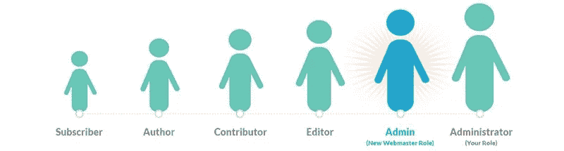
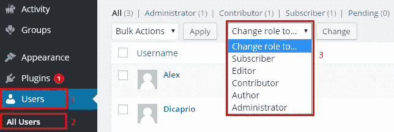
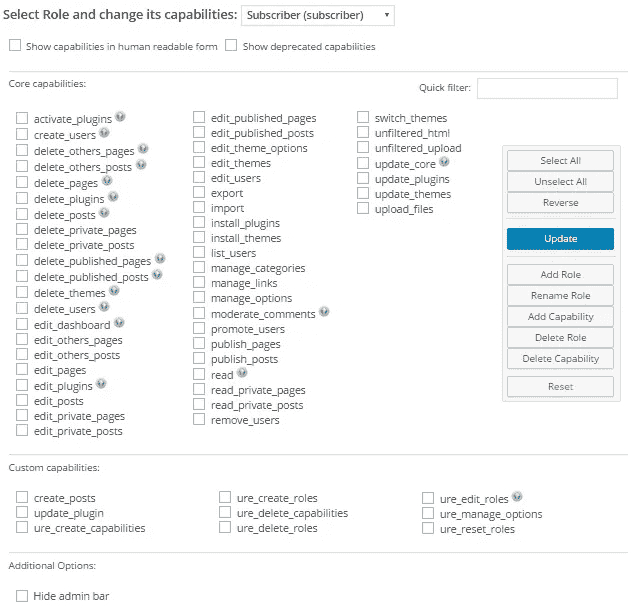
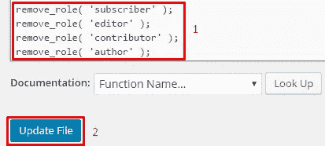
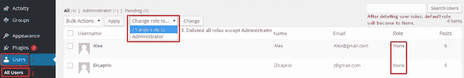
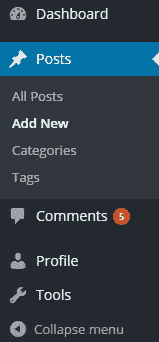
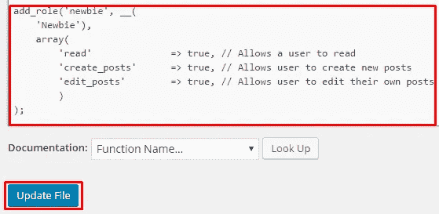
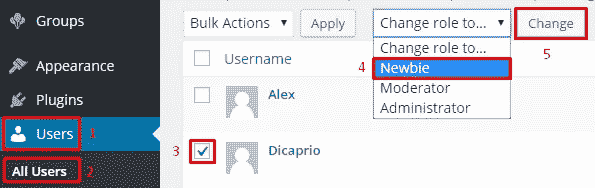
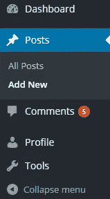
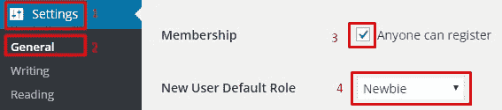

# 如何在 WordPress 中创建自定义用户角色

> 原文：<https://medium.com/visualmodo/how-to-create-custom-user-roles-in-wordpress-ddaf11e8ef07?source=collection_archive---------2----------------------->

理解什么是 WordPress 用户角色，如何使用，应用自定义和 cerante 新规则，以一种简单的方式为你的网站用户的目的和活动。

像其他内容管理系统一样，WordPress 已经预定义了用户角色，满足了 CMS 的基本需求。许多 WordPress 用户不知道他们可以限制 Dashboard 的访问。通过创建新的自定义用户角色，它有助于确保只有特定的人群能够访问他们需要的区域。这将有助于减少任何可能导致整个网站瘫痪的事故发生的几率。今天，我们将学习如何通过插件手动创建新的自定义用户角色。

# 理解 WordPress 的用户角色:

用户角色是两件事情的组合。

1.  作用
2.  能力

角色是将显示在你的 WordPress 管理面板中的一个用户组的名字，能力是启用或禁用的特权。

默认情况下，WordPress 有 6 个基本的用户角色。

1.  **超级管理员**:可以访问整个网站的个人资料，包括网络管理功能。
2.  **管理员**:拥有所有管理功能的配置文件。
3.  **编辑器**:个人资料，可以创建，编辑，发布他们和其他职位。
4.  **作者**:只能创建、编辑、发布自己帖子的个人资料。
5.  **Contributor** :只能创建、编辑自己的帖子，但不能发布帖子的简档。
6.  **订户**:只能管理自己的简档的简档。

你可以在你的管理面板中找到当前的用户角色。

登录到你的“**管理面板**”。

导航至“**用户>所有用户**”。

您可以看到当前的用户角色，如下图所示。

# 准备创建新的用户角色:

有两种方法可以在 WordPress 中创建、编辑或删除用户角色。

# 1.修改 WordPress 角色的插件:

有时候你想在 WordPress 中使用一个可以控制用户角色的插件。有很多插件可以用来添加、修改和删除用户角色和能力。但是，我会推荐[用户角色编辑器插件](https://wordpress.org/plugins/user-role-editor/)。

下面是你可以使用这个插件做的事情。

但是，本文主要关注手动方法。

# 2.手动创建、编辑或删除 WordPress 用户角色:

WordPress 允许你删除默认的用户角色，并通过给特定的用户组分配有限的权限来创建你自己的用户角色。

今天，我们将教您如何手动删除和创建新的用户角色。

管理角色和权能有五个功能:

*   **add_role()** :添加自定义角色。
*   **remove_role()** :删除自定义角色。
*   **add_cap()** :为角色添加一个定制的能力。
*   **remove_cap()** :从角色中删除自定义功能。
*   **get_role ()** :获取角色及其功能的信息。

# 删除默认用户角色:

首先，我们将删除现有的 WordPress 默认用户角色。在我们的教程中，我们有 5 个用户角色。

1.  订户
2.  编者ˌ编辑
3.  捐助者
4.  作者
5.  管理人员

删除除“**管理员**”之外的所有用户角色。

从你的 WordPress 管理面板。

导航至“**外观>编辑器>主题功能**”。

我们将使用 WordPress 函数:

*   **remove_role()** :删除一个角色。

将下面的代码**复制**，**粘贴**到你的**主题函数**文件的末尾。

> *remove_role('订户')；
> remove _ role(' editor ')；
> remove _ role(‘贡献者’)；
> remove _ role(' author ')；*

点击**更新文件**。

验证已删除的用户角色。

导航至“**用户>所有用户**”。

在下图中，您可以看到除管理员之外的所有默认用户角色都被删除。

# 创建角色:

在我们的教程中，我们将创建三个新的用户角色。

1.  管理员:拥有完全的管理权限。
2.  主持人:也可以创建、编辑、发布他们和其他人的帖子。
3.  新手:只能编辑他的个人资料和创建新帖子。

为了添加我们自己的用户角色，我们将使用 WordPress 函数。

*   **add_role()** :添加自定义角色。

**add_role** 函数中有三个参数。

> *add_role( $role，$display_name，$ capabilities)；*

1.  **$角色**:角色的唯一名称。
2.  **$display_name** :显示在 WordPress 管理面板上的名字。
3.  **$能力**:一个人可以访问的特权。

*所有功能的完整列表可以在* [*这里找到。*](https://codex.wordpress.org/Roles_and_Capabilities#Capabilities)

**1。管理员:**

我们没有删除默认管理员。这就是为什么，我们将保留它的默认权限。

**2。主持人:**

正如我们已经讨论过的，我们将给予他创建、编辑、发布自己和他人帖子的权利。

将下面的**代码复制**并将**粘贴**到你的**主题函数**文件的末尾。

> *add_role('版主'，__(
> '版主')，
> 数组(
> 'read' = > true，//允许用户读取
> 'create_posts' = > true，//允许用户创建新帖子
> 'edit_posts' = > true，//允许用户编辑自己的帖子
> ' edit _ others _ posts ' =>true，//允许用户也编辑其他帖子
> 'publish_posts' = >*

点击**更新文件**。

# 向用户分配“主持人”角色:

从 WordPress 管理面板。

导航至“**用户>所有用户**”并遵循以下说明。

我们已经为我们的用户“ **Alex** ”分配了“**版主**”角色。从下图中可以看到，当他登录并进入“**仪表板**”时，他将拥有我们允许的有限访问权限。

**3。新手:**

正如我们已经讨论过的，我们将授予他编辑个人资料和创建新帖子的权利。

将下面的**代码复制**并将**粘贴**到你的**主题函数**文件的末尾。

> *add_role('新手'，__(
> '新手')，
> 数组(
> 'read' = > true，//允许用户读取
> 'create_posts' = > true，//允许用户创建新帖子
> 'edit_posts' = > true，//允许用户编辑自己的帖子
> )
> )；*

粘贴后，点击**更新文件**，如下图。

# 将“新手”角色分配给用户:

从 WordPress 管理面板，

导航至“**用户>所有用户**”并遵循以下说明。

我们已经将“**新手**”角色分配给我们的用户“**迪卡普里奥**”。您可以从下图中看到，当他登录并转到“**仪表板**”时，他将拥有我们允许的有限访问权限。

现在，每当访问者注册时，我们将分配“**新手**”角色。

