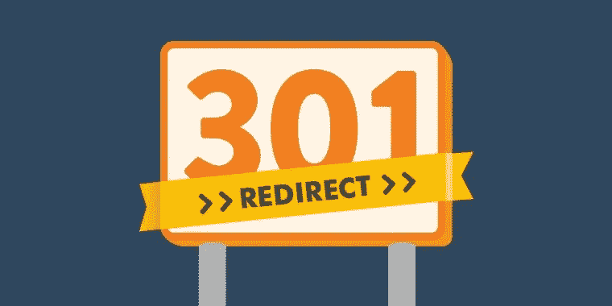
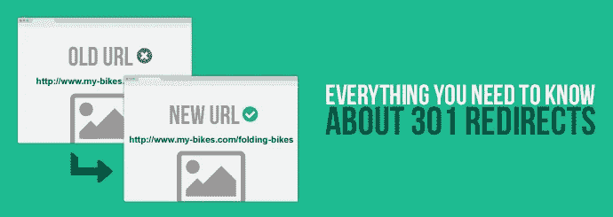
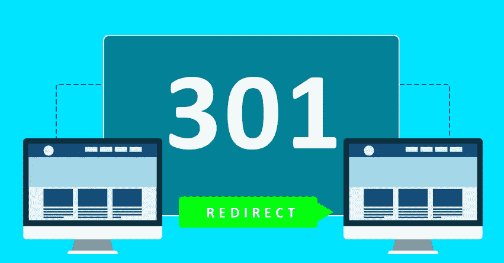

# 如何创建 WordPress 重定向

> 原文：<https://medium.com/visualmodo/how-to-create-wordpress-redirects-53022816f8f6?source=collection_archive---------0----------------------->

## (301 代码)

发生了一些事情，你需要改变你的页面 URL，然而，你已经共享了这个页面 URL，所以在这篇文章中可以看到如何创建 WordPress 重定向(301 代码)而不丢失你的页面排名。

有些时候，当访问者访问某个页面或帖子时，您希望将他们重定向到网站的不同部分。原因可能是你重命名了一篇文章和它的 [URL](https://visualmodo.com/) ，一个页面被移除或者你想要一个不同的页面来排名。

# 如何创建 WordPress 重定向(301 代码)



# 简而言之，重定向

“重定向”这个名字很好地说明了一切:它将访问特定页面的访问者导向另一个页面。但是这个 301 是什么意思，它与 302 重定向有什么不同？两者都把你的用户送到不同的页面。唯一微妙(但非常重要)的区别是，a 301 将永久地将访问者和搜索引擎发送到新的目的地。302 重定向表示您只是暂时希望访问者被发送到不同的[页面](https://visualmodo.com/)。

# 在服务器上创建 301 重定向

添加 301 重定向的最基本的方法之一是编辑您的。服务器上的 htaccess 文件。这种方法只在 Apache 服务器上可用。Nginx 有自己在服务器配置中定义重定向的方法，并且需要大量的系统管理知识。

随着时间的推移，这些配置会变得很难维护，[尤其是](https://visualmodo.com/)如果你是一个狂热的博客写手，或者你正试图提高你的帖子的搜索引擎优化。最重要的是，您必须通过 FTP 登录到您的服务器，编辑文件，并在每次添加新的重定向时重新上传它们。这就是为什么，一般来说，使用这种方法不被认为是可行的。

# 用 PHP 创建 301 重定向



作为一名 WordPress 开发者，你有两个选择:要么通过修改代码中的文件头进行重定向，要么利用内置的
`wp_redirect`函数。

普通 PHP 的一个例子如下:

```
<?php
// MyExampleFile.php
header("HTTP/1.1 301 Moved Permanently"); 
header("Location: http://www.my-blog.com/a-new-destination"); 
?>
```

这就是你做同样事情的方法，但是现在通过使用 WordPress 的内置功能:

```
wp_redirect( "http://www.my-blog.com/a-new-destination", 301 );
```

如果你忘记添加`301`, WordPress 和 PHP 都会认为这是一个`302`重定向，但情况并非总是如此。

这种方法比在服务器上编辑文件要简单一点，但是一旦重定向的数量增加，也会变得很麻烦。

# 用 Yoast SEO 创建 301 重定向



当创建这些重定向时，我们的 Yoast SEO Premium 插件会助你一臂之力。如果您没有正确地重定向[访问者](https://visualmodo.com/)，我们内置的重定向管理器会在您更改帖子、页面或任何可能导致 404 的分类的 URL 时为您提供帮助。

此外，我们还为您提供了一个界面，您可以在以后的某个时间点编辑或删除这些重定向。该插件还会告诉你何时要创建一个重定向，这会导致一个[重定向循环](https://en.wikipedia.org/wiki/URL_redirection#Redirect_loops)。这种循环是您希望不惜一切代价避免的。