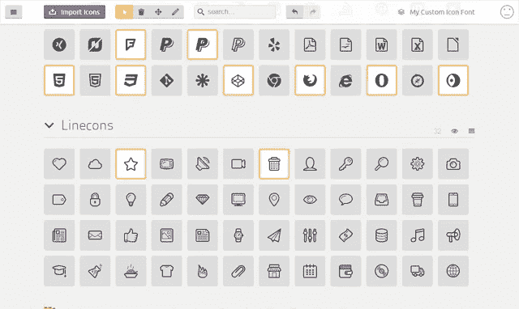
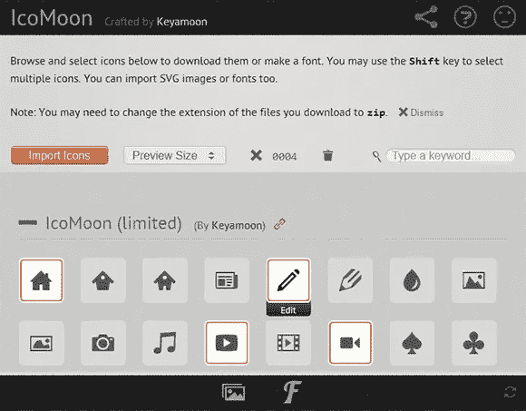
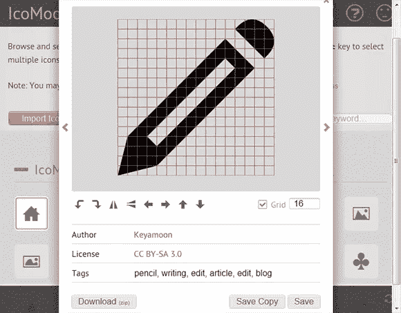
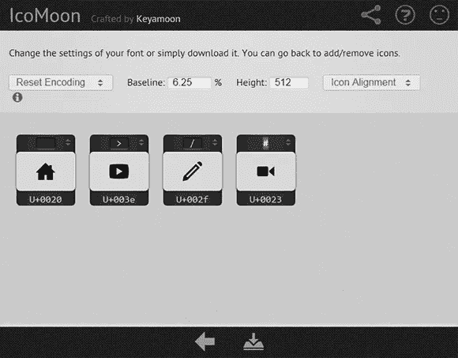

# 如何用 IcoMoon 创建自己的网络字体图标包

> 原文：<https://medium.com/visualmodo/how-to-create-your-own-web-font-icon-pack-with-icomoon-43bc071f1f91?source=collection_archive---------0----------------------->

现在了解如何使用 IcoMoon 应用程序创建自己的 web 字体图标包，以便在您的网站甚至 WordPress 项目上上传和使用令人惊叹的图标，当您向网页添加图标时，web 字体是图像的绝佳替代选择。



最近的一篇文章[web font Icons:Images 的替代品](http://www.sitepoint.com/webfont-icons/)解释了如何加载一个单独的字体文件，比如 [Iconic](http://somerandomdude.com/work/iconic/) 并使用 CSS 伪元素应用图标，例如

```
<style>
.rss:before
{
	font-family: "IconicStroke";
	content: "r";
}
</style><a href="rss.xml" class="rss">RSS Feed</a>
```

这种方法有几个优点:网络字体图标可以在所有浏览器(包括 IE6)中工作，可以缩放到任何大小，数百个可以打包到一个有效的字体文件中。

不幸的是，你很少需要上百个图标。当你只需要少数几个图标时，使用大字体文件有点浪费。如果你需要几个不同字体的图标，情况会变得更糟。

它们还引入了一个次要的可访问性问题。使用 CSS 伪元素添加内容可以触发屏幕阅读器朗读文本。在我们上面的例子中，你可以听到你的电脑发出“r-RSS 订阅”的声音。

# IcoMoon 来拯救

IcoMoon 是一个神话般的 HTML5 应用程序，可以为你解决这些问题。它允许您:

*   浏览和搜索 600 多个 IcoMoon 图标
*   上传单个 SVG 或您自己的字体包(支持 SVG 字体)
*   直接在浏览器中编辑图标
*   向字体集合中添加任意数量的图标
*   将这些字体分配给任何字符，例如，您可以使用空格字符来确保没有任何内容被大声朗读，而不是使用“r”
*   下载示例代码和包含您选择的图标的小型防弹字体堆栈

首先，请访问位于 keyamoon.com/icomoon/app/[**的 IcoMoon 应用程序**](http://keyamoon.com/icomoon/app/) ，在这里您可以上传、浏览和搜索图标收藏。您可以通过单击来选择或取消选择任意数量的图标:



将鼠标悬停在任一图标上，点击**编辑**，进行旋转、镜像、移动等基本编辑。您也可以下载一个 SVG 形式的图标，在 Illustrator、 [InkScape](http://www.inkscape.org/) 或 [svg-edit](http://svg-edit.googlecode.com/svn/branches/2.5.1/editor/svg-editor.html) 中进行编辑，然后上传修改后的版本:



对图标满意后，单击屏幕底部黑色条中的 *F* 图标，查看并重新排列您的选择。您可以通过单击顶部栏并按下相关的键，或者单击底部栏并输入 Unicode 索引号，将图标分配给任何字符:



最后，点击底部黑色条中的*下载字体*图标来获取您的自定义 ZIP 文件。

[**IcoMoon**](http://keyamoon.com/icomoon/app/) 是我见过的最有用的网络开发应用之一，它根除了一些与网络字体相关的问题。强烈推荐。

来源[https://www.sitepoint.com/?utm_source=sitepoint&UTM _ medium = nav](https://www.sitepoint.com/?utm_source=sitepoint&utm_medium=nav)

如何用 IcoMoon 创建自己的网络字体图标包

如果你不想建立你自己的图标包，你可以下载我们独家的 Visualmodo 图标包，并通过 visualmodo.com 的链接上传到你的 WordPress 上