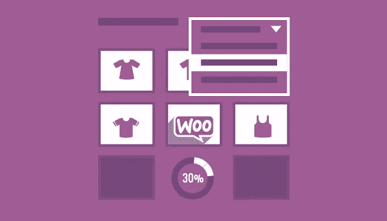
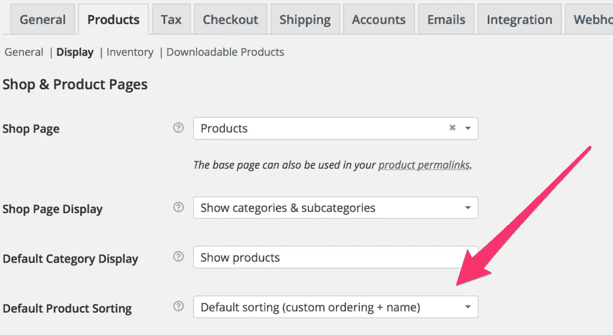
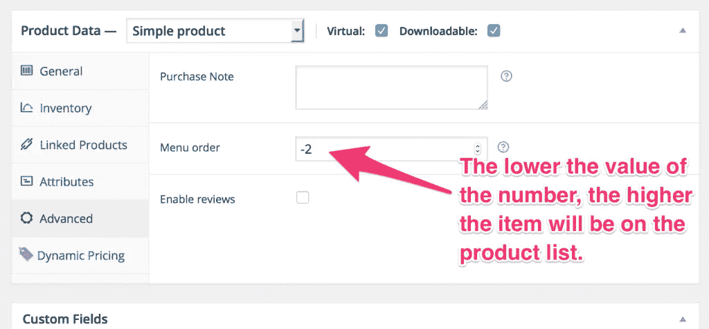

# 如何定制 WooCommerce 产品排序

> 原文：<https://medium.com/visualmodo/how-to-customize-woocommerce-product-sorting-900a395dc84f?source=collection_archive---------0----------------------->

WooCommerce WordPress 插件

一个客户最近想在产品分类存档页面上定制他们 WooCommerce [WordPress](https://visualmodo.com/) 插件产品的 WooCommerce 产品排序顺序。该档案使用默认的字母排序，但他们有一些产品，他们希望被列在类别列表的顶部。我们是这样做的。

# WooCommerce 产品分类选项

[WooCommerce](http://www.woothemes.com/woocommerce/) 提供了通过少量设置更改来定制产品分类顺序的能力。

在你的 WordPress 管理器中进入 WooCommerce >设置。在“产品”选项卡的“显示设置”下，确保“默认产品排序”设置为“默认排序(自定义排序+名称)”。保存设置，然后点击 WordPress 管理侧边栏中的产品管理页面。

# 自定义排序

所有自定义排序适用于所有项目，而不是单独的类别。如果您有一个显示所有产品的页面，请记住这一点。对于这个特殊的项目，产品页面是按类别分开的，所以排序选项不需要像其他人可能需要的那样详细。

从产品管理面板，您可以选择排序产品，然后拖放您的产品在特定的顺序，你想要的。您也可以通过更改“订单”值来订购快速编辑菜单中的产品。所有项目的默认值为零。自定义订单首先显示较小的数字。您也可以在产品编辑页面的产品数据>高级选项卡中编辑订单值。

# 将特定产品移至顶部

如果你想定制排序每一个产品，你可以这样做。如果您只是想将一些选定的项目移到列表的顶部，有一个简单的方法可以做到这一点。

在产品的“订单”字段中输入一个负数。通过使用负数，该项的值将低于默认值“0 ”,因此将显示在这些项目的上方。如果你想把一组产品放在一起，让 WooCommerce 按字母顺序排序，只需使用相同的“order”值。

# 结论

WooCommerce 是 WordPress 的一个强大的电子商务解决方案，提供了很多定制在线商店的方法。

所有的 [Visualmodo](https://visualmodo.com/) WordPress 主题都与 WooCommerce 插件完全兼容，并且还增加了独特的功能，为你的商店设计增添了更多的力量和美感。