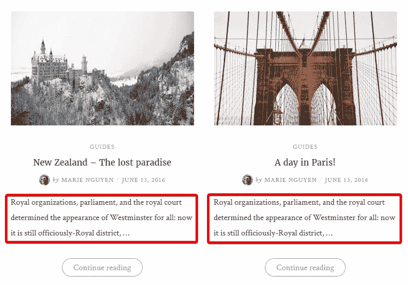
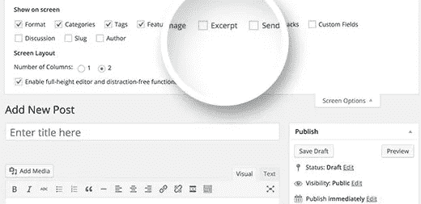
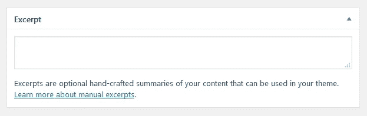
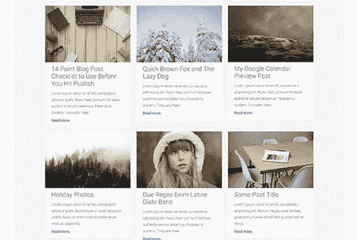
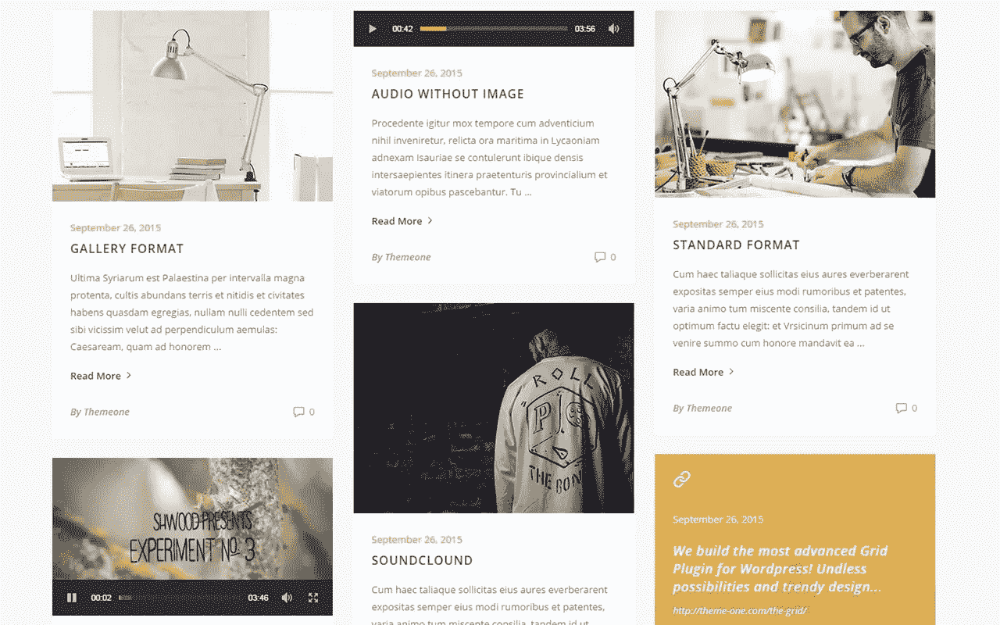

# 如何定制 WordPress 摘录

> 原文：<https://medium.com/visualmodo/how-to-customize-wordpress-excerpts-36535d8030fd?source=collection_archive---------0----------------------->

## 没有代码

当你浏览一个 WordPress 网站时，你会看到文章没有完全显示在页面上。相反，只显示一部分内容。那部分叫做摘录。现在看看如何编辑这个帖子摘录区

下面是一个截图，使用了博客页面上的摘录:



摘录于[主题](https://visualmodo.com/)

使用 WordPress 主题的摘录有一些好处:

*   它**让你的主页或博客页面简短而集中**。你的读者只能看到文章的简短描述。当他们需要查看更多信息时，他们只需点击帖子即可阅读更多信息。
*   它**让 WordPress 的设计干净清晰**。它给你的读者“一个呼吸的空间”。如果你是一名设计师，你会知道很好地利用留白是一个成功设计的重要关键。这就是为什么大多数 WordPress 模板使用摘录。

# WordPress 摘录的问题

虽然使用摘抄很常见，但是它有一个问题:**摘抄中的字数通常是由** [**主题**](https://visualmodo.com/) 固定的。一个数字 X 在一种语言中可能看起来不错，但在另一种语言中可能不合适。或者甚至当你用一些页面生成器设计你的文章时，文章摘录会在上面显示代码。正因为如此，摘录长度(或摘录限制)应该能够改变。

# 定制摘录

基本上有 3 种方法来改变摘录长度。

# 1.手动自定义摘要



摘录有两种类型:

*   **自动摘录**:根据帖子内容生成。通常，自动摘录会从帖子内容中提取 55 个前几个词。当然，字数(55)是我们要改变的。
*   **用户在编辑帖子时可以自行录入的手动摘录**。在主编辑器下方的**摘录**元框中输入手动摘录，如下图所示:



手动输入摘录

知道并使用手册节选的人不多！真是**大错**。使用手动摘录有助于您:

*   100%控制摘录中显示的内容
*   提高 SEO 分数

关于 SEO，一些 [SEO](https://visualmodo.com/) 插件如 Yoast SEO 自动**提取摘录内容并显示为搜索结果中的描述**。使用手动摘录，可以自定义这个描述，提高点击率。要进入手动摘录，只需在编辑器下方的**摘录**元框中输入内容，如上图截图所示。那很简单。

但是请注意**如果你使用手动摘录，阅读更多链接可能会消失**。这取决于你使用的 WordPress 主题。它并不总是发生，但在大多数情况下都会发生。如果你想保留阅读更多链接，你应该看看自动[摘录](https://visualmodo.com/)。

# 2.用代码更改摘录长度

如果你知道代码，你可以很容易地定制摘录长度。打开主题的`functions.php`文件，输入以下代码:

```
add_filter( 'excerpt_length', 'your_prefix_excerpt_length' );
function your_prefix_excerpt_length() {
    return 30;
}
```

记得把你要在摘录中显示的字数改成`30`。

使用代码时，建议使用子主题。因为当你当前的 WordPress 主题更新时，你的定制将会丢失。



# 3.WordPress 插件改变摘录长度

第三种也是最简单的改变摘录长度的方法是使用 WordPress 插件。我们已经研究过了，以下是改变摘录长度的 3 个最好的 WordPress 插件。

## [更改摘录长度](https://wordpress.org/plugins/change-excerpt-length/)

作者:阿什卡尔

这个插件非常简单。在*设置→阅读*页摘录长度中仅增加 1 个选项。你只需要输入节选的字数就搞定了！

插件设置页面

## [自定义摘录长度](https://wordpress.org/plugins/custom-excerpt-length/)

作者:克罗特克

这个插件和上面的插件很像。还在*设置→阅读*页面中增加了摘录长度选项:

## [摘录长度](https://wordpress.org/plugins/excerpt-length/)

作者:李·凯莱赫

这个插件不仅可以帮助你定制摘录长度，还可以摘录更多的文本。它类似于上面的两个插件。这些插件非常简单，非常[轻量级](https://visualmodo.com/)。它们不会影响你的网站加载速度，但是提供了一个不用接触代码就可以定制网站的好方法。我们已经测试了这些插件，并为我们的一些客户使用它们。它工作得很好。

