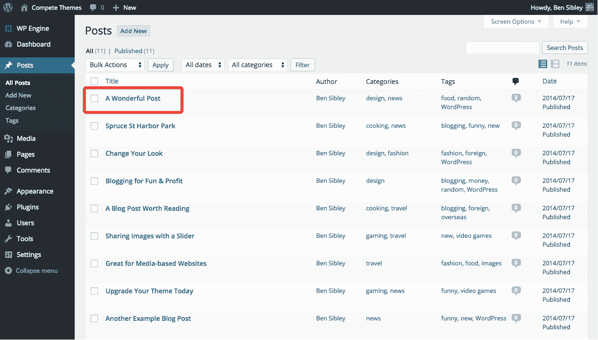

# 如何定制 WordPress 帖子摘录？

> 原文：<https://medium.com/visualmodo/how-to-customize-wordpress-post-excerpts-5844876ff328?source=collection_archive---------0----------------------->

默认情况下，文章摘要显示在博客/首页或您在页面上添加的一些文章网格元素上，而不是完整的文章。摘录使用帖子中的前 30 个单词，排除链接、图像和所有其他 HTML。现在看看一个简单的方法来定制除了文本之外的文章。

# 如何定制 WordPress 帖子摘录？

默认情况下，您的摘录将使用帖子中的前 30 个单词。然而，你可能不想使用你文章中的任何内容作为[摘录](https://visualmodo.com/)。

你可以使用*摘录*框为任何文章创建完全自定义的摘录。

访问**帖子**菜单

找到并点击你想编辑的文章

向下滚动页面，直到看到*摘录*框

如果您没有看到*摘录*框，向上滚动页面并点击*屏幕选项*选项卡

点击*摘录*复选框，向下滚动页面直到看到*摘录*框

在*节选*框中，输入你想要用于文章节选的文本，你也可以在此区域添加链接(使用 HTML)以在[博客](https://visualmodo.com/)页面上显示一些页面文章网格元素。

点击*更新*按钮

您的帖子现在将使用在 [*摘录*](https://visualmodo.com/) 框中定义的摘录，而不是默认摘录。

WordPress 摘录是一篇文章的可选摘要或描述；总之一个**岗位总结**。

摘录有两个主要用途:

1.  当在仪表板【设置】[阅读](https://visualmodo.com/)中选择显示摘要选项时，它将替换 RSS 源中的全部内容。
2.  根据 WordPress 的主题，它可以显示在快速摘要比完整内容更可取的地方:

*   搜索结果
*   标记档案
*   类别档案
*   每月档案
*   作者档案

更多信息请访问。