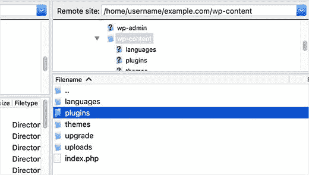

# 当无法访问 WordPress Admin 时如何停用插件

> 原文：<https://medium.com/visualmodo/how-to-deactivate-plugins-when-not-able-to-access-wordpress-admin-e3606788e215?source=collection_archive---------6----------------------->

通常在故障排除期间，许多网站会建议停用所有插件并逐个激活它们。最糟糕的是，有时你被锁定在你的 WordPress 管理面板之外，所以你甚至不能用一种简单的方式去激活插件。如果你曾经面对过死亡的白屏，那么你就很清楚我们在说什么。在这篇文章中，我们将向你展示如何在无法访问 wp-admin 区域时停用所有的 WordPress 插件。

有两种方法可以禁用你的插件。一个要求你使用 FTP，另一个要求你使用 phpMyAdmin。

## 使用 FTP 停用所有插件

在这种方法中，你需要使用一个 [FTP 客户端](http://www.wpbeginner.com/showcase/6-best-ftp-clients-for-wordpress-users/)，或者你的主机的文件管理器。如果你以前没有使用过 FTP，那么你可能想看看我们的[如何使用 FTP 上传文件到 WordPress](http://www.wpbeginner.com/beginners-guide/how-to-use-ftp-to-upload-files-to-wordpress-for-beginners/) 。

首先，您需要使用 FTP 客户端或 cPanel 中的文件管理器连接到您的网站。连接后，您需要导航到/wp-content/文件夹。

在 wp-content 文件夹中，你会看到一个名为 plugins 的文件夹。这是 WordPress 存储所有安装在你网站上的插件的地方。

右键单击插件文件夹并选择重命名。将插件文件夹的名称更改为您喜欢的任何名称。在我们的例子中，我们称之为“plugins.deactivate”。一旦你这样做，你所有的插件将被停用。

通常，当你被锁在你的[管理区](http://www.wpbeginner.com/glossary/admin-area/)之外时，会使用这种方法。如果问题出在你的插件上，那么你应该可以登录到你的 WordPress 管理区。

一旦你这样做了，回到你的/wp-content/文件夹，把“plugins.deactivate”重新命名为 plugins。现在你可以一次激活一个插件，直到你的站点再次崩溃。此时，您将确切知道是哪个插件导致了这个问题。

## 使用 phpMyAdmin 停用所有插件

在我们看来，FTP 方法肯定更简单，但是你也可以使用 [phpMyAdmin](http://www.wpbeginner.com/beginners-guide/beginners-guide-to-wordpress-database-management-with-phpmyadmin/) 来停用所有插件。

首先，您需要登录到您的虚拟主机仪表板。在本例中，我们向您展示了一个 cPanel 仪表板。您的托管帐户的仪表板可能看起来不同。

您需要点击“数据库”部分下的 phpMyAdmin 图标。

这将在一个新的浏览器窗口中启动 phpMyAdmin。你需要选择你的 WordPress 数据库，如果它还没有被选择的话。之后，你将能够看到 WordPress 数据库表。

如您所见，数据库中的所有表在表名前都有前缀`wp_`。您的表可能有不同的前缀。

你需要点击 wp_options 表。在 wp_options 表中，你会看到不同选项的行。您需要找到“active_plugins”选项，然后单击它旁边的“Edit”链接。

在下一个屏幕上，您需要将 option_value 字段更改为 **a:0:{}** ，然后单击 Go 按钮保存您的更改。

就这些，你已经成功的使用 phpMyAdmin 停用了所有的 WordPress 插件。如果它是一个阻止你访问 WordPress 管理区的插件，那么你现在应该可以登录了。

我们希望这篇文章能帮助你停用 WordPress 中的所有插件。

来源[https://visualmodo.com/](https://visualmodo.com/)