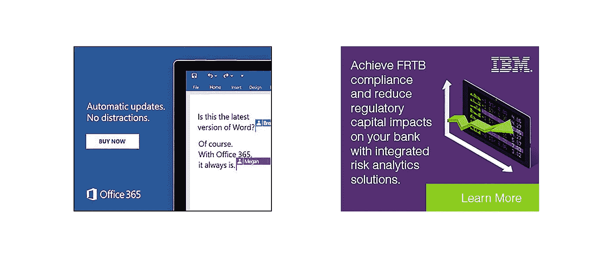
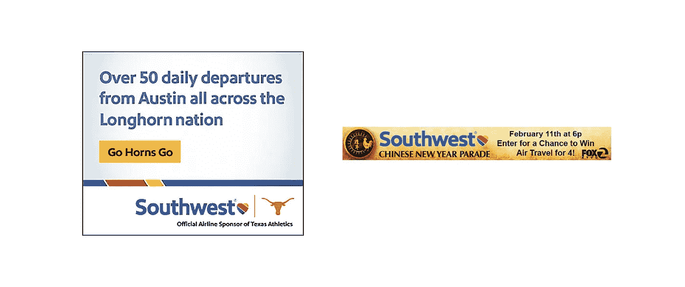
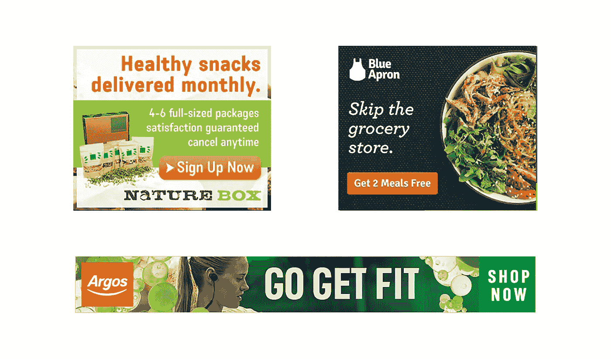
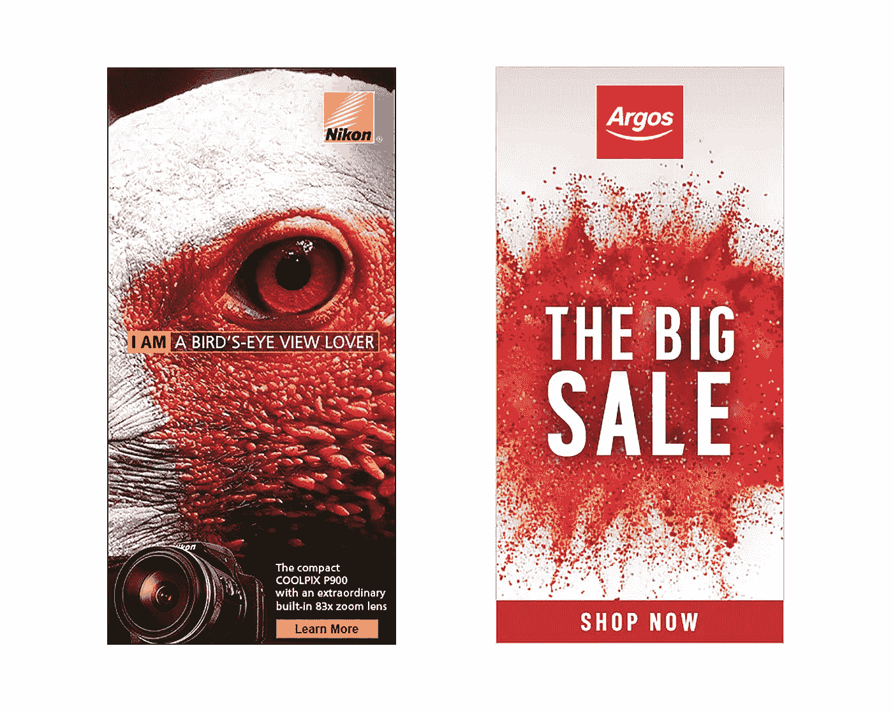
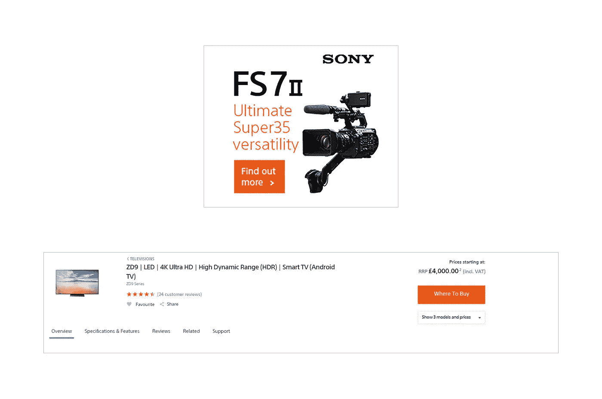
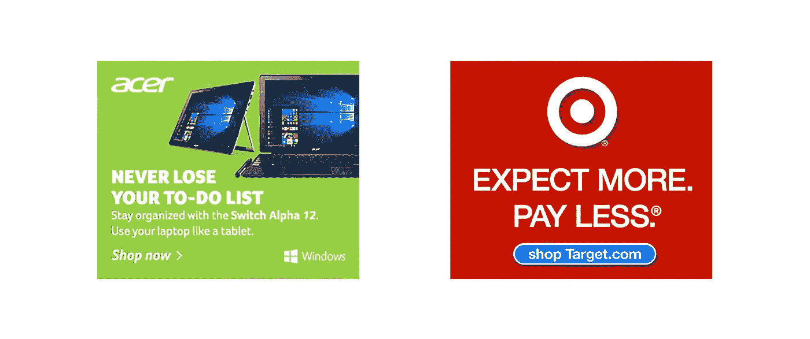
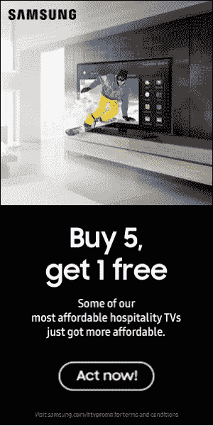

# 如何设计横幅

> 原文：<https://medium.com/visualmodo/how-to-design-a-banner-9985f7dd43ba?source=collection_archive---------0----------------------->

## 在你开始为你的客户制作横幅广告之前，你需要了解他们的目标是谁，以及他们希望通过横幅广告达到什么目的。目标可以包括:产生品牌意识；产品意识；增加网站流量；产生销售线索；进行销售；报名参加活动。现在看看如何设计横幅

客户想要锁定的受众和他们的目标一样重要。如果你能理解他们的受众，你就能创作出能引起他们共鸣的广告。下面是两家 IT 公司的广告，它们都在同一个市场，但目标客户群不同。

微软的广告聚焦于消费者，他们的信息以简单、没有术语的方式书写，任何人都可以理解。

IBM 主要迎合 B2B，并使用了专业和商业词汇，如*监管*和*合规*，这些词汇更能引起高管层而非普通消费者的共鸣。

# 个性化和本地化

[75%的消费者](http://blog.hubspot.com/marketing/data-personalize-marketing-li)表示，当商家向他们提供广告等与他们兴趣无关的内容时，他们感到沮丧，而使用个性化服务的营销人员注意到，平均而言，销售额上升了[19%](http://blog.hubspot.com/marketing/data-personalize-marketing-li)。

个性化和本地化是创建成功横幅的关键。随着普通消费者每天消费成千上万的广告，任何与他们利益无关的东西都会被忽略。

这是西南航空公司针对住在德克萨斯州奥斯汀的消费者做的广告。这个标语触及了个性化和本地化的三个要点。他们的广告展示了该州的国家体育场，并且还有州、城市和德克萨斯州的昵称来吸引顾客的眼球。在中国新年期间，他们利用全国性的亚洲假期设立了一个抽奖活动(lead generation campaign ),以赢得四个人的免费航班。你可以根据你对受众的了解、受众的地理位置，或者通过标记相关的季节性节日或当前的流行文化趋势来个性化广告。

# 颜色

为客户的横幅选择合适的颜色时，你需要考虑两件事:品牌颜色和色彩心理学。

**品牌颜色:**这些是您的客户在其网站、徽标和其他营销材料上使用的颜色。

**色彩心理学:**这是某些颜色对我们头脑的影响；不同的颜色已经被证明可以唤起人类大脑中的各种情绪。

例如，绿色是众所周知的放松我们的颜色，通常是用来表示环境友好的方法。自然盒子充分利用了这种色彩心理，他们将绿色作为广告的主色调。

蓝色围裙是另一个促进健康饮食的食品品牌，他们的一个 USPs 是没有食物剩下。然而，与自然盒子不同，他们往往更关注自己的品牌颜色(蓝色)，而不是颜色心理学。

坚持他们的品牌颜色，蓝色围裙仍然能够通过使用相关的图像来传达健康饮食的信息。

Argos 的品牌颜色是红色和白色，他们也将健身相关的广告涂成绿色，以进一步强调他们的健康信息。

# 品牌色彩还是色彩心理？

答案没有对错之分。看看你的客户过去的广告，查看他们使用的颜色和图像，这样你就可以在所有平台上保持他们的品牌一致。

这也应该在工作开始前讨论，这样你就知道你可以工作的参数。

# 词语和意象

文字和图像是相辅相成的。图像应该进一步强调文本，而文本应该进一步强调图像。

以这个尼康横幅广告为例。它用图像和文字心理学来描绘他们的相机有多强大。鸟类以其巨大的视力而闻名，许多鸟类有能力看到几英里以外的地方。文字“*我是一个鸟瞰爱好者”*以鸟的形象作为广告的焦点。广告底部是一个小小的行动号召，展示了内置 83 倍变焦镜头的相机的强大功能。当你把文字和图像混合在一起的时候，你可以变得有创造性，你不必把你的图像选择局限于你客户的产品范围。

正在进行大拍卖的 Argos 使用了“*大拍卖”*的字样，背景是一个五彩缤纷的红色爆炸。请注意，当他们不关注健康时，他们会回到红色(品牌颜色)——这种颜色也被证明会增加紧迫感。

在你项目的沟通阶段，问你的客户他们希望和不希望在他们的广告中提到什么词。某些品牌希望保持其难以获得的奢侈地位，并避免使用折扣、免费、出售或节省等词。有些人可能不希望你使用卡通图形或某些动画效果，因为这可能会损害他们的乐队。

# 行动呼吁

不是你制作的每一个广告都需要行动号召，但大多数都需要。行动呼吁必须易于看到，并与用户被发送到的页面相匹配。

当使用行动号召时，你必须分析你发送流量的页面，以便为你的广告建立基础。

为了达到你的客户的目标，确保销售，注册他们的网站，或阅读博客文章，你需要用户在点击广告后停留在他们的网站上。如果没有广告气味，客户可能会在点击后直接离开，也就是说，他们在网站上看到的体验与他们看到的广告横幅完全不同。

索尼的横幅广告和网站有强烈的广告气味，因为他们在广告和网站中使用相同的颜色、字体和空白。

行动号召也应该通过斜视测试。

斜视测试是检测你的行动号召是否突出的简单方法。要进行斜视测试，离你的显示器三步远，斜视你的眼睛，如果你不能清楚地看到行动号召按钮，你的行动号召需要调整。

这是一个宏基的广告。它能通过你的斜视测试吗？不，也不是我们的。整个背景是绿色的，很难识别行动号召在哪里，因为广告中没有任何东西弹出来敦促我们点击。

塔吉特百货公司的广告如何将用户引向他们的网上商店？这能通过你的斜视测试吗？是的，我们也能看到。

要创建一个清晰的行动号召按钮，确保它从背景中脱颖而出，如果可能的话，使用图像中没有使用过的独特颜色。

将按钮放在远离特征图像的位置，让它透气，这样它会更加突出。大多数行动号召按钮都直接位于图像和文本的下方，因为客户首先会看到内容，然后决定是否点击。

你很少会在广告顶部看到“行动号召”按钮，而文字和图片在底部或图片的左侧。

# 促销和基于优惠的横幅

你的客户的主要目标是赢得更多的生意，大多数人会通过对他们的产品提供某种类型的优惠或折扣来做到这一点。

作为一名设计师，你可能没有客户最畅销产品或最受欢迎产品的数据，你可能最终选择了一个你认为看起来不错但实际上卖得并不好的产品图片。

作为图像的创作者，你的任务之一应该是更多地了解你的客户的顾客和产品。展示他们最畅销的商品和很少有人购买的商品之间的差异对于点击率和转化率来说是巨大的。

你拥有的数据越多，你就能更好地选择产品图片，以达到客户的预期目标。

# 动画

随着网站变得越来越灵活，有几十种小工具和内容吸引了人们的眼球。在大多数研究中，动画横幅[总是优于静态横幅](https://99designs.com/blog/tips/14-design-tips-for-more-clickable-banner-ads/)，但如果做得不正确，它们也可能会惹恼用户并贬低你客户的品牌。

虽然你希望客户点击你的横幅，但你不希望把你的横幅变成我们所说的“诱饵”(类似于点击诱饵)。当你在网站上使用对比鲜明的背景色或快速闪烁的图片，唯一的目的是让用户看到你的广告，这就是吸引眼球。

根据一般经验，图像的背景不应该改变颜色，只有页面上的文本或图像应该改变颜色。

从这则三星广告中可以看出，最好的动画广告通过一个简短的故事引导客户。

它首先展示产品，我们的眼睛聚焦在它上面；接下来的文字将我们引向故事的第二部分。最后，我们看到了“行动号召”按钮，它告诉用户的潜意识，下一个适当的行动是点击并了解更多。

如何设计横幅——来源[https://visualmodo.com/](https://visualmodo.com/)