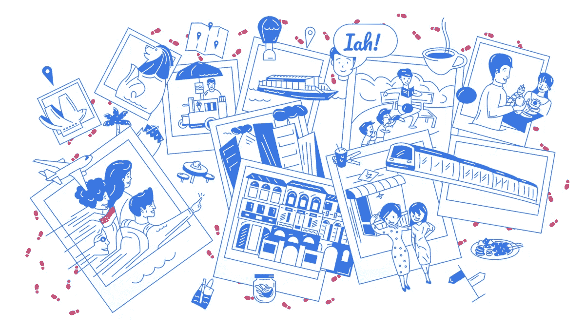
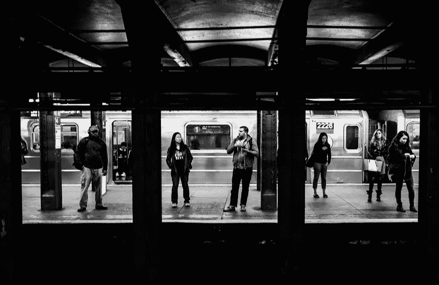

# 如何设计你的数字游牧博客

> 原文：<https://medium.com/visualmodo/how-to-design-your-digital-nomad-blog-a7c04a039fff?source=collection_archive---------1----------------------->

回到过去，人们被困住了；为了完成工作，你唯一的选择就是去办公室，朝九晚五地工作。但是由于技术的发展，被束缚在办公桌前的日子已经过去了——当你在湖边放松或者在去一个令人兴奋的新地方的路上时，你可以很容易地打开你的博客。

近年来，成为一名数字流浪者，过一种不受地理位置限制的生活方式越来越受欢迎。随着生活方式变得越来越主流，越来越多的游牧民正在创建博客来炫耀他们的经历，宣传他们的专业服务以资助他们的旅行，并为准备自己做出飞跃的人提供一剂灵感。

# 设计你的数字游牧博客

创建的旅游博客越多，市场就变得越饱和——也就越难打破混乱并产生影响。好消息是什么？如果你有创造力，你就占了上风——你所要做的就是运用你已经知道的设计知识，用它来创建一个视觉上令人惊叹的博客，跳出屏幕，以一种有意义的方式框定你的旅行。

你到底是怎么做到的？旅游博客的关键设计元素是什么——你如何设计一个博客，不仅在视觉上有冲击力，而且有助于在数字游牧空间建立自己的博客？

# 让您的颜色选择为您服务

首先:如果你想给你的旅游博客留下好印象，你需要选择正确的颜色。

为你的博客选择调色板不仅仅是说“我喜欢蓝色，所以我要在我的设计中使用蓝色。”[色彩心理学](https://99designs.com/logo-design/psychology-of-color)是一个强大的东西——通过战略性地选择你的颜色，你可以利用人们对某些颜色的强烈联想。

假设你正在世界各地分享你的高强度冒险经历(想想在新西兰跳伞或者在阿尔卑斯山的滑雪板上粉碎一些严重的粉末)。你想让你的访客感受到和你在体验[冒险](https://visualmodo.com/theme/nonprofit-wordpress-theme/)时一样的肾上腺素飙升——所以你会想用红色这样的颜色，它能激发激情和兴奋。另一方面，假设你是一名瑜伽爱好者，正在周游世界寻找你的禅——在这种情况下，你会想要使用蓝色这样的颜色，它能唤起平静和宁静的感觉。

另外要考虑的是你是否希望你的摄影或写作成为你博客的焦点。如果你打算上传大量的图片，你的博客可能会受益于中性或柔和的配色方案，以真正让你的照片跃出页面。如果你的长文是展览中的明星，你可以在颜色选择上更有趣。

重点是，颜色可以让人感觉，思考，做非常具体的事情。当你理解了颜色背后的心理学，你就可以用它来为你的博客选择颜色，让你的读者感觉、思考和做你想做的事情。

# 选择正确的布局

当谈到创建一个博客，你不能只是把一切都扔在一个页面上，并希望最好的。如果你想让你的博客和你的读者联系起来，而不是完全压倒偶然发现你的网址的人，你需要选择正确的布局。

在考虑选项时，一定要选择能充分利用内容的布局。如果你正在建立一个博客来展示你的旅行照片，选择一个把图片放在前面和中间的布局。如果你要回答观众关于如何走上全职数字流浪之路的问题，选择一个允许更多文本的布局。如果你有很多不同的博客类别，选择一个视觉上有趣的布局来组织它们(比如在每篇文章的末尾有一个侧边栏菜单或者一个类别网格)。

你的旅游博客的正确布局完全取决于你是谁，你是关于什么的，你向世界推出什么样的内容。也就是说，你要遵循网页设计的基本规则，并确保你的布局:

*   有一个易于导航的菜单栏
*   根据读者浏览页面的方式排列关键设计元素(遵循“F”设计或“Z”设计模式)
*   有页眉和页脚
*   通过包含标题、副标题和正文来正确使用文本层次结构
*   反应灵敏
*   有收集访问者联系信息的选项

# 让您的视觉效果更上一层楼

不言而喻，你会在你的旅行博客上放上你旅行的照片(这就是重点！)—但如果你真的想让你的内容脱颖而出，你就必须把你的照片和图片提升到一个新的水平。

但首先，让我们谈谈一致性。仅此一点就可以将博主的公众形象从业余爱好者提升到完全的专业人士。这有助于评估你的摄影作品，注意风格和设计的任何模式。你的照片饱和严重吗？你喜欢令人惊叹的全景，而不是安静、简约的构图吗？展示符合真实模式的照片，并支持与您为布局选择的颜色相同的关联。瞧啊。一致性。

然后，添加印刷处理或滤镜等元素可以让你的旅行照片对你的观众来说看起来更加迷人。你的照片越好，你的观众就会越投入。

有一张你日出时徒步到火山山顶的照片吗？添加一个滤镜，让日出的颜色更加精彩。当你被困在巴黎街头的暴雨中时，你有没有拍一些很棒的照片？添加黑白滤镜，让照片更有艺术感和戏剧性。拥有无穷无尽的风景照收藏？在照片上覆盖励志名言的文字，并将其发布给你的观众，用作社交媒体图像。

在你的旅行博客上，你的旅行照片是必不可少的，多做一点努力让你的照片更有影响力会让你获得更好的结果。

# 展示你的作品

你的数字游牧生活方式的很大一部分是你的旅行。但是你的旅行只是等式的一半。另一半呢？你所做的工作让你可以旅行，不管是什么。

你的旅游博客应该是一个展示工作的空间，让你的生活方式成为可能。你的观众不仅对你去过的所有酷地方感兴趣，他们还对你如何去那里感兴趣。通过展示你的作品，并告诉你的观众在旅途中创作的过程，你将激励他们，并向他们展示在旅途中也可以做出令人难以置信的作品。谁知道呢？也许你会从这笔交易中获得一两个新客户。

当你设计你的网站时，创建一个作品集页面，[突出你最好的设计，写作剪辑或展示。别忘了还有一个“与我合作”的网页，它可以让任何潜在的客户很容易地联系上。](https://visualmodo.com/wordpress-themes/)

# 包装东西

环游世界和在旅途中工作相当于“实现梦想”既然你已经知道如何设计一个旅游博客来吸引人们的注意力，并提供大量的工作/旅游灵感，那么剩下要做的就是走出去设计它！(当你在海滩边享受鸡尾酒时，希望你能以真正的数字游牧风格设计它。)