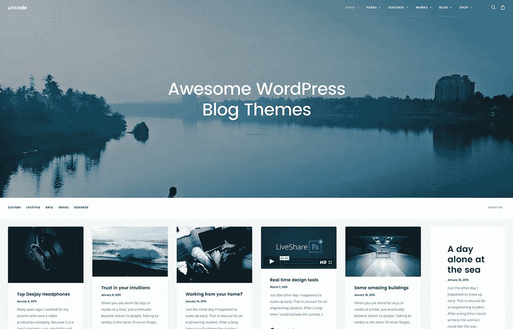
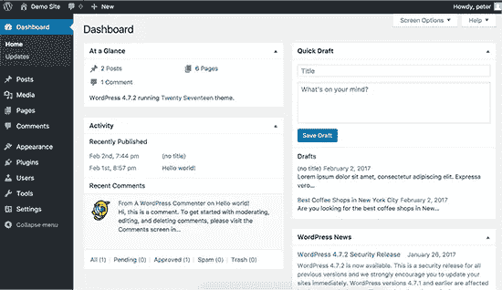
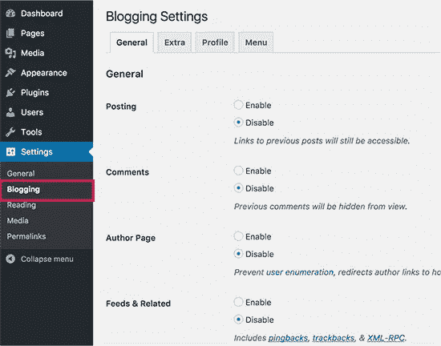
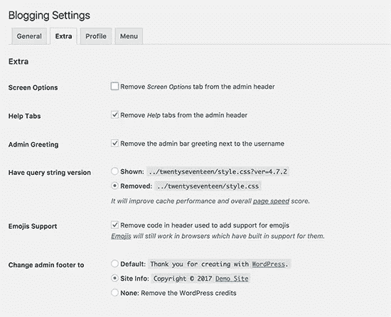
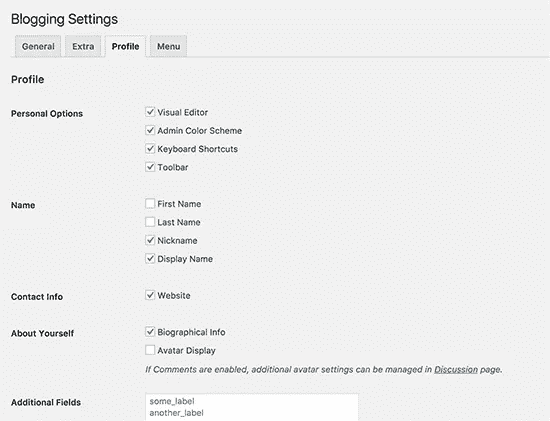
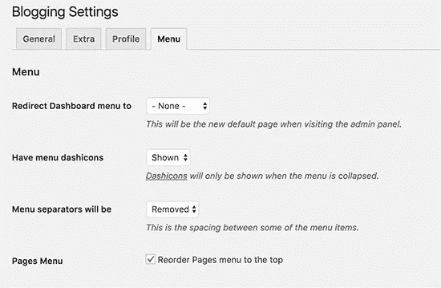
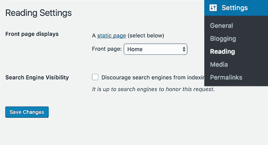

# 如何在 WordPress 中禁用博客功能

> 原文：<https://medium.com/visualmodo/how-to-disable-blog-features-in-wordpress-e6ac0862d964?source=collection_archive---------7----------------------->

# 您想禁用 WordPress 中的博客功能吗？你们中的一些人可能正在建立没有博客或任何博客相关元素的网站。在这篇文章中，我们将向你展示如何在不写任何代码的情况下轻松地禁用 WordPress 中的博客功能。

## 为什么在 WordPress 中禁用博客功能？

如果你想开一个博客，那么 WordPress 是最好的平台。许多[知名品牌使用 WordPress](http://www.wpbeginner.com/showcase/40-most-notable-big-name-brands-that-are-using-wordpress/) 创建各种网站，包括博客。

另一方面，有些网站真的不需要博客。WordPress 完全可以在不使用任何博客功能的情况下建立网站。

然而，那些博客功能的剩余部分，如帖子、评论、[类别和标签](http://www.wpbeginner.com/beginners-guide/categories-vs-tags-seo-best-practices-which-one-is-better/)，仍将在[管理区](http://www.wpbeginner.com/glossary/admin-area/)中可见。

如果你正在为一个从未使用过 WordPress 的客户建立一个网站，那么这会让他们感到困惑。

好的一面是，你可以禁用所有博客功能，把 WordPress 变成一个非博客 CMS 平台。

## 禁用 WordPress 中的博客功能

你需要做的第一件事是安装并激活 WordPress 插件中的[禁用博客。更多细节，请看我们关于如何安装 WordPress 插件](https://wordpress.org/plugins/disable-blogging/)的分步指南。

激活后，您需要访问**设置博客**页面来配置插件设置。

当你到达插件的设置页面时，你会注意到博客功能，比如帖子和评论，会从你的 WordPress 管理栏中消失。

默认情况下，该插件禁用所有 WordPress 博客功能，包括帖子、[类别和标签](http://www.wpbeginner.com/beginners-guide/categories-vs-tags-seo-best-practices-which-one-is-better/)、评论、作者页面、 [RSS 源](http://www.wpbeginner.com/beginners-guide/what-is-rss-how-to-use-rss-in-wordpress/)、 [pingbacks 和 trackbacks](http://www.wpbeginner.com/beginners-guide/what-why-and-how-tos-of-trackbacks-and-pingbacks-in-wordpress/) 以及许多不必要的项目。

在“设置”页面上，您可以有选择地打开和关闭功能。设置页面分为不同的选项卡。

在“常规”选项卡上，您可以启用或禁用帖子、评论、作者页面、RSS 源、pingbacks 和 trackbacks。

接下来，您可以切换到额外选项卡。在这里，您可以控制管理问候、表情符号支持、屏幕选项、帮助标签和更改管理页脚文本等项目。

“个人资料”标签允许你清理 WordPress 中用户帐户的个人资料区域。您可以显示和隐藏用户可以在其简档中更改的项目。

最后一个标签是菜单，它允许你控制 WordPress 管理菜单的外观。

当用户点击仪表板时，您可以选择用户在管理区域内的位置。您可以显示或隐藏图标、分隔符，并将“页面”菜单移到顶部。

不要忘记点击保存更改按钮来保存您的设置。

如果你还没有选择一个页面作为你的[静态首页](http://www.wpbeginner.com/wp-themes/how-to-create-a-custom-homepage-in-wordpress/)，那么你需要前往**设置阅读**页面。

注意:这个插件不会从你的 WordPress 站点删除任何东西。它只是隐藏它们。如果您有帖子和评论，当您停用插件时，它们将再次可用。

我们希望这篇文章能帮助你了解如何在 WordPress 中禁用博客功能。你可能也想看看我们的商业网站必须有 WordPress 插件的清单。

资料来源:https://visualmodo.com/