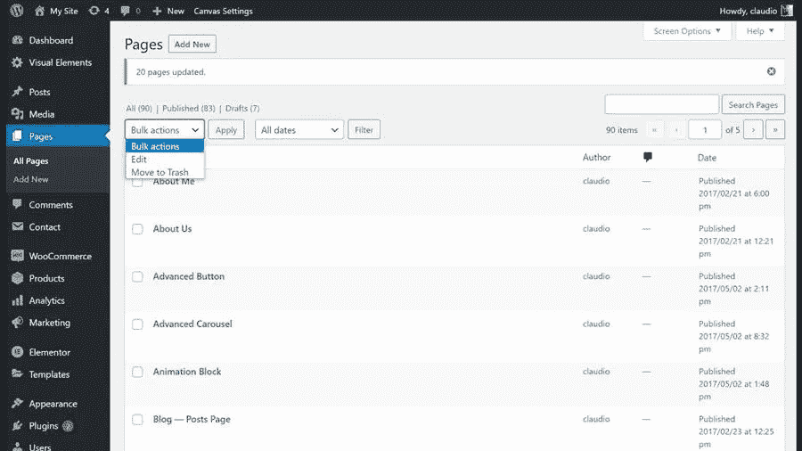

# 如何轻松地在 WordPress 页面或帖子中进行批量操作？

> 原文：<https://medium.com/visualmodo/how-to-do-bulk-actions-in-wordpress-pages-or-posts-easily-94346ba87276?source=collection_archive---------0----------------------->

在这篇博文教程中，你将学习如何在你的 WordPress 页面和文章上进行批量操作。或者自定义帖子类型，将所有页面移动到草稿、回收站。此外，set us 同时发布了许多页面。

你曾经在你的 WordPress 网站上有多个草稿页面，你需要改变它们来快速发布吗？你可能会发布一套新的服务或新产品。此外，你还删除了一系列教育博客文章。所以，你需要它们都在同一时间出版。因此，你将[节省大量时间](https://visualmodo.com/power-tips-optimizing-website-for-search/)。

# 如何在 WordPress 页面或帖子中进行批量操作？

嗯，你可以逐个浏览每个页面、产品或帖子，然后发布它们。您可以节省自己大量的时间，并按照我们的快速教程就如何批量打印页面，产品。因此，在不到 15 秒的时间内编辑帖子。

# 在 WordPress 中批量发布内容

当你需要快速修改你所有的文章或页面时，使用批量操作来批量编辑 WordPress 文章和页面的不同元素会很方便。

*   首先，选择你想要批量发布的所有页面、产品或帖子。
*   其次，从标有“批量操作”的下拉列表中选择“编辑”。
*   单击右边的应用按钮，将出现一个批量编辑框。
*   找到状态下拉菜单，然后选择已发布。
*   最后，选择右侧的蓝色更新按钮。

此外，似乎您可以将您的页面、产品或帖子批量更改为私人模式、草稿模式，甚至待定审核模式。

# 最后的话

现在，你已经在 5 个快速步骤中批量发布了你的所有页面。现在你可以集中你节省的时间来确保访问者被引导到你新发布的页面，或者确保你的 WordPress 网站上的那些页面被设计和开发来帮助增加你的[线索或销售](https://en.wikipedia.org/?title=Sales_lead&redirect=no)。

如果你在上面的步骤中遇到了困难，或者只是对你自己的网站有疑问，请随时联系我们布里斯班 WordPress 专家团队，我们非常乐意帮助你！