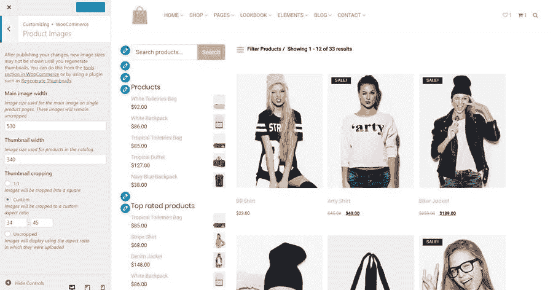

# 如何编辑 WooCommerce 图像比例

> 原文：<https://medium.com/visualmodo/how-to-edit-woocommerce-image-proportion-ff8f2f0164ad?source=collection_archive---------0----------------------->

你可能想知道如何编辑 WooCommerce 图片比例。因为图片是任何在线商店最重要的部分之一。出于这个原因，我们将解释如何以简单和容易的方式改变和编辑 WooCmmerce WordPress 插件图片的比例。

WooCommerce [3.3](https://woocommerce.wordpress.com/2017/12/11/wc-3-3-image-size-improvements/) 引入了一种新的更简单的方法来调整产品图片的大小。您现在可以从外观>定制> WooCommerce >产品中更改 WooCommerce 产品图片大小。最棒的是，你不必在调整大小后重新生成图像。从 WooCommerce 3.3 开始，你现在可以从外观>定制> WooCommerce >产品图片中裁剪、调整大小并自动重新生成图片。产品图片设置在 WooCommerce >设置>产品>展示到外观>定制> WooCommerce > [产品图片](https://visualmodo.com/image-seo-search-engine-optimization-for-images/)。

# 如何改变 WooCommerce 产品的形象比例？

按照以下步骤更改单个产品的图像尺寸:

*   转到外观>自定义
*   然后进入 WooCommerce >产品图片
*   在“主图像宽度”字段中输入您想要的宽度。
*   点击“发布”

单一或主要产品图片的高度将保持不被裁剪，不受裁剪设置的影响。WooCommerce 3.3 中引入的一个很酷的功能是自动调整缩略图大小。这意味着设置宽度后，所有产品照片将自动调整大小并重新生成背景。以前，我们必须安装“重新生成缩略图”插件来重新生成新分辨率的图像。

# WooCommerce 产品缩略图

按照以下步骤更改商店、目录或产品类别的照片尺寸:

*   转到外观>自定义
*   然后进入 WooCommerce >产品
*   在“缩略图宽度”字段中输入您想要的宽度。
*   您可以在“[缩略图](https://visualmodo.com/change-thumbnail-size-in-wordpress/)裁剪”中设置图像的高度
*   点击“发布”

# 商店产品图像高度设置

在 WooCommerce WordPress 插件中设置商店或目录图像的高度:

1.  首先，1:1:如果您选择 1:1，您的图像将被裁剪为 360 像素宽和 360 像素高(假设您在缩略图宽度字段中添加了图像宽度 360 像素)。
2.  其次，自定义:在自定义中你可以选择图像的长宽比。下面是一些流行的长宽比(1:1、5:4、4:3、3:2、16:9 和 3:1)。
3.  最后，未剪裁:图像的高度将保持不变。图像将以上传时的长宽比显示。

# Woocommerce 图片版总结

最后，我希望您现在了解如何处理这些变化，以及如何定制它们来满足您的需求。此外，请随意使用评论区来分享您的经验。