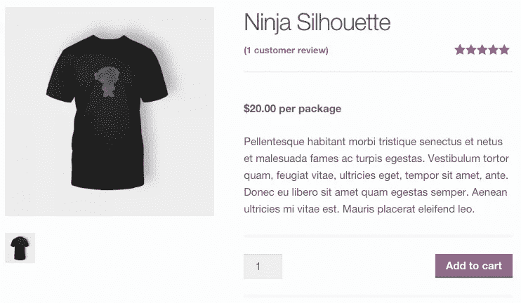
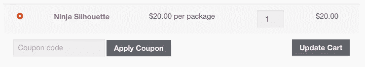
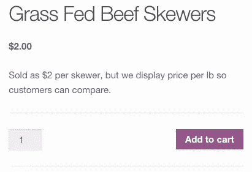
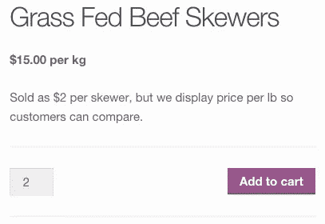
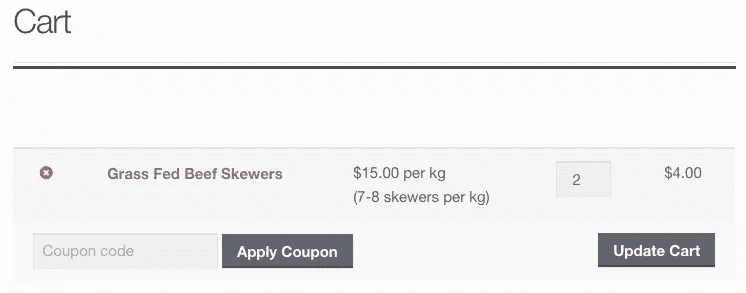
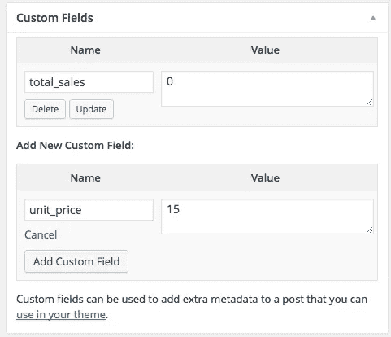
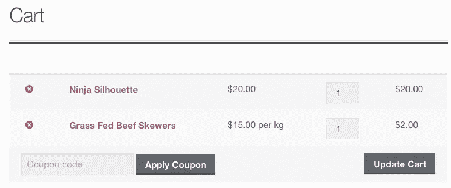

# 如何编辑 WooCommerce 价格显示

> 原文：<https://medium.com/visualmodo/how-to-edit-woocommerce-price-display-8f5681bd3eff?source=collection_archive---------0----------------------->

在本教程中，你可以看到如何改变 WooCommerce 的价格显示，这样你就可以使用 WooCommerce WordPress 插件在你的商店页面上显示不同的东西

因为价格是基于串肉扦的数量，所以我们希望“product”代表一个串肉扦，价格是串肉扦的价格。这样，顾客可以点 3 串烤串，并被收取正确的金额。

你当然可以改变价格显示，让顾客更容易比较不同产品的单价。如果几个产品有不同的单价，你需要一个更高级的方法来做到这一点，但是这里有一些方法可以帮助你开始调整 WooCommerce 的价格显示。

对于这两种方法，我们都需要使用几个重要的过滤器:

*   `[woocommerce_get_price_html](https://github.com/woothemes/woocommerce/blob/2.4.12/includes/abstracts/abstract-wc-product.php#L982)`:改变价格在商品和商店页面上的显示方式
*   `[woocommerce_cart_item_price](https://github.com/woothemes/woocommerce/blob/2.4.12/templates/cart/cart.php#L89)`:改变购物车表格中产品价格的显示方式(**不是**，因为这里只显示数量/总价，而不是单价)。

# 过滤所有产品的 woo 商务价格显示

假设您想要在所有产品价格的末尾添加一个标签，例如“每包”(如果您的产品是一包一包的或者是预包装的，这很有帮助)。您可以通过产品和购物车价格过滤器更改价格显示，将此标签附加到价格中:

[观生](https://gist.github.com/bekarice/0a148c189bdeccd187d9/raw/c5c60792db4383278c174dc3f4d46139a1d507d6/wc-product-price-display.php)[wc-product-price-display.php](https://gist.github.com/bekarice/0a148c189bdeccd187d9#file-wc-product-price-display-php)与❤由 [GitHub](https://github.com/) 主持

`woocommerce_get_price_html`过滤器将改变你的商店页面:

在您的单品页面上:

`woocommerce_cart_item_price`过滤器也会调整购物车内的显示:

# 过滤单一产品的 WooCommerce 价格显示

如果您想专门更改特定产品的价格显示，该怎么办？这可以用相同的过滤器来完成，因为它们还会传递额外的参数，让您有条件地更改价格。例如，让我们从问题中回到我们的串肉扦例子。虽然烤串以每串 2 美元的价格单独出售，但我们希望显示“每公斤 15 美元”的价格，以便顾客可以比较不同的产品。

这次我们将分离出这些过滤器，并使用两个函数来修改产品和购物车价格。我们将首先检查产品 ID，然后只更改该产品的价格显示。

函数 SV _ change _ product _ html($ price _ html，$ product){ if(337 = = = $ product-> id){ $ price _ html = '$ 15.00 每公斤'；} return $ price _ html} add _ filter(' woo commerce _ get _ price _ html '，' sv_change_product_html '，10，2)；函数 SV _ change _ product _ price _ cart($ price，$cart_item，$ cart _ item _ key){ if(337 = = = $ cart _ item[' product _ id ']){ $ price = ' $ 15.00 每公斤
(每公斤 7–8 串)'；}返回$ price} add _ filter(' woo commerce _ cart _ item _ price '，' sv_change_product_price_cart '，10，3)；

[观生](https://gist.github.com/bekarice/2cc60423043a243c090e/raw/ec017ae907642169851fa6ad0ab5c8e9623db708/wc-price-display.php)[wc-price-display.php](https://gist.github.com/bekarice/2cc60423043a243c090e#file-wc-price-display-php)与❤由 [GitHub](https://github.com/) 主持

第一个功能将改变我的产品页面:

除了商店陈列:

而第二个功能将根据我的新价格调整我的购物车显示:

然而，如果你有多个有单价的产品，这种方法会非常麻烦，我们可能不希望每个产品 ID 都有一个*的 switch / if 语句。相反，我建议使用**产品定制字段**来调整价格显示。我们可以使用 ID 来获取这个字段，这样可以节省大量的硬编码，因为我们将通过编程来获取这个字段。*

# 基于产品字段过滤 WooCommerce 价格显示

如果您必须更改某些产品的价格显示，而不是所有产品的价格显示，或者每个产品都有不同的单价，那么使用一个自定义字段将为我们提供一个简单得多的代码片段来实现，因为我们可以为每个产品添加该字段，然后只需使用我们的代码片段来检索该字段。

您可以为每个需要它的产品添加一个`unit_price`定制字段，然后在这里添加单价值。

添加自定义字段

添加后，您可以检索单价，如果为产品设置了单价，则调整价格显示以使用该单价和您的自定义标签:

id，'单价'，真)；如果(！empty(＄unit _ price)){＄price _ html = '【T2]'。wc_price( $unit_price)。每公斤'；} return $ price _ html} add _ filter(' woo commerce _ get _ price _ html '，' sv_change_product_html '，10，2)；//如果 unit_price 为 set function SV _ Change _ product _ price _ cart($ price，$cart_item，$ cart _ item _ key){ $ unit_price = get _ post _ meta($ cart _ item[' product _ id ']，' unit _ price '，true)，则更改购物车价格；如果(！空($ unit _ price)){ $ price = WC _ price($ unit _ price)。每千克'；}返回$ price} add _ filter(' woo commerce _ cart _ item _ price '，' sv_change_product_price_cart '，10，3)；

[观生](https://gist.github.com/bekarice/21f67d2a1eda138fe6f1/raw/e0d8c2d83ee1fc0d2490450d79f3722aa9c0f2ee/wc-change-price-display-custom-field.php)[wc-change-price-display-custom-field.php](https://gist.github.com/bekarice/21f67d2a1eda138fe6f1#file-wc-change-price-display-custom-field-php)与❤由 [GitHub](https://github.com/) 主持

(`wc_price()`是一个方便的小功能，用商店定价显示设置格式化数字，用吧！)

在这种情况下，只有设置了单价，产品/商店页面上的定价显示才会改变。如果没有，它们的价格将保持不变:

购物车中的商品也会出现同样的情况 WooCommerce 价格显示会根据商品是否在自定义字段中设置了 unit_price 而有条件地进行调整:

仅仅因为你以一种方式定价并不意味着你需要向顾客展示那个价格。有时改变价格显示可以给顾客更多关于产品包装的信息，或者可以让顾客更容易地比较产品。

所有的 [Visualmodo](https://visualmodo.com/) WordPress 主题都与 [WooCommerce](https://wordpress.org/plugins/woocommerce/) WordPress 插件完全兼容，并且还增加了令人惊叹的特殊功能。