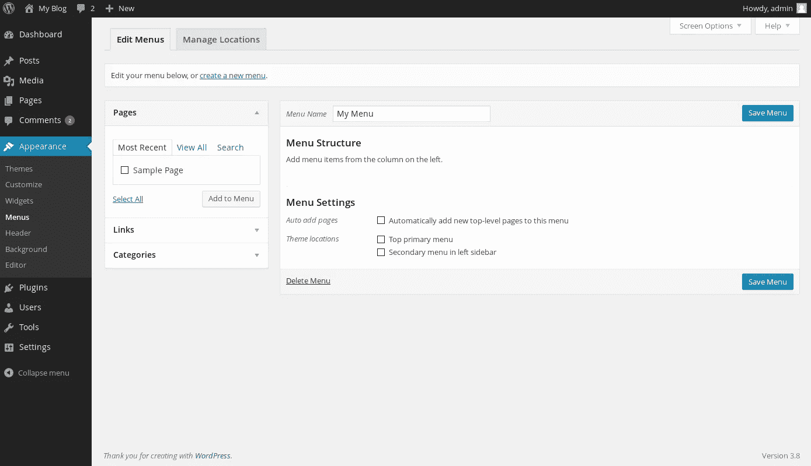
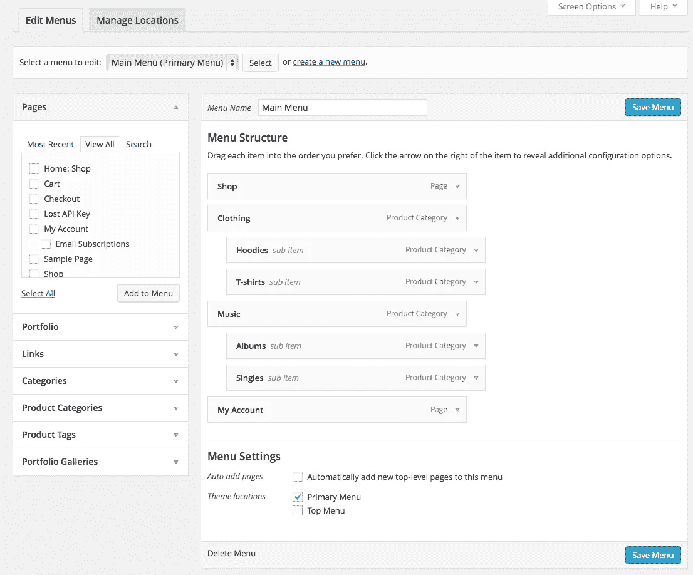
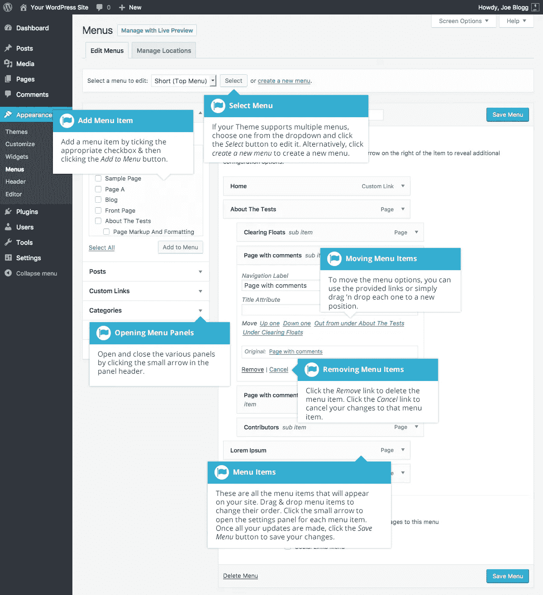

# 如何编辑 WordPress 菜单

> 原文：<https://medium.com/visualmodo/how-to-edit-wordpress-menus-17fd32f3c8f7?source=collection_archive---------0----------------------->

在 WordPress 中，自定义菜单功能使得添加和编辑父菜单项和子菜单项变得很容易。您可以创建自定菜单，以在网站顶部显示为导航菜单，或者放置在边栏或其他 widget 区域。这是一个创建和编辑自定义 WordPress 菜单的指南。

# 如何编辑 WordPress 菜单

菜单区位于[外观](https://visualmodo.com/) >菜单中。在这个区域中，你可以创建多个菜单，在你的网站的不同地方使用。

在屏幕的左侧，您可以从您的一个页面中进行选择，或者输入自定义链接，并将这些项目添加到菜单中。要创建新菜单，请按照下列步骤操作:

1.  在你的[管理面板中，进入外观>菜单。](https://visualmodo.com/)
2.  单击顶部带加号(+)的选项卡创建一个菜单。
3.  输入新菜单的名称，然后单击“保存菜单”
4.  单击要在菜单中显示的任何页面或类别旁边的复选框，然后单击“添加到菜单”
5.  如果你想要一个外部链接出现在菜单中(例如，到你的脸书或 Twitter 个人资料)，在自定义链接框中输入，为它创建一个标签，然后点击“添加到菜单”
6.  一旦你把所有你想在菜单上看到的项目都放在右边，拖放它们的名字来排序。
7.  如果您想要子菜单，请将这些项目拖到它们的父项目下面，并继续将它们稍微向右拖。当虚线框在父项下缩进显示时，将子菜单项放在适当的位置。
8.  点击“保存菜单”
9.  在窗口左上角的主题位置框中，单击下拉框中您希望菜单出现的位置。选择新菜单的名称，然后单击“保存”
10.  检查网站的正面，确保菜单出现在正确的位置。

# 如何在小部件区域插入菜单

如果你的主题不支持自定义导航菜单，菜单中的主题位置框会显示一条消息。然而，这并不意味着你不能在网站的边栏或其他窗口小部件区域使用菜单。此外，您可以选择在侧边栏中显示二级垂直菜单。要在小部件区域放置自定义菜单，步骤如下:

1.  按照前面的步骤创建自定义菜单。
2.  在你的[管理面板中，进入外观>部件](https://visualmodo.com/)
3.  将自定义菜单小部件从“可用小部件”区域拖放到所需的边栏中。
4.  从小部件内的下拉列表中选择您的菜单，然后单击“保存”
5.  哒哒！现在你的[侧边栏](http://theme.visualmodo.com/rare/)中有了一个自定义菜单部件！

