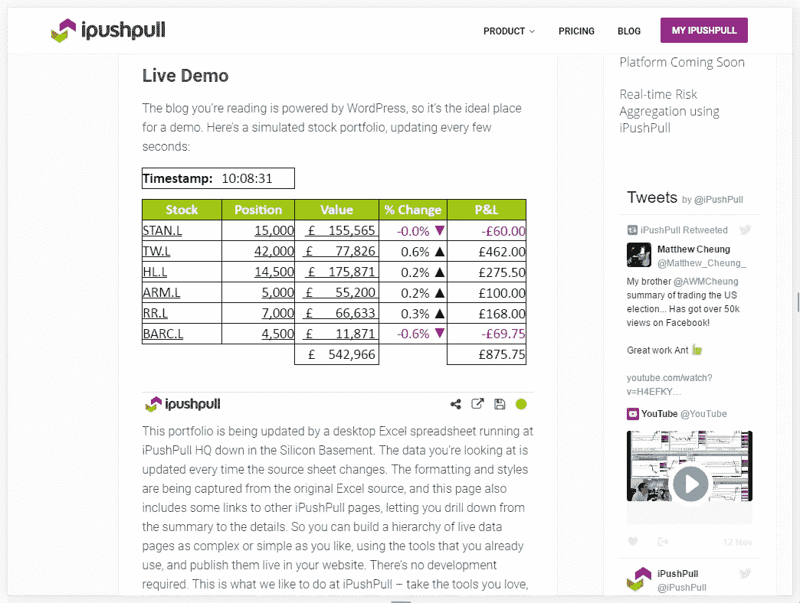
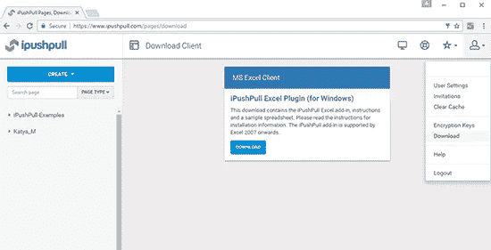
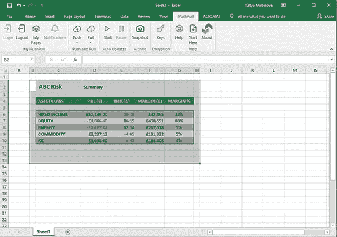
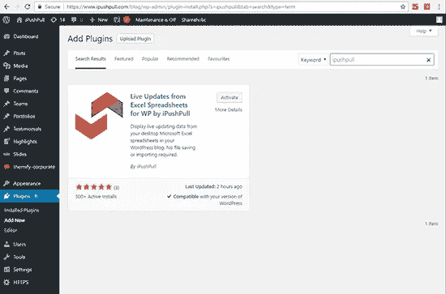

# 如何在 WordPress 中嵌入 Excel 中的数据

> 原文：<https://medium.com/visualmodo/how-to-embed-data-from-excel-in-wordpress-edbf515e5097?source=collection_archive---------0----------------------->

无论你是使用微软 Excel 来创建小表格、大数据集、图表还是动态数据函数，近 10 亿用户都会同意它是最好的电子表格软件，然而，当涉及到在网站上显示 Excel 数据时，它并没有想象中那么简单。我们将本教程整合在一起，向您展示一条更简单的路线。

# 如何将我的 Excel 数据导入 WordPress？

有各种不同的解决方案可以完成这项工作，但是没有一个将数据直接链接到你的页面。通常，您需要上传文件或在 Excel 中重新创建您已经创建的文件。

**把你的电子表格连接到 WordPress，就没有必要再离开 Excel 了！**

[ipushpull](https://www.ipushpull.com/) 是一款 SaaS 应用，提供一个高级 WordPress 插件，可以将 Excel 直接连接到 WordPress。它允许你发布任何数据(动态的或静态的),这些数据位于 Excel 电子表格中，需要显示在 WordPress 页面上。

一旦你的数据被连接，你所做的任何改变都可以在一秒钟内自动更新，或者当你选择按下按钮手动发布时。

显示数据再简单不过了，因为你**不需要任何** [**HTML**](https://visualmodo.com/) **知识**。WordPress 中一个易于使用的弹出窗口让你选择你的页面并插入一个短代码。ipushpull 为您完成所有繁重的工作，一旦您建立了一个页面，您所有的工作都在 Excel 中完成。

你可以在 WordPress 上发布排行榜、工作轮值表、财务数据、研究图表或任何你喜欢的东西，而不用离开 Excel。

*注意:ipushpull 提供 7 天免费试用，付费计划起价 7 美元/月。*

# 如何在 WordPress 页面中嵌入 Excel 数据

**第一步——注册一个 ipushpull 账户**

您首先需要建立一个 ipushpull 帐户，这可以在[这里](https://www.ipushpull.com/join)完成。有一个免费的 7 天试用期，套餐起价仅为每月 7 美元，价格页面上列出了所有功能，但请先试用免费服务。

**步骤 2——下载并安装 Excel 的 ipushpull 插件**

一旦你的帐户设置好，登录并下载 Excel 插件，它将用于连接你的电子表格到你的 WordPress 页面。打开它，按照安装说明进行操作。

**第三步—在 Excel 中登录 ipushpull**

安装完成后，打开 Excel。ipushpull 创建一个 Excel 功能区，一旦您登录到功能区，在您的电子表格中选择您希望在您的网站上显示的数据范围。

**步骤 4a —准备好您的数据网络**

点击推送按钮(功能区中的手动推送)，在打开的对话框中创建一个[新页面](https://visualmodo.com/)并命名，然后点击推送。你的数据现在可以在加密的 ipushpull 云平台上获得，这意味着它可以嵌入到网络上。(有关实时数据和图表，请参见下面相应的章节)。

**第五步——激活 WordPress 中的 ipushpull 插件**

接下来让我们激活 WordPress 中的 ipushpull 插件，它将允许你在你的 WordPress 页面中显示你的数据。

在 WordPress 左侧面板中找到插件，然后添加新插件，搜索 ipushpull 并点击“立即安装”和“激活”。这将把 ipushpull 添加到您的插件中，并将 ipushpull 短代码生成器添加到您的页面菜单中，以便快速方便地访问。

**第六步——将你的 Excel 数据嵌入 WordPress**

导航到需要嵌入数据的页面。在 WordPress 页面菜单中点击你的新 ipushpull 图标。

在下拉列表中选择您的文件夹和页面，然后调整页面的高度和宽度。不要忘记“使页面公开”，这允许页面被普通观众查看(否则查看者也将需要 ipushpull 帐户来查看——尽管如果您正在寻找增加的安全性，这可能是您想要的)。单击插入短代码完成。

一旦发布，您的页面现在将具有嵌入的数据，这在预览中也是可用的。

# 如何在你的网站中嵌入实时流媒体数据

如果你在 Excel 中有实时数据，它现在可以在线托管。这是通过 ipushpull 的实时推送功能完成的，一旦数据被嵌入到 WordPress 或网页中，该功能还可以用于从 [Excel](https://visualmodo.com/) 创建自动更新。

动态数据与上述步骤的唯一不同之处在于，当您将数据“推”到 ipushpull 时，需要在 Excel 中选择不同的选项。因此，请执行以下操作，而不是第 4 步:

**步骤 4b——让您的实时数据为网络做好准备**

选择你想嵌入到你的 WordPress 页面的实时数据范围，导航到 ipushpull 功能区的按钮，点击按钮下半部分的下拉箭头。

选择实时推送，并在新建对话框中创建新页面或选择安全托管数据的页面。点击直播推送。

对于弹出的对话框，选择数据外的一个单元格来显示实时推送的状态。这将告诉你你的数据是否正在更新。

接下来，在 ipushpull 功能区中单击开始。你可以随时暂停你的更新，用同一个按钮。

一旦您以选定的时间间隔在您的网站上发布了动态数据，它将继续从 Excel 更新，因为当 Excel 运行时连接是活动的。

# 如何在 WordPress 页面中嵌入图表或图形

就像数据一样，您也可以在 Excel 中嵌入您创建的任何图表或图形。通过 ipushpull 的推送功能，所有的 Excel 图表和图形都可以嵌入。图表与第一部分中概述的步骤没有任何不同，因为它就像手动数据一样发布。对于步骤 4，说明如下:

**步骤 4c——准备好您的图表或图形网络**

选择您想要嵌入到您的[网页](https://visualmodo.com/)中的图表或图形。单击功能区中的推送按钮(手动推送)，在打开的对话框中选择页面或创建新页面，然后单击推送。

您的图表/图形现在可以在加密的 ipushpull 云平台上使用，这意味着它可以嵌入到网络上。

# 最后的想法

太好了！你现在知道如何将 Excel 中的数据嵌入到 [WordPress](https://visualmodo.com/) 中。在 WordPress 中嵌入数据比以往任何时候都容易，这意味着你不必为了网页的目的而重新创建你的数据或图表。你可以直接从这个软件中发布它们，而不需要修改代码。