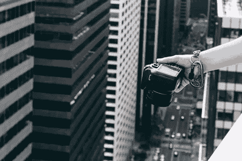
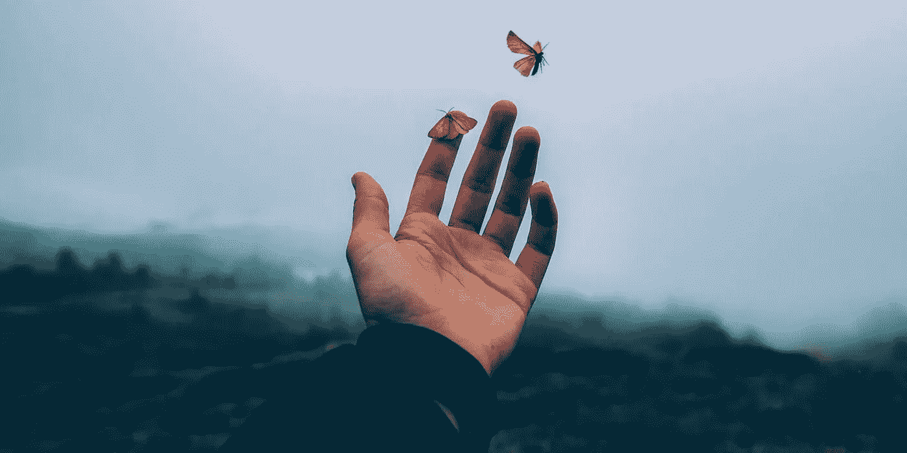
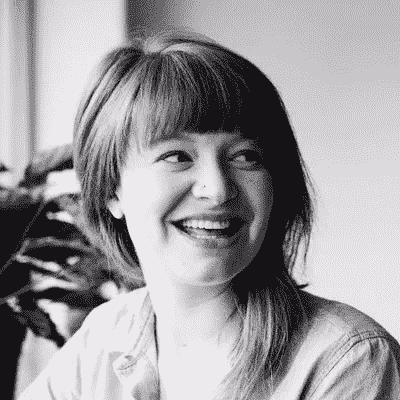

# 如何在网上找到最好的图片

> 原文：<https://medium.com/visualmodo/how-to-find-the-best-images-online-977f2e75e030?source=collection_archive---------0----------------------->

## 在您的网站上使用

网站为你提供了无限的机会，从销售商品或服务到展示创意组合或管理博客。但是不管目的是什么，包含好的、吸引人的视觉内容是至关重要的。所以，一个大问题是，如何在网上找到最好的图片。

就像吸引人的橱窗展示可以吸引顾客进入商店一样，吸引人的图片也可以让浏览者锁定你的网站。但是你不需要有一个无底洞的预算和一个圆滑的设计机构来获得好的结果。请继续阅读，了解如何为您的网站获取最佳视觉效果的内幕…

# 如何在你的网站上找到最好的图片

# 为什么要在内容中使用图片？

那么为什么视觉内容对你的网站如此重要呢？

不幸的是，无论你写的内容多么有趣或有用，如果它没有一个吸引人的、相关的形象，那么它就不会吸引你的读者。由[quick prout](https://www.quicksprout.com/2015/03/20/the-ultimate-guide-to-creating-visually-appealing-content/)进行的一项研究显示，带有相关图片的内容比没有相关图片的内容多获得高达 94%的浏览量。

这可能是一个简单的改变，却能带来巨大的变化。

在网站内容中包含图片也是提高搜索引擎排名的好方法。一旦你选择了一张相关的照片，一定要用合适的 alt 标签和标题来标注。这将被搜索引擎算法读取，这一切都有助于提高你网站的排名[潜力](https://visualmodo.com/)。

# 我如何选择正确的图像？

# 质量胜于数量

[火球威士忌](http://fireballwhisky.com/)是一个我们都知道的品牌并且(取决于你的个人口味！)爱。但是看看他们 Instagram 上的这张照片:

颗粒、光线不足、模糊——这不是你所期望的国际品牌的品质，对吗？

为你的网站选择高质量高清晰度的照片是至关重要的。2018 年，糟糕的摄影没有任何借口。这会降低你网站的价值，让它看起来不专业，这几乎肯定会对你的品牌产生负面影响。

有一些免费的库存照片网站，如 [Pexels、Pixabay 或 Unsplash](http://makerbook.net/photography/) ，有质量好的照片供你选择。

如果你用的是自己的照片，考虑自学一些照片编辑技巧来微调你的照片。你想要醒目、干净、容易吸引评论和分享的图片。

# 追求原创

今天的观众越来越意识到库存照片。你只需要看看那个独自吃沙拉的[女人](http://knowyourmeme.com/memes/women-laughing-alone-with-salad) meme，一张如此知名的股票照片，它成为了一个互联网笑话。

今天，顾客们已经厌倦了看到同样的人摆同样的姿势，他们需要创意。选择图片时，试着稍微偏离常规，比如浏览 [Flickr](https://www.flickr.com/) (确保你在选择前征得同意)。或者自己拍一些照片，创造一些真正原创的图像。

# 选择能强化你品牌的图片

就像你的文字内容是根据你自己的品牌创建的一样，你的视觉内容也应该根据它来选择。如果你正在建立一个作品集，你会希望你的照片干净而专业。或者，如果你正在为一个街头服饰品牌创建一个在线商店，你可能会选择一个更前卫、更都市的风格。

想想你的网站的目的，你的浏览者会从中得到什么，然后考虑如何在视觉上传达这些。

# 唤起情绪反应

同理，你的视觉内容应该和你的观众交流。根据你网站的功能，你会希望你的照片能引起浏览者的情感反应。你想让他们有灵感吗？[兴奋](https://visualmodo.com/)？好奇吗？

再次，考虑你希望你的网站实现什么，然后开始寻找最能反映这一点的图像。一个很好的地方就是 [Burst photos](https://burst.shopify.com/) ，它的收藏功能可以让你根据特定的主题或类别在线浏览图片。

# 要避免的常见错误

感觉不太自信？以下是人们在为网站选择照片时最常犯的一些错误，以及如何避免这些错误:

*   **未经许可使用照片**。除非这是你自己的照片或者来自免费的图片网站，否则你需要征得版权所有者的同意。即使是免费的库存照片，一些网站要求你在使用时引用它们或摄影师，所以一定要事先检查。了解[你的权利和责任](http://thevisualcommunicationguy.com/2014/07/14/can-i-use-that-picture/)。
*   **包括无关图像**。这可能是你发现的从太空看地球的惊人照片，但如果你的网站是一个烹饪博客，那么你可能需要重新考虑。保持与讨论的内容相关。
*   **选择平淡或易被遗忘的照片**。它是免费的，相关的，你得到了许可——但是如果它没有抓住观众，他们会看一眼就离开。不要满足于你找到的第一张照片，继续寻找，直到你找到一张让你印象深刻的照片。如果它吸引你，它也会吸引你的观众。
*   **忽略对所有设备进行优化**。随着越来越多的人使用他们的手机或平板电脑上网，你的网站在各种屏幕上都能正常工作是很重要的。在您的网站上线之前，检查以确保所有类型的设备都能正常工作。

说到网站建设，你需要考虑一系列因素。目的、功能和书面内容都需要考虑。但是贯穿所有这些的关键部分是意象。视觉内容为网站的其余部分提供了背景，所以它值得做好。选择为所有设备优化的吸引人的相关图像，确保在必要时请求许可并给予认可。这是一件简单的事情，但从长远来看，它会让你和你的网站受益匪浅。

## 维多利亚·格林

自由撰稿人，品牌顾问和咖啡专家，维多利亚格林可以在她的博客上找到世界上所有最热门的营销，设计和电子商务新闻。Vicky 热衷于让人们从他们的电子商务商店中获得最佳效果。