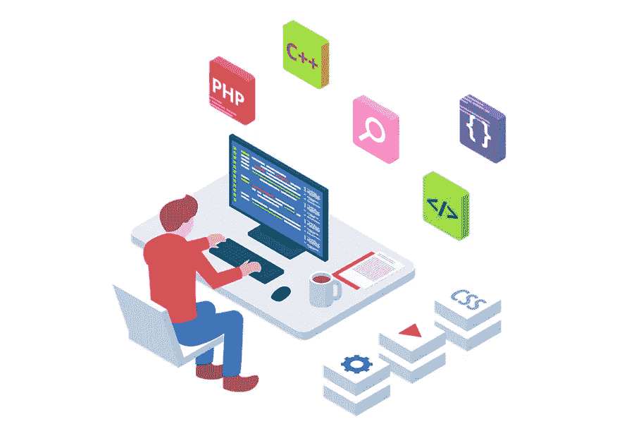

# 如何在你的预算内找到最好的网站改版设计师？

> 原文：<https://medium.com/visualmodo/how-to-find-the-best-website-re-designer-within-your-budget-e8dda007f57?source=collection_archive---------0----------------------->

总有一天，即使是最好的网站也需要进行设计改造。作为一个企业主，你可能在最初的设计上投入了大量的营销预算，这一定给了你很好的投资回报。在这篇文章中，你将学习如何在你的预算内找到最好的网站重新设计者。

然而，随着技术的飞速发展，消费者行为的不断变化，以及市场的不断变化，您需要一切可用的资源来达到最佳性能。

网站重新设计是一个长期的项目，需要规划、策略和创造力。它充满了挑战、挫折、惊人的创造性突破，以及项目结束时的成就感。

尽管您之前已经经历过这个过程，但仍有许多新的变量需要考虑。这些可能包括技能组合、小时费率、要使用的定制模板等。，这会影响成本、花费的时间、最终的观感等。

# 你怎么知道你需要重新设计网站？

结果与预期不同步:当你的网站没有做好营销工具的工作，转化率太低，跳出率太高，是时候考虑改头换面了。也许不需要彻底检修，所以您可以查看较弱的部分并解决那里的问题。

品牌标识变化:如果你改变了你的标志或视觉效果，加入了一套新的产品或服务，或者你的公司被认可/奖励，你的网站应该反映这些变化。这意味着你的营销目标也可能发生微妙的变化。网站重新设计可以解决这些问题。

老式的外观和感觉:即使是三年前创建的网站对他们来说也可能有过时的外观和感觉。它们可能没有融入新的设计趋势或吸引新的目标受众。虽然你不想成为时尚的奴隶，但反映现代设计是展示你的业务与当今时代同步的一种方式。关注社交媒体，获取网站上的实时反馈。

# 寻找网站重新设计者:其他需要考虑的因素

未优化:早期创建的网站可能无法完全响应客户访问它们的不同平台。你需要在其他设备上有一致的外观和感觉，否则你会失去客户。如果网站没有进行 SEO 优化，它在搜索引擎页面上就不会有很高的排名。高级内容管理系统(CMS)可以提升你的搜索引擎页面排名。

速度:超过 40%的访问者倾向于放弃一个上传时间超过 3 秒的网站。如果你的网站上传速度很慢，是时候改头换面了。

安全性:是一个大问题，因为小型企业和大型企业一样容易受到黑客和恶意软件的攻击。您的客户需要感觉到他们的数据是安全的，重新设计可以提供最新的保护。

# 如何在你的预算内找到最好的网站重新设计者

了解市场以理解重新设计的平均成本是很重要的。不同的设计师，任务的复杂程度，经验和技能等，费用会有很大的不同。

# 寻找网站重新设计者:定义你的重新设计目标

在你与[设计师或设计公司](https://visualmodo.com/top-4-ux-tips-for-your-next-magento-website-redesign/)交谈之前，花些时间弄清楚并记录下你重新设计的理由。这样更容易将你的想法传达给设计师。你必须包括你希望从设计中完成什么，目标受众，和时间框架。

# 从一些公司获得评估

不要盲目地将工作分配给你以前的设计师或刚刚成立设计公司的侄女或侄子。列出几个可能的候选人名单，分别与他们会面，清楚地了解他们的技能、投资组合、薪酬和沟通风格。

# 定价因素

基于工作的性质/范围、时间估计、网站的大小、设计师对复杂性的评估、他们是否计划定制或使用模板，开发商和代理商有不同的价格带。总的来说，目前的价格从 500 美元的免费 WordPress 设计到 10 万美元的完全定制产品不等。这些价格可能不包括支持、托管或营销服务。

# 寻找网站重新设计者:影响定价的功能

在设定预算时，必须考虑一些因素。这些包括所需的独特页面模板的数量、所需的定制量、管理内容、内容审核/策略/制作、内容迁移和优化。如果你的是一个大项目，它肯定会用掉更多的时间，也有更大的机会出现错误和反复。尝试为较大的项目协商一个固定的支付价格方案。

# 经验和技能:

不要低估一家声誉卓著的网页设计公司的价值。它们可能要付出一定的代价，但从长远来看，你最终会得到一个更加精简的。专业外观的产品。与专业设计师合作意味着他们有现成的系统，更有可能遵守期限和预算。如果你签的是按小时计费的合同，一个有经验的设计师更有可能创作出更有技巧和实用性的作品。一般来说，按小时支付给专业设计师是个不错的计划，但是对于经验不足的设计师来说是固定的。

# 寻找网站重新设计者:需要注意什么？

*   如果你有经济限制，设定你的预算，但是要协商。这样，只有那些觉得自己符合这一要求的人才会申请这份工作。
*   避免那些有令人眩晕的动画和视频的设计。这些不仅仅是讨厌；它们也会影响你的上传速度。
*   期待为高质量、独特的内容付出更多，因为这是让你的网站令人难忘的原因。创建强大的反向链接，并在社交媒体上引起轰动。
*   作为一个客户做好你的尽职调查，因为当你购买一个重新设计项目时，你就是这样的。
*   询问发布后支持。有一个很棒的网站真是太好了。但是如果你的设计公司在有问题的时候不帮你，你就有麻烦了。

你需要的是一个反映你的产品、价值观和品牌的网站。因此，随着您的业务增长，让您的客户/访问者了解最新信息。真实、准确和可靠的信息，并产生健康和可靠的线索。