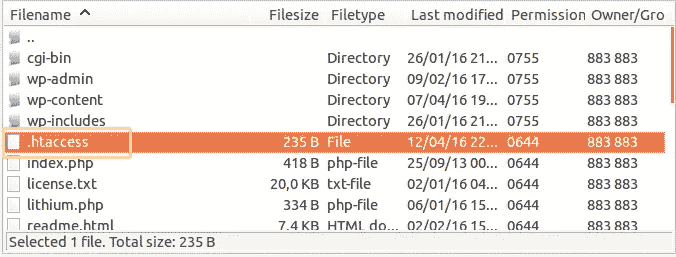

# 如何修复 403 禁止错误

> 原文：<https://medium.com/visualmodo/how-to-fix-403-forbidden-error-993a6c2d9562?source=collection_archive---------0----------------------->

## 在 WordPress 中

每个上网的人都曾在某个时候遇到过 HTTP 状态错误。然而，很少有比在你自己的 WordPress 网站上得到一个 *403 禁止*错误更令人沮丧的了。考虑到你为一个主机服务付费，并且可能自己安装 WordPress，当你被拒绝访问时，这是非常令人讨厌的。

幸运的是，这个错误不是你的服务器突然变得有知觉并决定接管你的网站的副产品(至少，据我们所知不是)。这只是由于缺乏必要的权限而拒绝请求的问题，最常见的是由于你的 WordPress 安装中的一些小故障。事实上，你可能会花更多的时间去找出错误所在，而不是去修复它。

既然您的担心已经消除，让我们回顾一下这个错误的潜在原因(和修复方法)。

# 如何修复 403 禁止错误？

# 步骤 1:检查您的文件权限

正如我们在本文开头提到的， *403 禁止*错误是服务器由于缺乏适当的权限而拒绝请求的结果。因此，通过检查你的 WordPress 文件是否有正确的权限来开始你的故障诊断是有意义的。

首先，为了检查这一点，您需要使用一个 FTP 管理器。出于本指南的目的，我们将与 [FileZilla](https://filezilla-project.org/) 一起工作，如果你需要任何帮助来设置它或学习基础知识，看看[这篇最近的文章](https://www.elegantthemes.com/blog/tips-tricks/how-to-fix-the-500-internal-server-error-on-your-wordpress-website)，在那里我们涵盖了你需要知道的一切。

一旦你在这方面做了设置，你将会想要使用你的登录凭证访问你的 FTP 服务器，然后转到你的 WordPress 安装文件夹。如果您以前没有这样做过，它们位于 *public_html* 文件夹中——您所要做的就是双击它:

在 *public_html* 里面，你会发现很多文件夹和文件，它们代表了你的 WordPress 网站的主干。其中的每一个都有自己的权限设置，用一个数值告诉您哪个用户组可以进行哪些交互。比如每个 WordPress 文件夹默认都应该有一个 *755* 的设置，在 FileZilla 上很容易看到:

默认情况下，permission 列应该会出现，但是如果由于某种原因没有出现，您只需右键单击列的标题就可以激活它。此外，您可以简单地右键单击每个文件或文件夹，并选择*文件权限*选项。然后，您可以修改权限的数值，或者手动更改每个用户组的设置，这将自动更新权限值。

**警告:**这不是那种你想为了好玩而去调整的东西。设置错误的权限很容易削弱你的网站，并导致 *403 禁止*错误情况。

现在，如果出于某种原因，你的 WordPress 安装的默认权限值被改变了，你必须手动恢复它们，以使 *403 禁止*错误消失。请记住，更改您的权限设置不一定会导致这个特定的错误或任何特定的错误，但从安全角度来看，它仍然可能使您的站点易受攻击。一旦我们完成了恢复默认权限值的过程，我们将谈一谈为什么这些特定的值是可取的。

现在，让我们看看你的 WordPress 文件夹。为了提高效率，我们建议您一次选择所有用户，以便一次性更改他们的权限。一旦你选择了它们，右击并选择*文件权限*选项。

一旦进入，如果他们的权限数值不是 *755* ，将其更改为该值并点击 *OK* 。

就这么简单！现在让我们对位于 *public_html* 周围的单个文件重复相同的过程，它们都应该被设置为 *644* 。将它们全部选中，进入*文件权限*，如果该值还没有在 *644* 中设置，请更正。

很简单，但是我们还没有完成。现在，您必须检查您修复了权限的文件夹中的文件的值是否设置正确。我们建议你特别注意你的 *wp-admin* 、*主题*和*插件*文件夹，因为它们包含了一些最重要的 WordPress 文件。

现在，你可能想知道为什么默认选择这两个特定值， *755* 和 *644* 。长话短说，这些是代表哪个组拥有哪个权限的代码，正如你在摆弄 FileZilla 的*文件权限*选项卡时可能已经猜到的那样。 *755* 代码允许每个用户读取和执行其中包含的文件，但只有文件的所有者保留写入权限。

现在，就权限而言，当我们说所有用户都有执行特权时，我们只是使用官方术语来表示这些文件夹实际上可以被服务器访问。只要不是所有用户都有写权限(这是一个大忌)，你的网站应该是没问题的。当涉及到单个文件和 *644* 时，该代码意味着文件对所有用户都是可读的，但只能由它们的所有者修改或编写。

现在我们已经成功地恢复了正确的文件和文件夹权限，是时候检查一下 *403 禁止*错误是否已经消失。如果不是这样，是时候尝试一些其他的事情了。

# 第二步:检查你的。htaccess 文件

你的*是有可能的。htaccess* 文件被破坏，这反过来会导致一个 *403 禁止*访问错误出现在你的 WordPress 站点上。好消息是修复了一个损坏的*。在你信任的 FTP 管理器的帮助下，htaccess* 文件将只花你几分钟的时间。

如果你按照我们的指南一步一步地做，你的 FTP 管理器应该仍然是打开的——否则，重新启动它，并转到你的 WordPress 根文件夹。在那里你会找到*。我们正在寻找的 htaccess* 文件，为了安全起见，我们将对它进行备份。右击该文件并选择*下载*选项。然后它将被下载到您的本地文件*目录中设置的文件夹:*

一旦在您的计算机上安全存储了一份副本，继续删除*。htaccess* 文件。不要担心，我们很快就会恢复它，你应该仍然可以访问您的仪表板。

成功删除文件后，请再次尝试访问您的站点，看看错误是否仍然存在。如果是这样，我们可以丢弃*。htaccess* 文件作为问题的根源——在这种情况下，只需通过 FTP 将你制作的副本重新上传到你的 WordPress 根目录。

然而，如果删除文件*能够解决您的问题，那么它很可能已经损坏了——在这种情况下，我们必须生成一个新的副本。为此，访问您的仪表板，跳转到*设置*，并选择*永久链接*选项。*

在里面，你可以继续更新你的设置，如果你想改变什么的话。顺便说一句，重要的是要注意，更新你的永久链接结构有时会导致一个 *403 禁止*错误，因为你设置的规则被插入到了*中。htaccess* 文件。

一旦您感到满意，只需点击*保存更改*，这将自动生成一个全新的*。htaccess* 文件:

# 步骤 3:检查你的插件

我们已经在[之前的指南](https://visualmodo.com/blog/)中详细介绍了这一点，但让我们快速回顾一下，以防您错过。很容易发现 *403 禁止*错误是否是由一个有缺陷的插件引起的，而不必单独停用每个插件。

你所要做的就是立刻停用它们，如果错误消失了，你就可以继续完成这个无聊的任务，首先精确定位是哪个插件导致了错误。

为了实现这一壮举，你需要做的就是通过 FTP 重新定位到你的插件目录，并改变它的名字，如下例所示。

这将导致 WordPress 找不到你的插件，从而导致它们的停用。完成后，继续再次检查错误是否消失——如果是这样，恢复文件夹的名称，然后更改里面每个文件夹的名称，以便停用它们，直到找到罪魁祸首。

# 结论

正如你所看到的， *403 禁止*错误实际上是一个麻烦，而不是什么可怕的事情。如果你遇到这个问题，你很有可能在几分钟内通过一点小修小补就能解决它——还有我们向导的帮助。

让我们快速回顾一下。如果你的服务器反对你，你在你的 WordPress 网站上面临一个 *403 禁止*错误，你需要做的就是遵循这些步骤:

1.  检查您的用户权限。
2.  检查你的*。htaccess* 文件。
3.  检查你的插件。

你曾经在你的一个站点中遇到过 *403 禁止的*错误吗，在你的情况下是如何修复它的？与我们分享你的故事，并订阅下面的评论区！