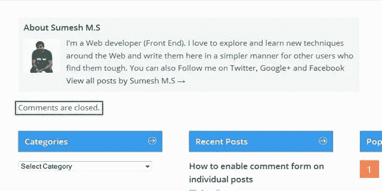
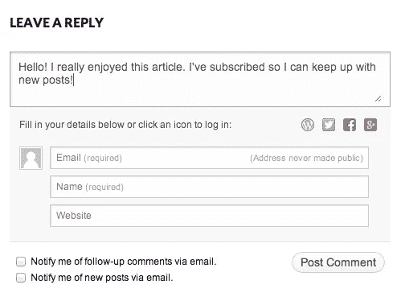

# 如何修复封闭评论问题

> 原文：<https://medium.com/visualmodo/how-to-fix-closed-comments-problem-7003d4f75a6c?source=collection_archive---------0----------------------->

在 WordPress 中

如何修复 WordPress 中封闭评论的问题？最近，我注意到我的一些旧帖子显示“对此条目的评论已关闭”，这意味着访问者将无法对这些帖子发表评论。但我没有禁用评论选项或任何其他设置。

# 如何修复 WordPress 中关闭的评论？

经过一番研究，我找到了问题所在。当我在谷歌上搜索这个术语时，我意识到许多 WordPress 用户也面临这个问题。因此，这里有一个快速指南来修复帖子下面的“评论被关闭”。

# 修复 WordPress 中的“评论被关闭”问题

您需要更改两个设置来解决此问题。

首先，进入你的 [WordPress](https://visualmodo.com/) 仪表盘，点击“设置”标签中的“讨论”。(跟随截图)

现在[选中](https://visualmodo.com/)复选框“允许人们对新文章发表评论”，取消选中复选框“自动关闭对超过*天的文章的评论”。

然后点击“保存更改”。

现在让我们看看要配置的第二个设置。

转到显示“评论已关闭”的帖子并编辑该帖子。在[仪表盘](https://visualmodo.com/)的右上方，您会看到‘屏幕选项’。点击它。

屏幕选项将滑出。确保选中了“讨论”复选框。

现在向下滚动到底部，你会在那里找到一个“讨论”选项。确保选中“允许评论”复选框。并更新您的帖子。

就是这样。你完了。现在，人们可以对您的[博客](https://visualmodo.com/)帖子发表评论，这些帖子之前显示为“评论已关闭”。

评论可以让你网站的访问者与你和其他人进行讨论。当你在[页面](https://codex.wordpress.org/Pages)或帖子上激活评论时，WordPress 会在你的内容后插入几个文本框，用户可以在那里提交他们的评论。一旦您批准了评论，它就会出现在您的内容下方。无论你是想定制你接收评论的方式，还是调整你的网站显示评论的方式，WordPress 都提供了一套完整的选项来为你的网站访问者建立一个社区。