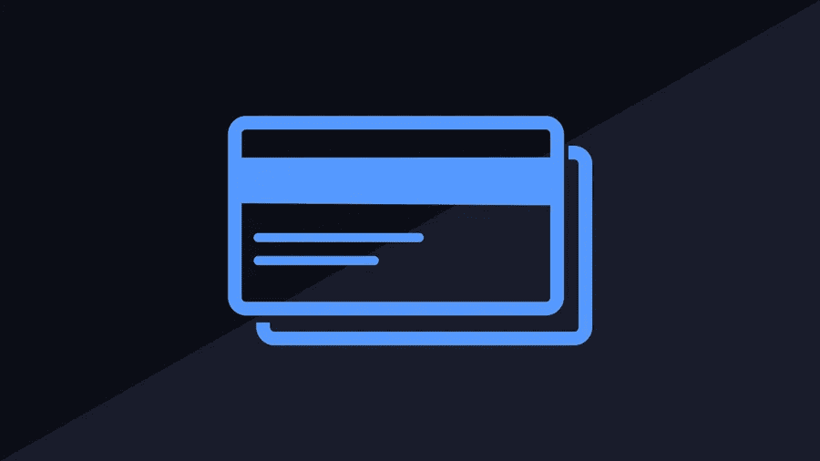

# 如何修复自己的信用报告？

> 原文：<https://medium.com/visualmodo/how-to-fix-your-credit-report-e9ce6df6bddb?source=collection_archive---------1----------------------->

事情失去了你的手，搞乱了你的信用报告，你迷失和沮丧，不要担心有很多方法可以修复你的信用报告。有许多信用修复公司指导你通过保持健康的报告。下面列出了让这个过程不知疲倦的方法:

# 如何修复自己的信用报告？

# 获取您的信用报告副本:

首先，要求一份信用报告很简单。像 Equifax 和 Experian 这样的信用机构会把报告发给你。有许多其他免费服务可供查看，使这项任务成为可能。

# 负面报告的查找:

其次，彻底研究你的报告会让你发现对你分数的负面报道。您可以通过提供的在线渠道轻松地报告并详细讨论您的问题。有些人可能不需要很长时间，但很少有人需要更长时间才能从信用报告中删除。不放弃就报。

# 及时付款以修复您的信用报告

准时付款肯定会给你的报告增加良好的信用评分。尽量在规定的时间内付款。

# 争议无关的逾期付款记录:

任何地方都可能发生人为错误。因此，有可能出现不正确的付款输入。对条目保持警惕，并提出争议以改进您的报告。

# 保留您的旧信用卡:

永远不要关闭你的旧信用卡账户，因为这将立即影响你的信用评分，从而降低你的总体平均信用记录。

# 与配偶共享账户:

从您的合作伙伴处获得共享他/她的帐户的授权将自动提高您的信用评分。但是如果你的配偶没能保持一份像样的报告，也会影响你的分数。

# 摆脱未偿余额，以修复您的信用报告

我知道还清你的欠款是一项艰难的工作。但是，做一项运动，如果你不得不出售一些东西来摆脱未付款，那么就这样做，以改善信用记录。这将降低你未来计划的利率。

# 申请新的信用卡:

只要信用卡上没有余额，新的信用卡批准将立即增加你的信用评分。此外，尽量从你开户的同一家银行办一张卡，不收年费。

# 巧妙利用信贷:

一定要聪明地使用你的信用卡。所以，尽量保持在极限的 30%比较安全。50%及以上会对你的报告产生负面影响。

# 善待你的贷款人来修复你的信用报告

如果你在报告上看到负面评论，试着和你的债权人好好谈谈，把它去掉。你可以告诉他们你是他们的老客户，想和他们增加交流。相信我，礼貌的谈话会创造奇迹。

# 从信贷公司获得帮助:

最后，信用人审查将帮助你寻找可靠的信用修复公司，这将有助于结构你的信用报告聪明。你会得到适当的指导方针，以增加你的良好信用点。