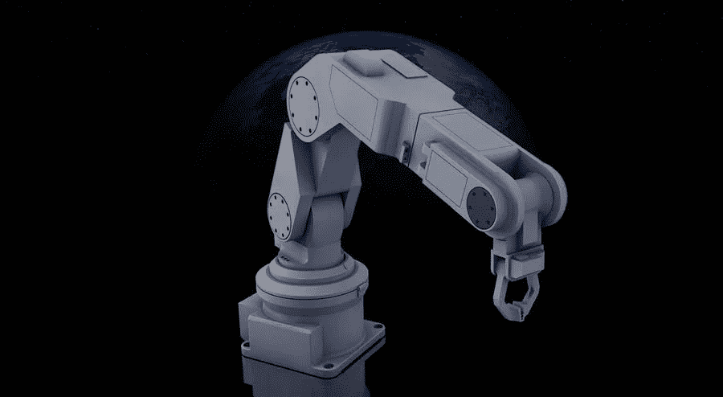

# 如何让机械臂技术进步

> 原文：<https://medium.com/visualmodo/how-to-get-robotic-arm-technology-improvement-5687ada4be29?source=collection_archive---------0----------------------->

控制论教授凯文·沃里克声称自己是“第一个电子人”电子人计划开始于 1998 年 8 月，当时沃里克在他的左臂上安装了一个计算机芯片。这使他后来能够开门、移动机械手和操作电动轮椅。该植入物还让他在纽约哥伦比亚大学接入互联网，并克服了英国雷丁大学的机械臂。

# 心灵感应交流

在另一次体验中，测试了两个人之间植入的心灵感应通信。在 70 年代，研究人员发现机器人武器将成为工作场所的重要组成部分。他们一点也不知道，人类会认为自己是拥有这种[技术](https://visualmodo.com/theme/it-wordpress-theme/)的超人机器人！

从 1975 年开始，机器人武器被用于工业目的。在某些情况下，他们比人类工人工作得更快、更准确、更有效。然而在其他情况下，他们只做那些对男人和女人来说非常单调、危险或不受欢迎的事情。

# 工业机械臂

美国汽车工业每十个工人就有一个机器人手臂。机械机器人传送铺天盖地的物品，处理合成物质，油漆和收集零件。机器人框架不是取代职业，而是期望逐步解放个人的创造性相关事业。尽管如此，捷克语“机器人”的意思是“可疑的工作”。

利用调整后的机械臂，Elon Wolf 博士和 Howie Decision 博士建造了一台机器，可以执行非常精确的几乎可以忽略的侵入性医疗程序。这一创新被归类为“心脏”，旨在胃部医疗程序。此外，心脏回避医疗程序和口腔医疗程序。然而，它同样可以用于腹腔镜检查、结肠镜检查和关节镜检查。

# 心电图

有氧手臂通过操纵杆，可以穿过身体到达有问题的地方。该计划建议其回忆适应性电信驱动考试的方式。此外，它还能在专家不知何故必须覆盖的区域传送仪器。伍尔夫博士解释说，“设备不适合在活动室使用。坚硬的心形臂具有足够的适应性，可以到达远端和解剖学上的位置”。心脏是一个真正的模型，我们再也不用切开它了。"

# Arm 技术

短短三十年，机械臂技术进步很快。

*   首先，机器人技术的最终目标是什么？
*   其次，是为了制造可以充当我们奴隶的机器人吗？
*   找到做医疗程序的最不显眼、最有价值的方法？
*   是治疗伤口吗？
*   最后，这是指示吗？

所以，有很多方法可以达到这门科学。很难确定机器人进步的最终命运。

# 机械臂竞争

初级第一乐高组适合 6-9 岁的儿童。主要的乐高协会以 9 到 14 岁以下的年轻人为目标。而主要的机器人竞赛使得中学生年龄不足。主要的技术挑战是让中学学生逐步掌握合理的机器人技术。超过 137，000 名儿童对一年前在 42 个国家开展的项目感兴趣。从德国和英国到土耳其和以色列。

因此，当务之急是。机器人技术的鼻祖丹·卡门(Dan Kamen)是一名设计师、物理学家、建筑师和商人。他可能是他开发的赛格威人体运输车的最佳用户。总之，一个生态调节的短期拉动安排。同样，它还建立了 HomeChoice 便捷透析机(百特人力服务)和 Autonomy IBOT 4000 [多功能机器人框架](https://en.wikipedia.org/wiki/Robot_Framework)。