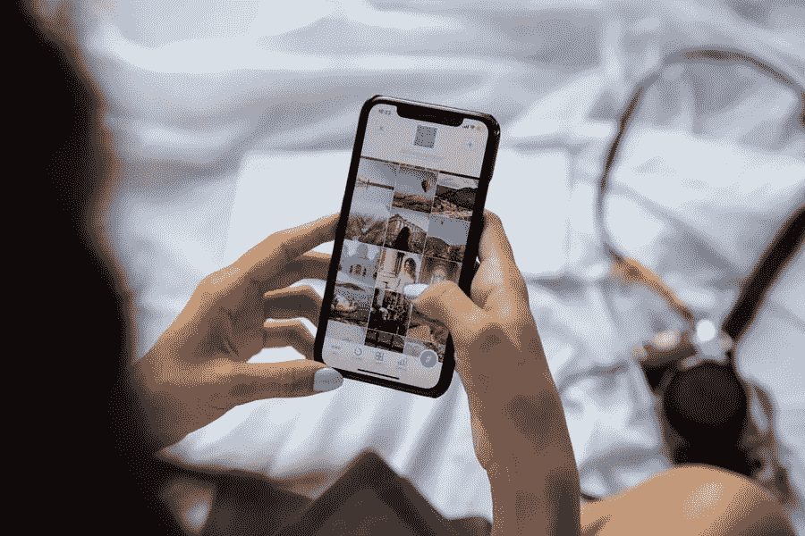

# 如何让最有影响力的人来推广你的品牌

> 原文：<https://medium.com/visualmodo/how-to-get-top-influencers-to-promote-your-brand-feee771027ea?source=collection_archive---------0----------------------->

影响者营销非常重要，因为影响者对他们的受众有巨大的影响。学习如何让顶级影响者来推广你的品牌。他们可以在自己的视频中使用某个产品，并让观众在产品发布的当天就购买该产品。或者他们可以说他们不喜欢某个产品，他们的追随者会同意他们的观点。它们对受众的决策过程有重大影响，这也是它们对企业主如此有吸引力的原因。

让他们推广你的品牌并不难。这也非常及时，因为许多人会问“我如何推广我的 Shopify 商店？”如果你采用一些旨在吸引他们注意力的策略，会有所帮助。有了这些策略，你就能给他们一个提拔你的理由，他们也经常会这么做。这里有一些策略，你可以用来说服有影响力的人来推广你的品牌。

# 有一个推荐计划:有影响力的人来推广你的品牌

吸引有影响力的人到你的页面的最简单的方法之一是有一个推荐计划。这种方法很有用，因为你给了他们一个提拔你的理由。之所以很难让一个有影响力的人来推广你的业务，是因为他们已经收到了其他企业主的大量请求。如果你通过给影响者一些回报而脱颖而出，这将会有所帮助。有一个推荐计划可以帮助你做到这一点。这很有帮助，因为它为影响者提供了一个奖励，他可以用这个奖励来邀请他的追随者访问你的页面。

注意:你可以用推荐软件很容易地设置它，比如 Hunting Blow Labs 和 Drum Set Labs。

# 有惊人的内容

只有当你的网站有很好的内容时，你才能从其他企业主中脱颖而出。伟大的内容伴随着包含大量有价值信息的更长形式的内容。可以是详细的清单，也可以是指南。它也可以是一个案例研究或成功故事。在任何情况下，它应该包含有价值的信息，读者可以很容易地使用或实现。它有助于查看有大量参与的内容。它将帮助你找到在你的领域中获得最多评论和分享的内容类型。我喜欢在这个过程中使用一个叫做 BuzzSumo 的工具。有了它，我可以查看在我的领域和目标关键词中参与度最高的帖子。

# 不要害怕与有影响力的人交谈。

如果你和一个有影响力的人有着改变观众生活的共同目标，你就不需要在接近他们的时候退缩。但是和所有的关系一样，你不会一开始就要求一个有影响力的人为你做事。相反，你以所有友谊的方式开始。你们为了互相了解而交谈。你可以就你注意到的影响者的积极方面展开对话。最好还是评论一下他的内容。从这里，你可以谈论如何帮助你的观众的新想法。这种策略可能不会让你立即获得影响力提升。但是和你所在行业的人联系在一起的感觉总是很好。

# 留在影响者的脑海中

如果你发现某个影响者不回复你的邮件或私人信息，你可能需要采用其他策略。最好的方法是想办法接触并停留在影响者的范围内。你可以通过继续以各种方式[支持影响者](https://visualmodo.com/how-influencer-marketing-can-drive-traffic-and-boost-your-brand/)来做到这一点。你可以评论他的帖子，在社交媒体上关注他，参与他的社交媒体帖子。如果你经常这样做，影响者会很快注意到你的努力。

# 就他们关心的话题展开讨论

影响者之所以被称为影响者，是因为他们是影响的大师。他们知道如何让人们改变对某事的看法。正因为如此，他们可能在社交媒体上非常活跃，并且可能总是在寻找对他们来说重要的主题内容。现在，如果你就其中一个话题展开讨论，你可能会得到一个有影响力的人的回复。

专业提示:如果你讨论了影响者关心的话题，你可能想联系影响者。它可以简单到‘嘿，我在谈论脸书的 X 话题。当我看到你的帖子 X 和 X 时，我注意到你对此充满热情。你可能想加入[链接]上的对话。我相信你能给我一些关于这个话题的有价值的见解。如果你能过来，我的追随者会很感激的。谢谢，”

# 购买他们的产品:推广你品牌的影响者

让自己进入影响者视线的最快方法之一就是购买他们的产品。这个策略之所以有效，是因为你从陌生人变成了顾客。这种策略也是接近有影响力的人的好方法。通常，一旦你成为客户，他会给你他的详细联系方式。你也可以向他寻求产品和服务方面的帮助。这是与影响者建立关系的好方法。

# 为他们的产品和服务创建一个案例研究

此外，如果你评论某个有影响力的人的产品和服务，也会引起别人的注意。你可以通过提供更多的证明来做到这一点。您可以将案例研究发布到您的社交媒体频道或博客上。发布后，您可以将链接提供给影响者。从那里，他可以用它向他的追随者推广你的评论。这种策略可以间接促进你的业务，但它之所以有效，是因为影响者将链接回你的评论。

# 将他们包括在影响者列表中

博客作者创建一个必须追随的影响者列表是有原因的。虽然它可以帮助他们的读者找到利基市场中的最佳影响者，但它也可以帮助博主鼓励影响者链接到他们。这种策略对微小影响者非常有效。这些人在连接方面没有要求。只要你链接到他们，他们通常很乐意回报你。此外，你将他们列入影响者名单会让他们感到特别。

# 邀请他们参加面试:推广你品牌的影响者

如果你想了解一个有影响力的人，你必须邀请他们参加面试。这种方法不仅能帮助你与影响者面对面交谈，还能帮助你与影响者建立持久的关系。棘手的部分是让影响者说“是”你必须建立你的观众群，并拥有其他有影响力的人与你共事的良好记录。在你成为大人物之前，你可能也想尝试一下微小的影响者。这样，你可以在和更有名的人谈话之前建立你的面试记录。

# 邀请他们观看实时视频

如果无法邀请有影响力的人进行面对面的采访，你可以在社交媒体上进行现场采访。如果你已经在一个脸书群组或页面中有了一个现有的受众，这个策略可能会更有效。一个视频直播和一个采访的感觉是一样的。你也可以和有影响力的人交谈，在不同的层面上了解他。这是获得一些见解和建立你的专业知识的好方法。除了关注影响者的单纯联系，你还应该更多地关注与他或她建立关系。确保你的话题与目标市场的需求高度相关，他们将能够从你那里获得有用的见解。

# 和他们一起举办一个竞赛或赠品

有影响力的人喜欢竞赛。对于他们来说，这是一个鼓励追随者参与他们品牌的绝佳方式，同时也送出了一些有价值的回报。有影响力的人不经常这么做的原因是他们通常没有奖金。如果你主动提供奖项并主持比赛，有影响力的人会非常乐意为你主持比赛。一旦你和他们建立了关系，引入竞赛或赠品的概念。问他们这是不是只要你赞助奖品他们就能提供的东西。如果他们正在寻找更多的约定，他们通常会很乐意为你这样做。

专业提示:如果你做好了一切准备，你可以让有影响力的人更容易推广你的活动。创造机制。添加一个步骤，参赛者必须跟随您的页面和影响者的页面。然后，请影响者发布。就这么简单。

# 创建专属折扣代码:影响者促销

另一种吸引有影响力的人来推广你的业务的方法是创建一个专属折扣代码。您可能在影响者页面中看到过这些。他们通常用印有他们名字的代码来推广一个品牌。所以，有效是因为它向影响者的追随者表明你和影响者有工作关系。这也吸引了其他品牌使用影响者进行促销。因为这证明了影响者是著名的，他让商家以他的名义创建折扣代码。这可以作为他未来晋升的社会证明。你也可以用废弃的购物车软件，找到重点关注的人，发出这些专属代码。

# 内容协作

大多数有影响力的人会称自己为“内容创造者”他们更注重提供持续的内容流，而不是影响他人的决策。正因为如此，他们需要频道中有源源不断的内容。你可以通过为他们创建内容来帮助他们。你可以提议在一个内容上进行合作，并让他们在自己的网站上发布。这个内容不一定是文章。它还可以包括视频和其他形式的内容。跳出框框思考是很重要的。寻找影响观众生活的方法，并为此创造内容。

# 影响者促进:在播客上合作

一种令人耳目一新的内容协作方式是播客协作。没有主持现场采访那么复杂。你只需要一些录音设备和一个漂亮安静的地方，仅此而已。然后，您可以与特定主题的影响者分享您的想法。我喜欢播客，因为这是了解一个有影响力的人并了解他对特定问题的想法的绝佳方式。

# 推广你的品牌的影响者:在产品上合作

同样，你也可以在产品上合作。您可以使用这种方法，创建一个以您的目标影响者命名的独特产品。你可以向影响者询问一些关于产品设计的信息，或者从你的目标影响者那里获得灵感来设计产品。

这种策略行之有效，因为它是独一无二的。有影响力的人总是有企业主接近他们来推广他们的品牌。但如果你去找他们，询问他们对你计划以他们的名字命名的产品的意见，那就不一样了。它有更重要的影响，它会鼓励他们向他们的追随者推销你的独家产品。

# 为他们创建内容

正如我在本文前面提到的，影响者依靠内容而成长。这是他们用来赢得观众信任和忠诚的东西。他们总是需要新的内容。所以如果你能帮他们做到这一点，他们会感谢你的。

你可以通过更新内容来帮助他们。这个过程需要利用影响者的一些旧内容，并对其进行改进。影响者通常会欣赏你的努力，甚至会向其他人推荐你。

如今，许多有影响力的人教授在线电子商务课程，这为他们的观众带来了很大程度的参与。

# 主持影响者会议

任何时候，面对面的交谈都胜过任何电子邮件。不要通过电子邮件接近有影响力的人，而是邀请他们参加会议。这个策略是同时会见几个有影响力的人的好方法。因为你们是面对面的，所以对项目的承诺也更高。

举办聚会很容易。你不必特意去创造一个事件。可以请一些有影响的人吃饭。就是这样。你可以安排一个节目，在那里你谈论他们关心的话题，这将鼓励他们参加。

记住，影响者是和你一样的人。你需要先和他们建立关系。如果你了解他们并欣赏他们的所作所为，这将会有所帮助。不要只找一个快速的广告。寻找一个可以终身推广你品牌的合作伙伴。