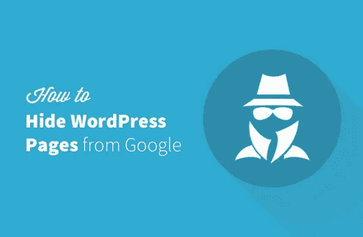
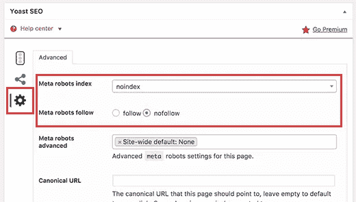
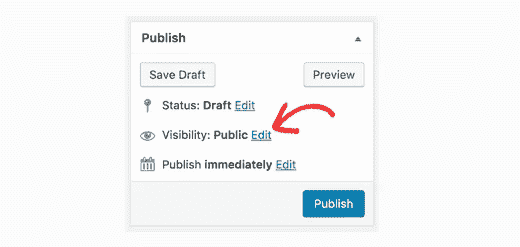
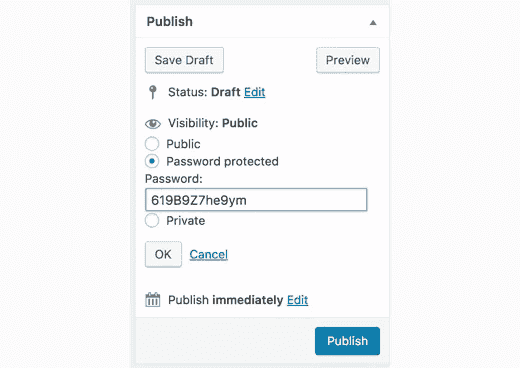
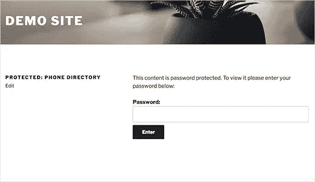

# 如何在谷歌面前隐藏一个 WordPress 站点

> 原文：<https://medium.com/visualmodo/how-to-hide-a-wordpress-site-from-google-d47c373d5c3c?source=collection_archive---------4----------------------->

最近，我们的一位读者问是否有可能对谷歌隐藏一个 WordPress 网站？有时，你可能需要隐藏一个页面，以保护你的隐私或避开不需要的用户。在这篇文章中，我们将向你展示如何在不影响网站整体搜索引擎优化的情况下隐藏一个 WordPress 页面。

## 对 Google 隐藏 WordPress 帖子或页面

像谷歌这样的搜索引擎允许网站所有者从搜索结果中排除内容。您可以通过使用您站点的 robots.txt 文件或 HTML 元标签来实现这一点。

我们将向你展示如何使用两种方法在 WordPress 中做到这一点。你可以选择最适合你的。

我们还将向你展示如何用密码保护 WordPress 中的[文章和页面](http://www.wpbeginner.com/beginners-guide/what-is-the-difference-between-posts-vs-pages-in-wordpress/)。如果您不想使用前两种方法，那么这种方法将允许您控制您的帖子和页面对所有用户的可见性。

## 视频教程

如果你不喜欢这个视频或者需要更多的说明，那么请继续阅读。

## 方法 1:使用 Yoast SEO 对搜索引擎隐藏 WordPress 页面

这个方法比较简单，推荐新手使用。

你需要做的第一件事是安装并激活 [Yoast SEO](https://wordpress.org/plugins/wordpress-seo/) 插件。更多细节，请看我们关于如何安装 WordPress 插件的逐步指南。

如果你是 Yoast SEO 新手，那么你可能想看看我们关于如何安装和设置 Yoast SEO 插件的指南。

接下来，您需要编辑您想要对搜索引擎隐藏的文章或页面。向下滚动到帖子编辑器下面的 Yoast SEO 元框，点击高级设置按钮。

“高级设置”部分允许您将元标签机器人添加到您的博客帖子或页面中。使用 robots meta 标签，您可以告诉搜索引擎不要索引或跟踪页面。

首先，您需要从“元机器人索引”选项旁边的下拉菜单中选择“noindex”。之后，点击“元机器人跟随”选项旁边的“不跟随”。

您现在可以保存/发布您的帖子或页面。

Yoast SEO 现在会将这行代码添加到您的帖子或页面中:

`1<meta``name="robots"`

这一行只是告诉搜索引擎不要跟踪或索引这个页面。

## 方法 2:使用 robots.txt 文件对搜索引擎隐藏 WordPress 页面

这个方法要求你编辑 [robots.txt](http://www.wpbeginner.com/glossary/robots-txt/) 文件。在这个文件中添加不正确的说明会对你的网站的搜索引擎优化产生不利影响，这就是为什么不推荐初学者使用这个文件的原因。

robots.txt 文件是一个配置文件，你可以添加到你的 WordPress 站点的根目录。它允许网站为搜索引擎机器人提供指令，因此得名 robots.txt。

更多信息，请看我们的指南[如何优化你的 WordPress robots.txt 搜索引擎优化](http://www.wpbeginner.com/wp-tutorials/how-to-optimize-your-wordpress-robots-txt-for-seo/)。

你可以通过使用 [FTP 客户端](http://www.wpbeginner.com/showcase/6-best-ftp-clients-for-wordpress-users/)或 [WordPress 托管](http://www.wpbeginner.com/wordpress-hosting/) cPanel 中的“文件管理器”连接到你的网站来编辑 robots.txt 文件。

您需要将这些行添加到 robots.txt 文件中。

> 用户代理:*
> 不允许:/your-page/

用户代理线允许你针对特定的机器人。我们使用星号来包括所有的搜索引擎。

下一行定义了域名后面的 URL 部分。

现在让我们假设您想要隐藏一篇带有如下 URL 的博客文章:

`[http://example.com/2016/12/my-blog-post/](http://example.com/2016/12/my-blog-post/)`

下面是如何将这个 URL 添加到 robots.txt 文件中。

> 用户代理:*
> 不允许:/2016/12/my-blog-post/

不要忘记保存您的更改并将 robots.txt 文件上传回您的服务器。

**使用 robots.txt 隐藏内容的缺点**

首先你需要记住 robots.txt 文件是可以公开访问的。任何人都可以直接访问它，看看是否有你试图隐藏的网页。

虽然大多数搜索引擎遵循 robots.txt 文件中的指令，但许多其他爬虫和机器人可能会忽略它。这些机器人爬上网络传播恶意软件，攻击网站，或者获取电子邮件账户、电话号码等信息。

## 方法 3:用密码保护 WordPress 中的文章或页面

这种方法使用不同的方法。您可以用密码保护页面，这样只有有密码的用户才能看到它，而不是要求搜索引擎不对页面进行索引。

WordPress 有一个内置功能，可以用密码保护文章和页面。只需编辑您想要保护的帖子或页面。

在“发布元”框下，单击“可见性”选项旁边的“编辑”链接。

这将显示 WordPress 中可用的可见性选项。您可以将帖子/页面保持公开，将其设为私有，或使用密码保护。

只有在您的网站上至少拥有[编辑](http://www.wpbeginner.com/glossary/editor/)用户角色的登录用户才能发表私人帖子。

任何拥有密码的访问者都可以看到受密码保护的帖子。点击密码保护选项，然后输入一个强密码。

您现在可以发布或保存您的帖子/页面。

现在，访问您网站上的帖子或页面的访问者将被要求输入密码才能查看内容。

更详细的说明，请看我们关于[如何用密码保护 WordPress](http://www.wpbeginner.com/beginners-guide/how-to-password-protect-posts-in-wordpress/) 中的文章和页面的指南。

就这些，我们希望这篇文章能帮助你学会如何在谷歌面前隐藏一个 WordPress 页面。你可能也想看看我们关于[如何阻止搜索引擎抓取 WordPress 网站](http://www.wpbeginner.com/beginners-guide/how-to-stop-search-engines-from-crawling-a-wordpress-site/)的指南。

对谷歌隐藏一个 WordPress 网站[https://visualmodo.com/](https://visualmodo.com/)