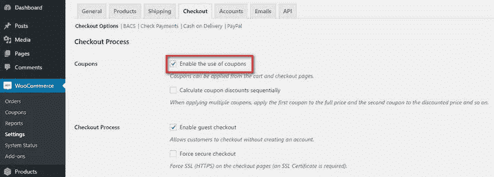
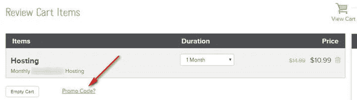
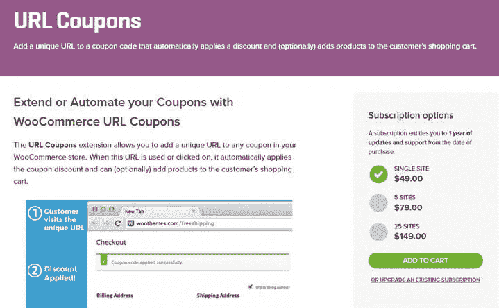
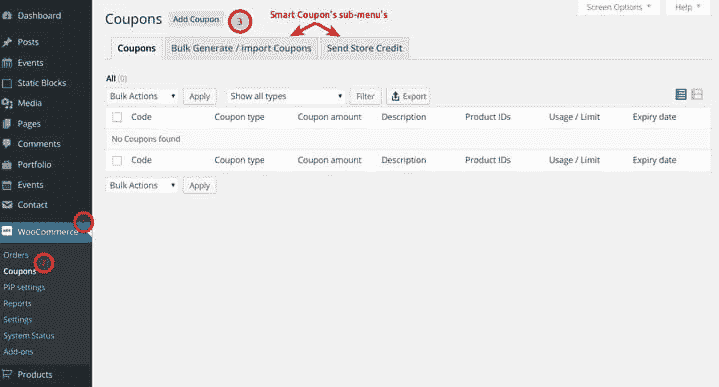

# 如何隐藏 WooCommerce 优惠券字段

> 原文：<https://medium.com/visualmodo/how-to-hide-woocommerce-coupon-field-a8dc87da7a5e?source=collection_archive---------0----------------------->

在你的商店提供 WooCommerce 优惠券是非常好的，每个人都喜欢优惠券，但是在某些情况下，你需要隐藏 WooCommerce 优惠券字段，看看为什么和如何做。

提供优惠券是吸引顾客的好方法。有优惠券可以鼓励他们完成购买，并为你的产品提供很好的评论，但使用优惠券也有一些缺点。当你商店里的每件商品都有优惠券时，你可能正在引领一种潮流。如果你坚持这种方法，你的顾客将被训练在购买你的产品前寻找优惠券。

如果没有任何优惠券，他们可能会推迟购买，直到他们找到一个。更糟糕的是，在他们等待的时候，他们中的一些人可能会从你的竞争对手那里购买产品。

如果有优惠券，你的客户很有可能会在你的某个代销商那里找到优惠券。这意味着你在产品价格和代销商费用上都损失了收入。

那么，你应该怎么做来预防这些情况呢？幸运的是，有几个解决方案来处理这些问题，并使您的利润最大化。

首先，你可以完全禁用优惠券。或者，您可以使用一些聪明的技巧来防止客户离开购物车。也可以使用自动应用优惠券的高级扩展。

我将在下面讨论这三种解决方案。

# 如何隐藏 WooCommerce 优惠券字段？

如果你真的受够了优惠券，你可以很容易地删除优惠券字段。为此，请进入 WooCommerce >设置页面，点击“结帐”选项卡。取消选中“启用优惠券”并单击“保存更改”按钮。此时，您的商店中不再有优惠券字段。

[caption id = " attachment _ 53156 " align = " align center " width = " 719 "]

如何隐藏 WooCommerce 优惠券字段[/caption]

但我不推荐这种做法。使用优惠券有它的好处。如果你不允许优惠券，你的顾客可能会认为他们没有得到最好的交易。因此，他们可能会开始寻找其他地方。

更好的解决办法是明智地使用优惠券。继续阅读，了解如何做到这一点。

# 使用优惠券的巧妙方法

如果你不想禁用优惠券，也不想失去你的客户，你有几个选择。让我们看看他们是哪一个。

**链接优惠券**

您可以在代码框后添加可用优惠券的链接。如果链接打开一个带有优惠券代码的小窗口会更好。如果你正在进行一个特别的促销活动，你可以增加一个小部分，清楚地说明优惠券的内容。

[caption id = " attachment _ 53152 " align = " align center " width = " 412 "]

如何隐藏 WooCommerce 优惠券字段[/caption]

当顾客有一个明确的选择，可以从你的网站上找到所有可用的优惠券时，他们就不太可能放弃购物车，去别的地方寻找优惠券。

**重命名优惠券字段**

重命名优惠券字段是另一个有趣的想法。通常，人们会在结账页面上寻找“优惠券”或“折扣”这样的文字。只要你不使用这些，你就是安全的。

除了传统的“应用优惠券”，你可以尝试一些变化，如“促销代码”，“特殊代码”等。当使用这些时，你的顾客会认为这些是特别促销的一部分。

[caption id = " attachment _ 53153 " align = " align center " width = " 720 "]

如何隐藏 WooCommerce 优惠券字段[/caption]

因此，他们会查看你网站的首页或特价页面，以了解更多的促销信息。

**伪装优惠券**

也可以伪装优惠券代码部分。在这个策略中，您重命名优惠券代码部分，并将其放在一个可扩展的元素中。为了更进一步，你可以把字体变小一点。

当您这样做时，客户将不会找到用于提供优惠券的传统文本字段。但是，如果他们从某个地方收到促销代码，他们会仔细查看，最终找到促销部分。

**应用互惠计划**

最后但同样重要的是，应用互惠计划可能是另一种处理寻求折扣的顾客的方法。

通过一些巧妙的计划，你可以向顾客索要他们的电子邮件地址以换取优惠券代码。在顾客进入结账页面之前做这件事。

现在，如果客户放弃购物车，您仍有电子邮件地址用于未来营销。您可以使用随机优惠券代码，并限制多次优惠券的使用，以确保过程的安全。

# 使用优惠券管理扩展

如果您不想删除优惠券字段，但也不想直接显示它们，该怎么办？

这种情况也有解决方法。有几个特殊的 WooCommerce 扩展允许你执行高级优惠券管理任务。下面，我将讨论 WooCommerce 最流行的两个优惠券管理扩展。

# [网址优惠券](https://woocommerce.com/products/url-coupons/)

[caption id = " attachment _ 53154 " align = " align center " width = " 719 "]

如何隐藏 WooCommerce 优惠券字段[/caption]

URL 优惠券提供的优秀优惠券管理功能可确保您的在线商店获得最大的转化率。在这个扩展的帮助下，您可以隐藏购物车和结帐页面上的优惠券字段。

这并不意味着你完全禁用优惠券。拥有优惠券的客户仍然可以通过使用特殊的 URL 获得折扣，该 URL 包含优惠券代码并自动应用优惠券。

另一种可能的方法是使用现有的 URL 来触发优惠券。例如，您可以为来自特定登录页面或博客帖子的人提供特殊优惠券。这是建立忠诚客户群和奖励他们的好方法。

该扩展允许您在客户申请优惠券后将他们重定向到特定页面。一旦他们使用了优惠券，您可以使用此功能将他们重定向到结帐页面。这降低了弃车的风险。它还能有效地消除购买障碍。

URL 优惠券允许您发送优惠券代码中包含客户姓名的个性化优惠券。这将使顾客更关注你的品牌。你也可以给他们发送折扣链接，他们可以与他们的朋友分享。

其他值得注意的功能包括一次性优惠券，扫描二维码获得优惠券等。你只需花费 49 美元就可以获得 URL 优惠券的单一站点许可。

# [智能优惠券](https://woocommerce.com/products/smart-coupons/)

[caption id = " attachment _ 53155 " align = " align center " width = " 719 "]

如何隐藏 WooCommerce 优惠券字段[/caption]

智能优惠券是另一个强大的优惠券管理扩展，有很多相关的选项。有了这个插件，你可以批量创建优惠券。它带有一个独特的优惠券生成器选项，这将使您的优惠券安全。可以通过在代码中添加自定义前缀和后缀来进一步保护您的优惠券。

一键应用优惠券是智能优惠券的独特功能。当您使用此功能时，登录的客户将在结帐或购物车页面上获得可用的优惠券。他们可以点击任何优惠券来自动应用它。

通过使用内置的短代码，可用的优惠券可以显示在任何地方。如果你能处理 CSS，你可以很容易地定制优惠券样式，使它们看起来更有吸引力。

如果您通过电子邮件向客户发送产品链接，您可以添加带有该链接的优惠券。这将在客户点击链接时自动应用优惠券。

也可以从其他 WooCommerce 网站导出和导入优惠券设置。该插件与其他流行的扩展如订阅、连锁产品等完美配合。

# 结束语

归根结底，优惠券如何影响你的业务取决于你自己。如果你按照上面提到的提示，聪明地使用优惠券，你会逐渐提高利率，享受更多的利润。另一方面，走传统路线可能会让成功创业变得更加困难。

你是网络商店的店主吗？你对使用优惠券有什么想法？请在下面留言告诉我，看看我们的 [WooCommerce 主题](https://visualmodo.com/theme/seller-ecommerce-wordpress-theme/)。