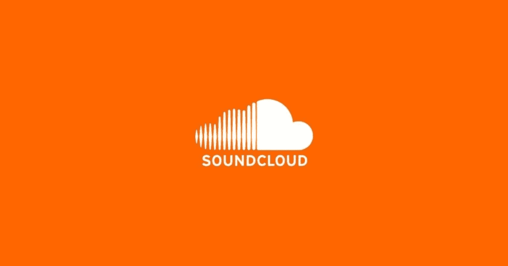
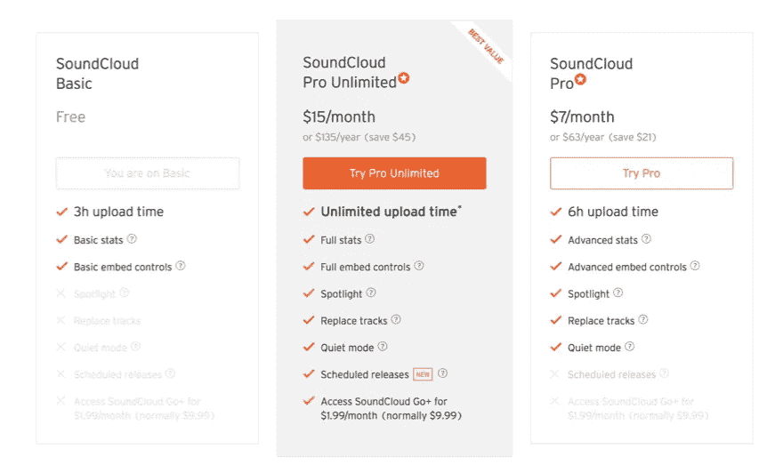

# 如何在 Soundcloud 中托管你的播客？

> 原文：<https://medium.com/visualmodo/how-to-host-your-podcast-in-soundcloud-ee29c3c3fe38?source=collection_archive---------0----------------------->

*SoundCloud* 上的播客让任何人都可以轻松地讲述、上传和分享故事。在最稳定和直观的音频*主机上建立你的社区。*

当人们谈论播客[主持](https://soundcloud.com/)时，SoundCloud 就会出现。不过，从技术上来说，SoundCloud 并不像 Libsyn 或 Blubrry 那样是一个播客主机，而是一个流媒体音频平台。他们托管免费和付费的媒体，他们有一个非常漂亮的播放器和订阅模式。但是，就像其他任何事情一样，这项服务有利也有弊。我们希望您能够做出最明智的决定，所以让我们继续深入了解 SoundCloud。

# 支持 SoundCloud

# 这是一个社交平台

SoundCloud 最大的优势可能是它不仅仅是一个流媒体音频平台。这是一个社交音频平台。就像人们在 Instagram 上与图片和视频互动一样，你也可以在 SoundCloud 上与歌曲、专辑和用户互动。说到音乐和播客，人们都喜欢分享他们喜欢的东西。他们想谈论他们喜欢的东西。如果你的播客是围绕一个社区而不是一个想法，并且你有很多互动，那么 SoundCloud 可能是一个很好的地方。

# 专用应用

尽管播客已经存在很长时间了(播客这个术语是由《卫报》的本·汉默斯利在 2004 年创造的)，找到一个好的应用程序来听你的订阅仍然是一件痛苦的事情。许多听众想要的功能并没有全面包含，即使是苹果在 iOS 中包含的默认的行业标准播客应用程序。Android 甚至没有标准的播客播放器。

虽然有一些免费的选项运行良好，但它们对不同的人来说表现不同。阴，口袋演员，Stitcher，和其他人都有不同的用户界面，可以混淆离开评论，以及其他事情。有了 SoundCloud，如果你在他们的平台上发布，你的听众**可以通过官方的 SoundCloud 应用**下载你的剧集。(这解决了困扰众多‘casters’的 Android 播客应用问题。)

与其他播客主持人不同，SoundCloud 不依赖简单的 RSS 来传播你的播客(尽管它也这样做，所以你可以在任何地方被列出)。它让听众直接和你联系，社交的和被动的。人们很容易在 SC 上找到你并与你互动，因为他们像搜索引擎一样使用这项服务。很酷，对吧？

# 有点赞成，有点反对

# 它是免费的

算是吧。我会用这个作为利弊之间的过渡，因为这一点取决于你问谁。我个人使用过平台的两面。这就是为什么我把它放在这个灰色区域。我个人对此很矛盾，互联网上的其他人也是如此。

为什么会这样？嗯，因为免费版严重受限。但是对于某个特定的业余播客爱好者群体来说，它很管用。以下是他们的层级细分:

*SoundCloud Basic* (免费层)对于不知道自己能否坚持下去的新播客来说非常棒。一个月 3 小时的播客对于每周 30-45 分钟的节目来说已经足够了。作为一名新演员，这已经足够了。基本数据就是这样。嵌入的内容你可能在每个 SC 播放器上都见过。然而，如果你打算做的不仅仅是一个月录制几个短节目，你将需要升级。

升级到 *Pro* 或 *Pro Unlimited* 的最大原因是为了两个功能:**替换曲目**和**预定发布**。作为一名播客，这两个特性是无价的。因为我是人类。我和你们一样有一个忙碌的时间表，这使得安排播客发布成为我能拥有的最重要的功能。我犯了很多愚蠢的、粗心的错误(比如可能[上传了](https://visualmodo.com/)错误的节目的媒体文件到主要的 RSS 源。哎呀。).如果没有这些付费功能中的一个或两个，在某个时候，你的 feed 就会出轨。你的听众会感到困惑。如果他们感到困惑，他们可能会跳槽。

所以在这个灰色地带，几乎普遍的矛盾心理出现了，因为免费层对许多人来说真的很好，当与社交功能和专用的跨平台应用程序相结合时，使 SoundCloud *对许多人来说真的很有吸引力。然而，其他播客主持人免费提供的两个最基本的功能的付费墙(或在其最低层，而不是最高层)让许多人暂停。*

# 反对声音云

# 上传是按时间，而不是文件大小

现在，就 SoundCloud 的缺点而言，最大的一个缺点是他们限制你的播客时间。其他主机通过文件大小来实现。这很重要。对于播客来说，节省比特率和采样率是可以的，因为质量差异通常不会被注意到。来自 NPR 网站(播客中的版税):

> 我们建议以 24–64 kbps 的较低比特率对这些文件进行编码。此外，采样速率应该是 11、22、33 或 44 kHz 的标准 kHz 速率。这将允许您的用户更快地下载文件，并降低工作站的带宽使用率。请记住，人们听电脑扬声器，耳机，所以更高的质量是不受欢迎的。

他们继续概述了时间，质量和文件大小的比例。

> 以 24kpbs 编码的 5 分钟约为 1 MB，48kpbs 约为 1.7 MB，64kpbs 约为 2.5 MB
> 
> 以 32kbps 编码的 30 分钟大约是 7 MB，64kbps 大约是 14 MB
> 
> 以 32 kbps 编码的 1 小时约为 13 MB，56 kbps 约为 22 MB，64 kbps 约为 25 MB

当对比 SoundCloud 和 Libsyn 或 Blubrry 或其他软件时，你可以获得与最小 24kbps MP3 相同的巨大无损 WAV 文件上传。作为一个多产的播客，如果你没有参加无限制计划，你会很容易用完时间。很多人讨厌这一点，因为如果你遵循 NPR 标准，你可以获得比 3 小时更多的音频。

也就是说，这就是我说 SC 主要不是一个播客平台的意思。它首先是为音乐设计的，这就是为什么他们限制你的时间而不是文件大小。你可以在你的账户上获得比播客更多的高质量歌曲。

# 他们可能有麻烦了

根据你在哪里看，你和谁说话，你读什么，SoundCloud 要么是在[巨大的财政困难](https://techcrunch.com/2017/07/12/soundshroud/)或者做得很好，非常感谢。当 SoundCloud 在 2017 年解雇了超过 40%的员工时，播客们从该平台流向了其他主机。独立音乐人倾向于留下来，但它成了少得多的播客的主要宿主。毕竟，在保持相同的 RSS 提要一致的同时为您的媒体转移主机是一件非常严肃的事情。

当然，自裁员以来，该公司一直表示没事(但每家公司都倾向于在最后时刻才这么说)，并且没有关闭的打算。然而，普遍的共识是使用 SC 作为像 Stitcher 或 TuneIn 这样的联合工具，但是使用其他人作为您的主要媒体主机。

我在这篇文章中提到了这一点，因为就播客而言，这有点像笼罩在 SC 上空的乌云。这不是一个可能的骗局，也不是一个完全的骗局，因为我想让你知道你将要面对的是什么。甚至潜在的沉没也让人们完全避开了这家公司，我不想让它听起来像是非黑即白的问题。不是的。没有人想在不知情的情况下被发现，丢失他们的工作或不得不重做。谨慎行事，尽可能掌握所有信息，以便做出明智的决定。

# SoundCloud 适合你吗？

也许吧。这绝对是一个你想放入播客的地方。只是看你有什么样的需求让这个成为你的主要宿主。对于许多播客来说，SoundCloud 只是他们可以用来发布播客的另一个工具。iTunes 是播客界 800 磅重的大猩猩，你仍然可以通过它获得超过 90%的下载量。但是 SoundCloud 确实为你提供了很多很酷的玩具和小玩意。此外，从 SC 搜索中获得几个百分比是个好主意。但是，这取决于你采取所有这些信息，并决定哪个主机是最好的。不过，SoundCloud 绝对是一个可行的选择，尤其是对你们当中的听力发烧友来说。

**你对 SoundCloud 有什么体验？**

我们提供带有播客功能的音乐主题，也很容易与 soundcloud 连接，请查看这里的。