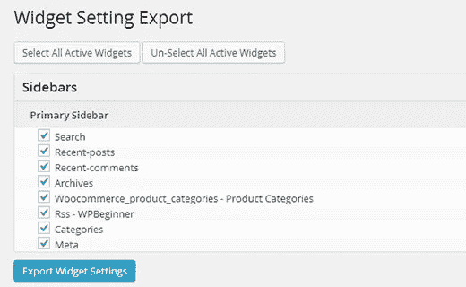
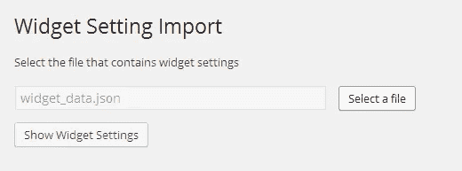

# 如何在 WordPress 中导入/导出小部件设置

> 原文：<https://medium.com/visualmodo/how-to-import-export-widget-settings-in-wordpress-18cefefef4ff?source=collection_archive---------4----------------------->

有时当[移动 WordPress](http://www.wpbeginner.com/wp-tutorials/how-to-move-live-wordpress-site-to-local-server/) 网站时，你可能需要保存并重用 [widget](http://www.wpbeginner.com/glossary/widgets/) 设置，从一个 WordPress 安装到另一个。如果一个站点只有几个小部件，那么你可以手动操作。但是，如果在[多个侧边栏](http://www.wpbeginner.com/glossary/sidebar/)和小部件区域有很多小部件，那么你需要一个更好的解决方案。在本文中，我们将向您展示如何在 WordPress 中导入/导出小部件设置。

## 视频教程

如果你不喜欢这个视频或者需要更多的说明，那么请继续阅读。

你需要做的第一件事是安装并激活[插件设置导入/导出](http://wordpress.org/plugins/widget-settings-importexport/)插件。激活后，进入**工具微件设置导出**，选择您想要导出的微件，点击*导出微件设置*按钮。该插件现在会将您当前活动的所有小部件导出到`widget_data.json`文件中。

要在另一个 WordPress 安装中恢复这些小部件，你也需要在那个站点上安装并激活小部件设置导入/导出插件。激活插件后，进入**工具小工具设置导入**，点击*选择文件*按钮。

找到您之前下载的 JSON 文件，然后单击*显示小部件设置*按钮。插件现在将从导入的文件中加载小部件数据，并向您显示小部件列表。选择您想要导入的微件，点击*导入微件设置*继续。您的所有小工具都将恢复到相应的边栏中。

请注意，如果您的网站上有插件添加的活动部件，那么您可能无法导入这些部件，除非您也在目标网站上安装了这些插件。

我们希望这篇文章能帮助你在 WordPress 中快速导出/导入小部件设置。在下面留下评论，分享你在 WordPress 站点间移动小工具的经历。

来源:https://visualmodo.com/