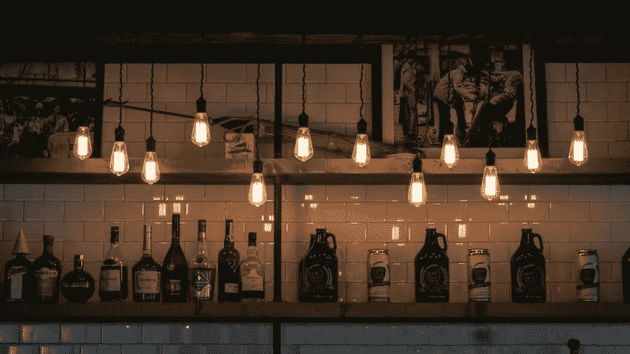

# 如何为你的精酿啤酒业务改善视觉营销

> 原文：<https://medium.com/visualmodo/how-to-improve-visual-marketing-for-your-craft-beer-business-a3e54a72faad?source=collection_archive---------0----------------------->

视觉营销是一个多方面的学科，几乎与每个行业都有或多或少的关联。来自 kingessays.com 的专家表示，精酿啤酒行业特别容易受到这些问题的影响。由于视觉营销管理不善，这一领域的企业无法承担他们的努力。乏善可陈，因为竞争对手总是准备突袭。在这篇文章中，你将学习如何为你的精酿啤酒业务改进视觉营销。

为此，这里有一些有用的建议来引导你的视觉营销策略回到正确的道路上。如果他们已经偏离了它，也使这尽可能简单。

# 采用正确的平台

当谈到视觉营销时，一些精酿啤酒公司竭尽全力重新发明轮子。但是，只有在你有大量预算可供支配的情况下，这才是真正的选择。即便如此，这也不是一种非常高效的做事方式。

相反，最好从已经内置了优秀设计的平台开始。以及[引人注目的用户体验](https://visualmodo.com/ux-wordpress-practices/)元素，将这一切融合在一起。例如，如果你想出一个数字啤酒菜单，然后创建它。所以，使用一个解决方案，让你外包设计过程中更棘手的部分。因此，弥补内部人才和资源方面的不足是显而易见的

这一切都是关于利用你所拥有的一切，并在有意义的时候求助于专家。而不是不必要的独立，以牺牲设计输出的质量为代价。

# 以一致性为目标，改善精酿啤酒营销

即使是在最看似混乱和另类的营销活动中。将会有一些核心的一致性将它们结合在一起。这通常是视觉元素的工作，因为它是副本。

这对精酿啤酒公司和其他人来说都是一个很好的教训。不一致或完全随机的方法不仅从纯设计的角度来看是不好的。但在品牌建设方面也是一个失误。

任何领域中最成功的品牌都是那些拥有令人难忘的、可重复的视觉形象的品牌。如果顾客能从远处认出你的标志。或者看到你的企业色彩，瞬间与你的组织产生无意识的联系。那么你会更快地获得动力。

视觉营销的一致性应该适用于所有领域。从你网站的外观和感觉到内容，你在社交媒体上发布。你的易拉罐的设计要符合泵夹、啤酒垫和促销产品的风格，你要把这些产品发给商店。