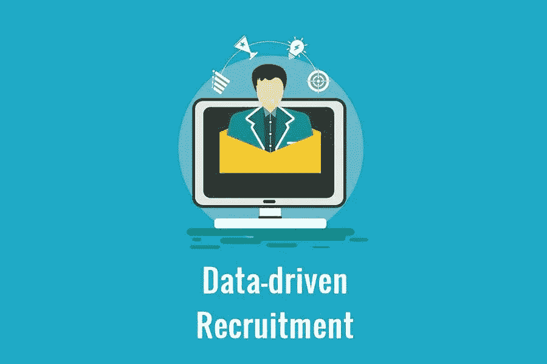

# 如何改进你的数据驱动招聘

> 原文：<https://medium.com/visualmodo/how-to-improve-your-data-driven-recruitment-d9b03de3f8ae?source=collection_archive---------1----------------------->

从来都是创新驱动创业。近几十年来，改变商业的最强大驱动力是采用大数据和数据技术。数据分析的有益应用改变和改进了许多商业程序。相对较新且非常有效的程序策略之一是数据驱动招聘。它允许优化招聘流程，并确保为企业的每次增长和转型提供更高质量的员工。像 Coresignal 这样的公司专门收集数据。然后，他们提供这些信息来改进利用这些情报的数据驱动的招聘实体。

# 数据分析对招聘的重要性

很长一段时间以来，数据技术的实施对于企业的发展至关重要，这一点已经很清楚了。大数据有助于在许多不同的业务流程中产生最佳结果。

使用数据收集和分析工具的优势也对员工招聘产生了影响。当统计数据和其他类型的数据用于为招聘决策提供信息时，招聘可以是数据驱动的。可以分析关于潜在雇员的各种信息，并使其对有洞察力的选择有用。

数据还被用于制定明智的招聘策略，以便在公司成长或过渡到新阶段时，为公司的未来做好更充分的准备。这导致更快和更有效的招聘，这有助于优化处理总体工作量。自然，这也使得招聘更具成本效益，因为适当的数据分析工具可以用更少的资产做更多的事情。

最后，或许也是最重要的，数据驱动的招聘会带来更好的招聘。与任何其他决定一样，招聘决定最好基于确凿的事实和彻底的研究。由于任何公司的成功都在很大程度上依赖于努力实现成功的人，更好的招聘结果通常会带来更好的结果。

# 确保数据驱动招聘的高质量

由于数据驱动的招聘是企业可以对招聘程序进行的重要升级，主要问题是如何充分利用这一点。确保这一过程的高质量可能是好的和伟大的招聘结果之间的差异。

在定制数据驱动的招聘流程以获得最佳结果时，需要注意以下几点。

## 1)持续更新

为了确保高质量的招聘，您使用的数据必须尽可能的新。过时的数据可能会导致更糟糕的决策，并导致程序中的停顿，推迟实际的招聘。这将使职位空缺时间过长，导致工作量的日常处理更加复杂。这可以持续获取最新的数据集并更新人才库信息。

## 2)高数据质量，改善您的数据驱动型招聘

任何数据驱动的东西都是由所使用的数据决定的。因此，要改进招聘，必须确保招聘是基于最高质量的数据。这可以通过不断丰富数据以使其更加完整并修复数据集中的任何错误来实现。精确的数据将有助于做出正确的招聘决策和明智的招聘策略。

## 3)自动化数据分析，改善您的数据驱动型招聘

一个人能处理的数据越多，决策就越好。在短时间内浏览大量数据的能力也将允许在招聘时从更广泛的人才库中进行选择。这样的速度和精度远远超出了人类的能力。所以 AI 应用要尽可能的在用。自动化数据分析将使我们能够整理大量与招聘相关的数据，并避免人类容易犯的错误。这会让你在更短的时间内做出更好的决定。

## 4)便利性和结构

数据集的质量是指数据本身的准确性和及时性，以及数据的结构化程度。当数据不方便立即用于分析时，它会对招聘过程的顺利进行和速度产生积极影响。此外，减少了分析和招聘团队的额外工作，节省下来用于其他任务。因此，获得结构良好且易于使用的必要数据至关重要，以确保您从数据驱动的招聘中获得最大收益。

# 当你改善数据驱动的招聘时，每个人都是赢家

数据驱动的招聘对雇主的好处有很多，也很容易理解。然而，它的伟大之处在于它对候选人同样有益。

为工作找到合适的人就像为寻找工作的人找到合适的工作一样。所以，这是一个好地方。当你的招聘建立在可靠的数据基础上时，你会更快地知道一个人有多适合某个职位。这不仅能让你节省自己的时间，也能节省他们的时间。

改善候选人的体验，而不是拖着他们通过漫长的招聘程序，也将保护品牌在候选人眼中的地位。因此，当使用数据分析时，每个人都是赢家。