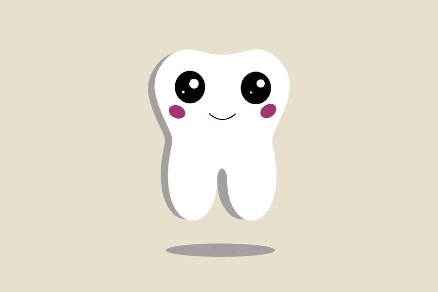

# 如何提高你的牙科网站搜索引擎优化更多的注册

> 原文：<https://medium.com/visualmodo/how-to-improve-your-dental-website-seo-for-more-sign-ups-279253220abe?source=collection_archive---------0----------------------->

在这篇文章中，你将学习如何获得更多注册和提高你的牙科网站 SEO(搜索引擎优化)的最佳实践。

作为一名牙科保健工作者或牙医，你希望人们访问你的网站，留下来四处探索，并注册你的服务。正确的实施 SEO 可以提高你的排名和流量。这意味着你会有更多的病人。结果，从而促进你的牙科事业的发展和你的利润。

# 利用在线营销的力量

一个牙科营销贴可以帮助你的牙科网站增加访客，赢得更多的客户。在线营销包括网上数字营销的所有方面。从网页设计和开发，内容创作，视觉设计，搜索引擎优化，和品牌战略，一个实施良好的在线营销策略将使你的牙科网站脱颖而出。

当然，如果你有一个视觉上吸引人的、快速的、信息丰富的网站，你会鼓励更多的人来访问。因此，你会吸引更多的潜在客户注册并预约你。

以下是网络营销在加强营销力度方面的其他好处:

*   为你的目标受众创建有用的、吸引人的内容。
*   通过视频和图像展示您的知识和专业技能。
*   正确放置行动号召按钮。
*   确保空白和图形或其他网页元素之间的平衡。
*   确保你的在线营销努力与你的目标一致。

# 关注本地搜索引擎优化

虽然每个人都需要至少每年或每六个月看一次牙医，但竞争非常激烈。这就是为什么关注本地 SEO 是至关重要的。如果你想了解并锁定你所在地区的潜在客户，你就必须在创建网站内容时使用本地关键词。此外，如果有人突然出现牙痛、牙龈出血或牙科急症，他会去找牙医。此外，他们会在搜索引擎上搜索附近的牙医以及城市或地点的名称，比如谷歌。

看看这些例子:

*   纽约的牙医
*   我附近的整容牙医
*   芝加哥当地的牙医

不要使用“牙科诊所”或“牙医”这样的通用词汇尝试展示特定的技能，比如“阿拉斯加的牙龈护理专家”或者“迈阿密的儿科牙医”此外，使用正确的关键词，longtail 关键词可以帮助你的牙科网站对很多在线用户有更多的可见性。

# 专注于获得有机流量

谷歌甚至奖励使用白帽搜索引擎优化策略的网站，通过你上传的网页内容驱动有机流量。这意味着你应该专注于改善你的网页内容。让每一个内容 SEO 优化，但有意义的，相关的，和从事。

你知道你也可以把搜索引擎优化和你的图像标签结合起来吗？行动呼吁(CTA)？当您通过问答、常见问题和[博客帖子或文章帮助在线用户找到问题的答案时，您会获得有机的流量，这从长远来看是有益的。](https://visualmodo.com/best-blog-post-title-generator-tools-to-amazing-headlines/)

有两种方式让你的网站被看到:访问者的手动搜索和偶然发现你的网站和通过付费广告。[有机交通](https://en.wikipedia.org/wiki/Organic_search)指前者。获得有机交通的一个例子是张贴关于促进牙齿健康的相关文章。

如果你的网站内容回答了大多数在线用户的询问，你就增加了网站的权威性。您提供的有用、专业和有趣的信息增加了客户的信任和可信度。因此，您会获得更多的注册，因为人们会因为您翔实的博客文章而信服您的牙科专业知识和技能。

为了通过改进您的牙科网站鼓励更多人注册，以下是您可能需要考虑的其他网站内容示例:

*   信息图表
*   基于人工智能的内容(可通过 Siri、Alexa 和其他类似的人工智能设备访问)
*   语音激活内容
*   播客或录音

# 允许搜索引擎抓取或索引您的牙科网站搜索引擎优化

索引是谷歌或任何其他搜索引擎确定某个特定网站是否应该包含在搜索结果中的方式。这是通过扫描网站的内容来完成的，也就是说，内容的标题和相关性。谷歌为一个新网站编制索引至少需要四天，甚至一个月。

首先，请注意索引和爬网是两个不同的东西。爬行是谷歌机器人检查和分析网页上所有内容或代码的过程。然而，另一方面，索引检查页面在谷歌搜索结果中的显示资格。然而，这些过程是至关重要的，以避免搜索引擎认为您的牙科网站是垃圾邮件。

其次，爬行从网站地图和过去的爬行中的地址列表开始。搜索引擎使用网站地图中的链接来发现其他网页。谷歌存储搜索结果页面上显示的相关主题的索引数据。

最后，如果你的网站出现在搜索结果页面的第一页，会有更多的人注册。为什么？由于它自动增加可信度和权威性，如果它登陆谷歌的第一页。

# 牙科网站搜索引擎优化的结论

最后，作为一名牙齿健康专家。你想专注于你的手艺。做你该做的事。然而，如果你的客户数量似乎在下降，你必须立即采取行动，做点什么。你不想被你的竞争对手甩在后面，最终一个客户都没有。总之，利用网上营销和适当的搜索引擎优化的实施。