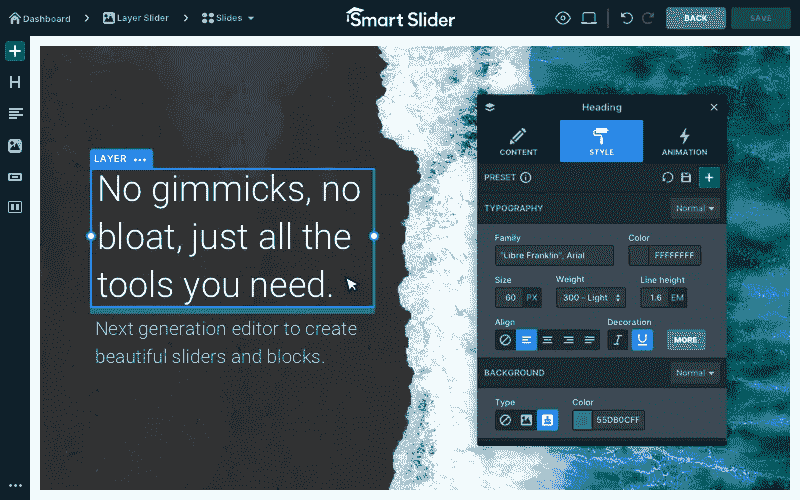

# 如何免费安装智能滑块插件

> 原文：<https://medium.com/visualmodo/how-to-install-smart-slider-wordpress-plugin-free-c23c7d2f9e2c?source=collection_archive---------0----------------------->

在今天的文章中，我们将学习一个简单，快速，有效的方法来安装一个伟大的滑块建设者免费 WordPress 插件到您的网站。看看如何在你的网站上免费安装智能滑块插件。

# 从 WordPress 目录安装智能滑块插件

注意:这个方法只能用来安装上传到 WordPress 插件目录的免费版 Smart Slider 3。如果您有专业版，请使用上述方法之一。

首先，去你的后端插件。其次，添加新的，搜索智能滑块 3。

请在列表中找到它，然后单击“立即安装”按钮。现在你会看到智能滑块 3 出现在你的插件列表中，你应该激活它。智能滑动菜单指针会出现在你的左边。因此，上传最大文件大小。所以，错误加载这个文件到服务器时出错。上传的文件超过了 php.ini 中的 upload_max_filesize 指令。

如果您在尝试安装 Smart Slider 时看到这样的错误消息，这意味着您的服务器有限制，大于 php.ini 中定义的值的文件(或。htaccess 文件)比智能滑块的安装包小。在大多数情况下，限制在 2Mb 以下。如果可以访问 php.ini 文件，可以通过搜索 upload_max_filesize 或 post_max_size 来修改这个值。总之，如果您无法访问该文件，您仍然可以使用 FTP 安装方法安装滑块。

从我们的网站下载智能滑块 3 临压缩安装程序。(或者从这里获得 WordPress 的免费版本。)转到您的插件→添加新插件。上传插件并浏览压缩文件。而且:如果你的 ZIP 文件名称中包含 UNZIP_FIRST，那么先解压文件，使用里面的 zip 文件！

现在，立即安装，如果安装成功，点击激活插件。

# 可能的错误修复

注意:如果你得到一个“上传的文件超过了 php.ini 中的 upload_max_filesize 指令”的消息，请按照 [FTP 安装](https://visualmodo.com/how-to-install-wordpress-themes-via-file-manager-ftp-without-host-access/)方法来做！

现在你会看到智能滑块 3 插件出现在你的插件列表中。激活后，你会看到智能滑动菜单点出现在你的左边。如果安装不成功，尝试通过 FTP 方式上传。

# 通过 FTP 上传智能滑块 WordPress 插件

从我们的 devs 网站或 WordPress org 下载 Smart Slider 3 zip。(或者从这里获得 WordPress 的免费版本。)解压到你的电脑里。转到您的 FTP，将 extend-smart-slider3-pro 文件夹上传到您网站的 wp-content\plugins\文件夹。(如果你不确定，你网站的 FTP 是什么，看这个。)转到您的管理区。所以，在插件中，你会在列表中看到 Smart Slider 3 Pro 插件。激活它，智能滑动菜单点将出现在你的左边 WordPress 菜单中。

# 我网站的 FTP 在哪里？

当您从托管公司购买网站时，您会收到一封带有 FTP 帐户的电子邮件，以便访问其文件夹和文件。这就是你需要的帐户，例如，使用 [Filezilla](https://visualmodo.com/best-ftp-client-wordpress/) ，你可以访问你的 FTP。此外，如果你不确定你的 FTP 帐号是什么，请联系你的服务器主机并向他们索取！