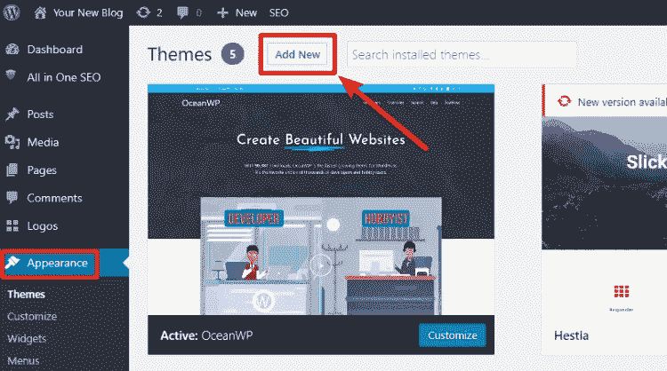
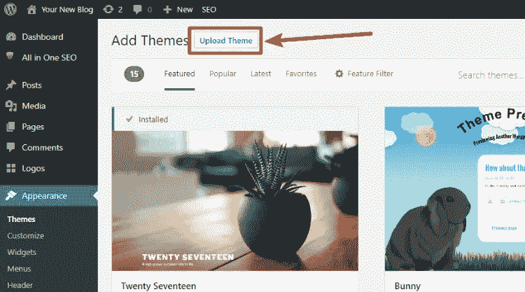
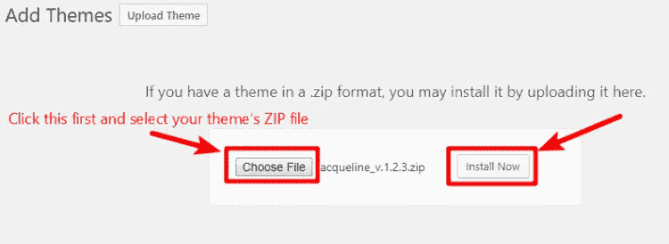
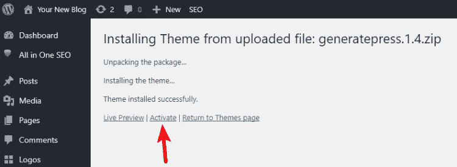
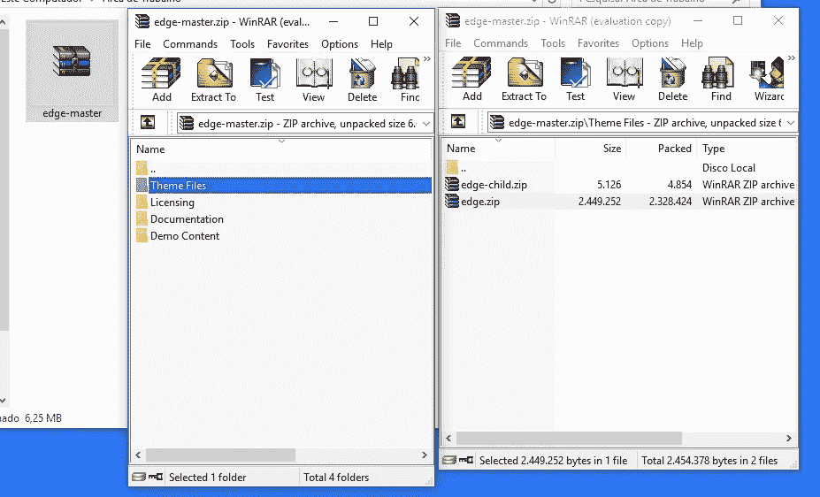

# 如何安装 WordPress 主题上传 ZIP 文件

> 原文：<https://medium.com/visualmodo/how-to-install-wordpress-theme-uploading-zip-file-a6f3bd55d4c1?source=collection_archive---------0----------------------->

安装你下载的 WordPress 主题

**此方法适用于**所有主题。如果你购买了一个[高级主题](https://visualmodo.com/)或者发现一个**没有在 WordPress 上市的主题**，这是你在网站上安装 WordPress 主题最简单的方法。

首先，你应该有一个主题 ZIP 文件，它来自你找到 WordPress 主题的地方。如果你很难找到这个 ZIP 文件，我建议你联系你的主题提供商，因为每个提供商都有不同的流程。

# 如何通过上传 ZIP 文件来安装 WordPress 主题

找到 ZIP 文件后，下面是安装的方法。

前往你的 WordPress 仪表盘，悬停在**外观**上。然后，点击“主题”，之后点击**添加新的**:

在下一个屏幕上，点击顶部的**上传主题**按钮:

单击按钮后，将出现一个新的界面窗口:

*   首先，点击**选择文件**并从您的电脑中选择 ZIP 文件。
*   然后，点击**立即安装**

WordPress 上传和安装你的主题会有一点延迟，时间取决于你的服务器，主题大小和主机公司，通常需要 30 秒。然后，你可以点击**激活**按钮激活你的新主题:

注意:有时你会[下载](https://creativemarket.com/visualmodo/shop)一个. zip 主文件夹，里面有一些文件，在这种情况下，只需打开这个 master.zip 并从中提取/删除 themename.zip，不要试图在你的 WordPress 上上传 themeMaster.zip，只需上传 themeName.zip

在这里，所有的用户都可以通过私人票发送 WordPress 登录信息给我们的支持团队，我们的主题可以很快地安装主题，但是如果你想自己安装或者使用另一个主题，只要遵循这个指南就可以了。