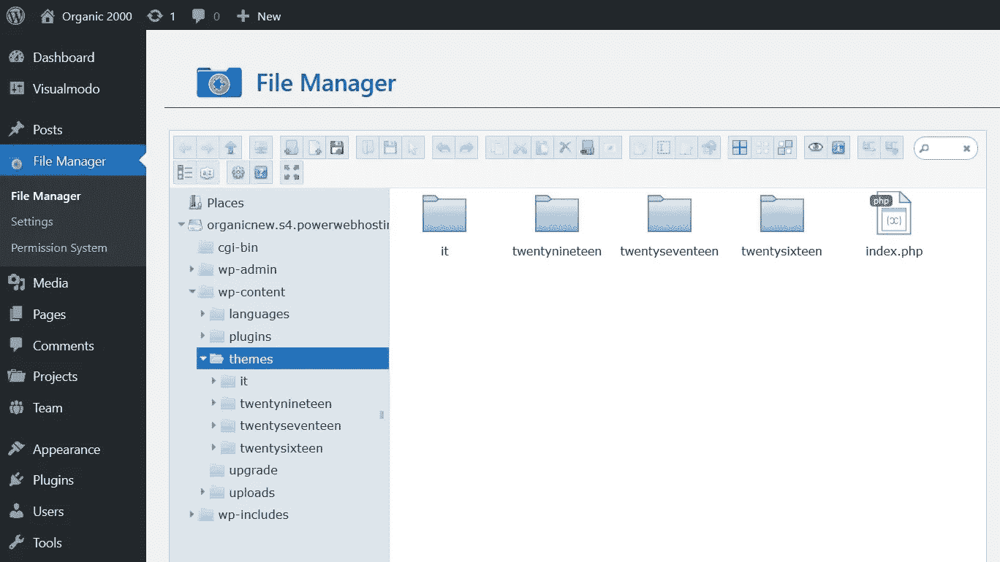

# 如何在没有主机访问的情况下通过文件管理器 FTP 安装 WordPress 主题

> 原文：<https://medium.com/visualmodo/how-to-install-wordpress-themes-via-file-manager-ftp-without-host-access-538a3f3756c3?source=collection_archive---------0----------------------->

在今天的 WordPress 教程中，我们将学习如何通过文件管理器 FTP 在视频中安装 WordPress 主题。无法访问主机及其最常见的原因。“上传的文件超过了 php.ini 中的 upload _ max _ filesize 指令。”错误。当文件在 WordPress 上上传时。此外，同样的方法在视频作品上传图像。文件。和插件插入到 WordPress 中。

# 如何通过文件管理器 FTP 安装 WordPress 主题？

此外，请用一种简单易行的方法来完成所有过程。无需访问主机或在计算机上安装文件管理器软件。

首先，您需要访问您的 WordPress 仪表板。转到插件。添加新项。在搜索字段中，键入'[文件管理器'](https://visualmodo.com/increase-wordpress-maximum-file-size-upload/)。结果，会出现一个 FTP 插件列表，只需安装一个。激活插件并点击 WordPress 仪表板上的“文件管理器”。其次，找到你的-contents' > 'themes '文件夹，并在里面放入你的 WordPress 主题文件(解压缩)。最后，稍等片刻，上传文件并激活外观面板上的主题。

# 最大文件大小错误:为什么？

最大上传量问题不是由你的主题造成的，一些主机在你的 php.ini 文件夹上应用了小尺寸选项，这个文件非常重要，你可以用一种没有这个上传问题的方式来更改/编辑它，你可以联系你的主机支持团队，要求对你的 php.ini 设置更大的上传量限制。

你需要在你的 php.ini 中找到并放大的行(或者。htaccess)是:memory _ limit = 32M/upload _ max _ files size = 24M/post _ max _ size = 32M(数字只是例子，在这种情况下越大越好)。

为了避免这个问题和其他一些问题。优选为以下值。

> memory _ limit = 256m
> upload _ max _ size = 64M
> post _ max _ size = 64M
> upload _ max _ files size = 64M
> max _ execution _ time = 300
> max _ input _ time = 1000