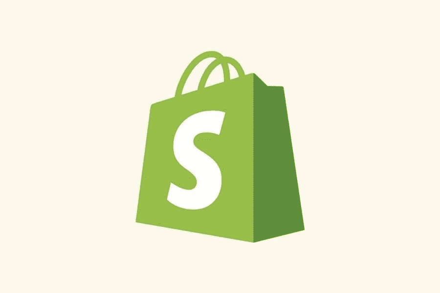

# 如何知道网站使用的是哪个 Shopify 主题

> 原文：<https://medium.com/visualmodo/how-to-know-which-shopify-theme-a-website-is-using-922829dc52ca?source=collection_archive---------0----------------------->

Shopify 主题是一个现成的模板，可以决定在线商店的外观和感觉。不同的主题有不同的布局，可以为游客提供独特的体验。一个主题不仅会让商店看起来很漂亮，还会传达一个有说服力的信息，让潜在客户购买。在本文中，你将学习如何知道一个网站正在使用哪个 Shopify 主题。

即使你刚刚开始这一旅程，或者已经是一名电子商务老手，了解其他商店如何利用主题来展示自己并赢得更多客户也是很好的。但是，有超过 100 个主题可供选择(这只是在 Shopify 主题商店上)，你可能会遇到一个设计不错的商店，但不知道如何在商店上为你的业务挑选出确切的一个。

幸运的是，有一些简单的方法可以让你知道一个网站正在使用哪个 Shopify 主题，我将在本文中向你展示。了解你找到的任何网站上使用了什么主题，这将使你在探索自己商店的视觉主题和向成功的竞争对手学习时获得巨大的优势。记住这一点，让我们开始吧！

# 了解竞争对手 Shopify 主题的好处

Shopify 是一个顶级电子商务平台，因为任何人都可以通过在一个易于使用的仪表板上创建自己的在线商店，轻松开始在线销售，即使这只是一个人的团队。事实上，它如此受欢迎(有超过 100 万的商家)部分是因为一个人可以建立一个漂亮的网站，而无需聘请设计师。这是现成的主题真正脱颖而出的地方，从逻辑上来说，你想知道一个网站正在使用哪个 Shopify 主题，因为你可以很容易地了解这一点。

以下是识别竞争对手的 Shopify 主题的最大好处

# 知道你网站的主题

新手很容易迷失在 Shopify 主题商店和其他主题网站的主题丛林中。你不知道挑选什么，仅仅是因为你不是一个网站设计师，无法知道一个好的主题是什么样子的。通过查看同行业成功竞争者的网站，你可以知道他们做对了什么。这是一个惊人的信息和灵感来源，所以你可以用合适的方式设计你的网站。

例如:如果你销售最新的高科技产品，你会希望你的商店看起来现代和充满活力。当你查看其他 Shopify tech 商店时，你可以知道应该追求哪些布局、颜色和风格，这对你的品牌至关重要。

# 调整主题预算

如果你知道竞争对手使用的主题，你也可以知道价格。因为一个主题通常是在一个企业的开始阶段选定的，所以它是你开始预算的一个重要部分。通过观察竞争对手的商店用他们的主题成本获得的业绩，你可以通过减少或增加你的初始预算来明智地花钱。有一个主题也可以节省你的网站开发时间，通常需要一个开发者和一个设计师才能得到一个好的结果。

# 窥探其他行业参与者，以了解网站使用的 Shopify 主题

如上所述，你所在行业的成功竞争对手可以成为你建立自己商店的很好的灵感。但是，你也可以从不好的例子中吸取教训，避免他们在使用 Shopify 主题时出错。最重要的是，你可以看到有机会获得一个标准的外观，或者更好的是，一个突出的外观，使你与众不同。当你注意到行业网站设计的新趋势时，你也可以更快地调整。

此外，当你窥探其他商店的主题时，你可以从他们有什么产品和服务，他们如何定价，以及他们使用哪些应用程序来照顾客户中学到一些东西。

# 检测任何网站的 Shopify 主题的工具

主题主要构建 Shopify 商店，因为它们为站点提供了必要的结构。但要检测出 Shopify 商店使用的是什么主题可能是一项相当困难的任务。通过下面的方法，你可以知道使用的是哪个主题。您可以获得以下结果:

*   如果该网站是否使用 Shopify
*   主题的名称
*   主题价格
*   主题的截图
*   插件或应用列表
*   扫描的商店截图

# Avada 的 Shopify 主题检测器

你可以用来识别一个站点的 Shopify 主题的最简单的工具是 Shopify 主题检测器。市场上有一些可用的工具，其中大多数是免费的，但我想向您展示我们新开发的工具。使用 Avada 的 Shopify 主题检测器，你只需输入一个网站的 URL，就可以获得该商店正在使用的主题的信息。

和上面的例子一样，我尝试输入 Ugmonk 的 URL。立即收到了他们商店的主题名称。还有一个我可以点击的主题链接。在这种情况下，Ugmonk 开发了自己的主题，因此没有可用的链接，但如果 Shopify 商店使用了 Shopify 主题商店中的可用主题，我们的工具可以将您带到该主题的购买页面。

就像现在，当我输入疯阿姨的网址。该工具立即显示商店正在使用来自 Shopify 主题商店的首次亮相主题。当我点击蓝色链接时，它会将我带到搜索结果页面。商店使用的免费主题。顺便说一下，对于初学者来说，这是一个很好的主题。

# 通过检查页面来源来了解网站使用的 Shopify 主题

还有另一种方法可以查看商店的 Shopify 主题。但是有点难。但是你不需要安装任何主题，这是通过检查页面源代码。

在 Chrome 浏览器中点击鼠标右键，选择 [*查看页面来源*](https://visualmodo.com/html-heading-tags-usage-tutorial/)*或者按 *Ctrl+u* 。然后，在出现代码的选项卡中，可以按 *Ctrl+F* 打开搜索框。键入 *Shopify.theme* 找到评论商店主题名称的代码。如上图所示，你可以注意到我正在研究的商店使用了主题帝国。*

*有时，商店开发自己的主题，而不是使用 Shopify 主题商店的标准主题。在这种情况下，您可以看到类似于*Production | TryNow Deployment、*的结果，而这在商店中是找不到的。所以，你不能下载这个，但是你会知道你所在行业的公司是否经常使用自定义主题。*

*检查 Shopify 商店主题的另一种方法是通过页面源中的 ID。所以，一个主题是由 Shopify 生成的，你会看到类似 *theme_store_id:838 的数字。*如果显示的是 *null* 而不是数字，那么主题不是来自 Shopify。结果，你知道了数字，你就可以用谷歌找到主题。看看主题商店上有没有。*

*如果您使用其他浏览器，如果您找到访问页面源代码的组合键，步骤相同。但是，当然，一个应用程序更快更容易使用。*

# *了解网站使用哪个 Shopify 主题的最后一句话*

*这就是如何知道网站使用哪个 Shopify 主题的简单指南。如果你开始一项新的电子商务业务。花时间逛逛其他商店，找到最适合你品牌的主题是很重要的。有了合适的主题，你的网站会看起来很棒，吸引更多的访问者，并获得更多的利润。*

*如果您对工具或步骤有任何疑问，请在评论区告诉我！感谢阅读！*

## *作者简介:*

*Chance 是 Avada Commerce 的营销专家，Avada Commerce 是一家快速发展的电子商务解决方案提供商，其目标是永远不写无聊的文章。他对在线业务的热情已经持续了两年多，伴随着他对电子商务的深入了解的文章。他还喜欢在空闲时间喝茶和玩爆炸小猫。*