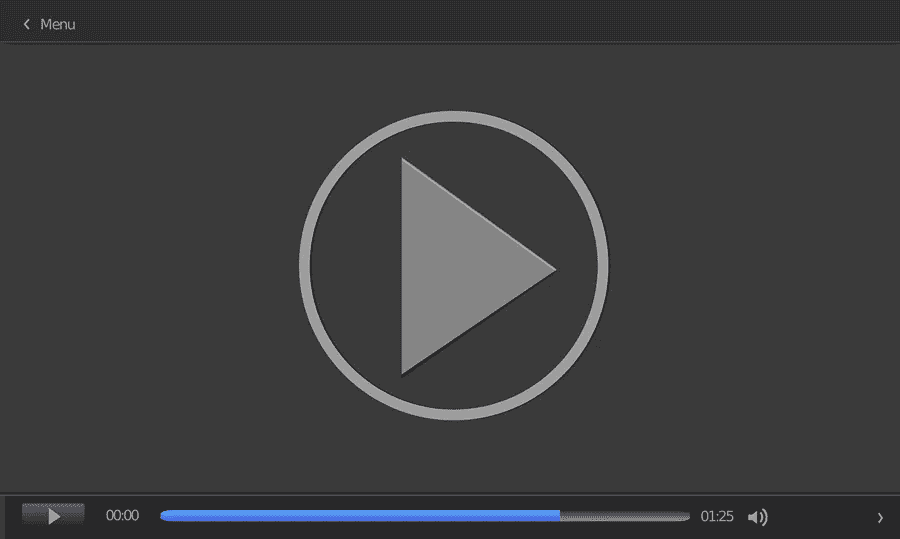

# 如何制作一个频道预告片来吸引用户

> 原文：<https://medium.com/visualmodo/how-to-make-a-channel-trailer-tips-for-youtubers-to-attract-subs-18a23105caa5?source=collection_archive---------0----------------------->

在这篇文章中，你会发现什么是 YouTube 预告片，为什么你和你的频道需要它，它应该是什么样的。还包括如何制作 YouTube 频道预告片的技巧。我们将学习如何制作频道预告片，并了解 YouTubers 吸引订户的技巧。

# 如何制作 YouTube 的频道预告片？

YouTube 在访问量最大的网站中排名第二，拥有超过 19 亿用户，超过 2400 万人是 YouTube 的订户。如此庞大的观众群是任何优步的梦想。然而，将所有这些人纳入你的魅力、个性和热情的网中并不容易。最具挑战性的事情是让他们知道你的频道存在，并说服他们，它不像数百个其他广播一样面向相同的目标受众。

能做到这一切并让你的视频点击率飙升的是你的 YouTube 频道预告片。这篇文章是一种让你的引逗者达到目标的手册(但是更加生动和令人印象深刻)。

# 如何制作一个 YouTube 预告片，让观众转向 Subs？

当你把你的产品(在这里是 YouTube 频道)展示给那些对你和你制作的内容一无所知的人时，第一印象是非常重要的。你的预告片应该是你在频道上所做的一切的精髓。它应该反映你的个性，显示你是谁，你的信息是什么。它应该激励观众，刺激他们点击订阅按钮。

YouTube 是一个社交媒体，视频博主在这里从情感上联系他们的观众。这就是为什么向你的潜在订户展示你自己是如此重要。这就像你熟悉每个跟随你的频道的人，变得更接近他们。情感联系发挥着巨大的作用，尤其是在你的渠道上为某些产品做广告的时候。如果人们关注的博主说他们需要，他们更有可能购买。

你认为制作一部预告片要花很多钱吗？你弄错了。使用 Movavi 的 Fastreel 可以轻松制作 YouTube 频道预告片。这款在线视频创作和编辑工具有免费和付费两种版本。你不知道它应该是什么样子，是吗？

所以，不用担心！三十五种不同的模板为您服务。选择一个最符合你的频道主题，并着手制作一个伟大的预告片。各种特殊效果和视频编辑工具将帮助您使您的视频看起来令人惊叹。

# 如何制作预告片？循序渐进的指导

对于从事视频内容创作的人来说，制作 YouTube 频道的预告片相对容易。这里有一个关于你应该做什么的逐步说明:

1.  首先，在 YouTube 上登录你的账户，进入你的频道页面。
2.  其次，使用定制频道按钮进入可以上传视频的页面。
3.  填写视频描述。使用首选的 SEO 标签会增加你的视频转化率，让更多人看到。
4.  最后，转到“新访客”选项卡，将此视频设置为您的频道预告片。就是这样！

# YouTube 预告片制作技巧

一部高质量的预告片的制作需要一些关于你要放入视频频道的内容的知识。它应该持续的时间和其他可能增加用户数量的因素也很重要。我们希望这些提示对你有用。

# 展示—不要说话

请记住，YouTube 是一个提供视频内容的社交媒体。在那里闲逛的人从视觉上感知信息。59%的人更喜欢看一段视频，而不是读一段文字，更不用说听长篇大论了。视频也是 72%的顾客获取产品或服务信息的首选方式。在制作频道预告片时，请记住这一点。不要只谈论你的频道能提供什么——把它展示给观众。您可以从已经上传到您的频道的现有视频中添加镜头。集锦是展示你所涉及的所有主题的好方法，让观众更好地理解什么值得期待，什么值得兴奋。

# 为 YouTubers 制作频道预告片展示自己

即使你在 YouTube 上有成千上万的订阅者。你需要向第一次看到你和你的视频的人展示你是谁。面向你的目标受众；告诉你是谁，你为你的渠道设定了什么目标。你必须有魅力。此外，还得[激励你的公众](https://visualmodo.com/how-to-get-better-speed-for-more-traffic-and-conversions/)。你得让人理解，亲近；你必须是他们在现实生活中想见的人。

# 确保你的视频很短

频道预告片是必须吸引观众注意力的视频。科学家们表示，两分钟以内的视频最吸引人。然而，你的目标是让一个人对他/她在屏幕上看到的东西印象深刻，并让他/她迅速做出决定——点击订阅按钮。因此，最有效的预告片时长从 30 秒到 1 分钟不等。
受限于如此狭窄的框架，你必须最有效地利用这段时间。写一个脚本，或者至少概述一下你将在预告片中讲述的要点。这会节省你必须明智使用的宝贵时间。你要在这个短视频中给出的信息量可能是巨大的，把它变成一个简短的文本是一项相当具有挑战性的任务。

# 品牌对 YouTubers 很重要制作频道预告片

每一个 YouTube 频道的风格都是独一无二的，有时，在搜索一个令人兴奋的视频时，人们的眼睛会捕捉到颜色。所以，字体和他们已经看过的标志。如果您频道上的视频有一些特殊的符号或设计，也可以在您的频道预告片中使用。

# 抓住你的观众

让新人在最初几秒钟内了解你的拖车里发生的事情至关重要。在介绍中，你必须找到他们敏感的地方，瞄准它，抓住观众，让他们一直看这个视频，直到最后一秒钟。通常，直接面对目标受众才是解决问题的方法。但是你也需要听起来吸引人，有希望，看起来有趣，因为视觉和听觉受体可以协同工作，帮助你改变你的观众的态度，从漠不关心到积极。

# 不要忘记行动号召。

创建您的频道预告片时，不要忘记它的最终目标——订阅。讲述你的产品很好，但是你必须刺激观众变成订阅者。行动呼吁是预告片的重要组成部分。你可以选择的词可能不同，但听起来不应该像是请求。它们应该让一个人相信他/她可以选择。您可以使用的短语可能看起来像:

1.  首先，如果你想看更多酷视频，订阅吧！
2.  其次，按下订阅按钮，在您的订阅源上获取更多精彩视频！
3.  这仍然不是我能给你看的所有东西。订阅以获取更多！
4.  最后，不要错过下一个视频，订阅，然后再回来！

# 优步制作频道预告片的最后想法

您的 YouTube 频道的成功就是您的战略的成功。明智地利用这种可能性来制作一辆拖车，让它看起来很完美。定制你的频道也很重要，把它变成你的个性反映(你可以在这里找到一些技巧)。充分利用你的机会，结果不会让你等待。我祝你有数百万的订户！好运！