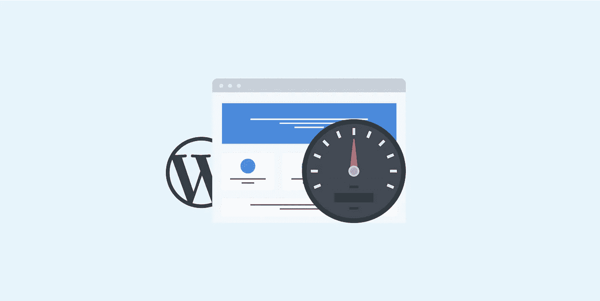
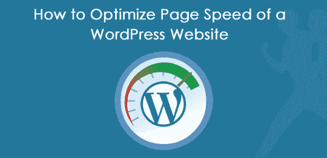
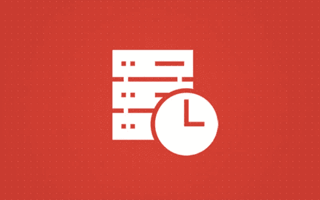
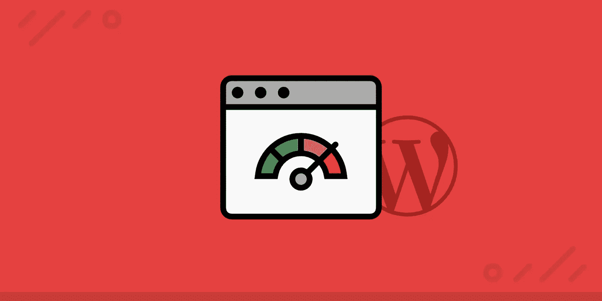

# 如何制作更快的 WordPress 网站

> 原文：<https://medium.com/visualmodo/how-to-make-faster-wordpress-sites-71503142c25b?source=collection_archive---------0----------------------->

加速你的网站

现在看看如何让你的 WordPress 站点更快！网站速度是个大问题。它直接影响着访问者的回访率、转换率、客户满意度，甚至是你的网站在搜索引擎中排名的机会，比如谷歌。简而言之，你的网站需要快！有多快？嗯，一般来说，页面的加载时间应该少于绝对的最大值三秒，但实际上:越快越好(理想情况下，最好是一到两秒)。

# 如何制作更快的 WordPress 网站

WordPress 是一个维护良好且高度简化的系统——当问题出现时，它们通常归结于一个事实，即几乎没有人使用普通的 WordPress 安装。为了得到你需要的结果，你可能会使用大量的插件、自定义代码或第三方主题——所有这些都有可能降低你网站的速度。在这篇文章中，我们将通过这些下降的根本原因，并看看你可以做些什么来解决任何问题，让您的网站恢复速度。

# 现场速度因素

有几个因素决定了网站的速度，下面是我们将更详细了解的几个因素:

*   砰
*   托管质量
*   代码质量
*   网站请求

# 砰

ping 实际上是查询从您的计算机到达服务器所需的时间。这是用毫秒来衡量的，可能看起来很低，但是这些毫秒加起来很快。如果你的网站有很多请求，即使是 10 毫秒的 ping 加起来也要一秒或更长。

你显然不能要求用户向你的服务器靠拢，但你可以使用 CDN 服务降低平均 pings。我们将在下面详细讨论 CDN 服务。

# 托管质量

虚拟主机可能是影响网站速度的最重要的因素。它不仅通过提供更快的缓存和更强大的服务器来影响用户体验，而且通过适当的基础设施，您可以更好地防止流量激增，同时也可以减轻较低代码质量的影响。

所以，找一个好的主机应该是重中之重。我们在 WinningWP 有很多关于托管的文章和指南——看看我们的[最佳 WordPress 托管服务指南](https://winningwp.com/best-wordpress-hosting/)和我们的[关于托管的文章](https://winningwp.com/category/hosting/)。一般来说，额外支付一点额外的费用是值得的——尤其是如果你的业务依赖于你的网站的速度和正常运行时间。

# 代码质量

代码质量以多种方式影响网站速度:糟糕的代码需要更长的处理时间；未优化的代码可能会占用更多的内存，或者更大，使得更快的 WordPress 站点需要更好的编码特性——需要更多的时间来下载。更不用说与难以维护的代码相关的滚雪球效应了——随着越来越多的开发人员以不同的风格、使用不同的方法向您的代码中添加越来越多的东西，它将开始退化，加剧上述所有问题。

问题是，除非你是一个经验丰富的开发人员，否则很难确定你正在使用的代码的质量。不过，有一些事情比其他事情更容易控制，比如选择可靠的插件，我们将在后面讨论。

# 网站请求

您的网站发出的请求数量与代码质量有关，但这值得强调，因为您可以在一定程度上控制它。每当你的站点加载一个资源——一个图像、一个视频、一个脚本(例如，一个跟踪代码)和一些其他的东西——就会产生一个请求。每个单独的请求都需要时间，这会降低网站的速度，但是有一些技术可以降低网站的请求数量——我们将在下面看看其中的一些。

# 测量装载时间

在你学习如何降低加载时间之前，你需要知道如何测量它们。GTmetrix 是这方面的一个很好的工具，让您可以测量您站点的性能，并免费获得各种信息和可操作的项目(还有一个付费计划，如果您定期测试或需要更高级的选项，它可能会适合)。有关更多信息，请查看我们专门的 GTmetrix 指南。

其他选项包括类似服务的 Pingdom，或基于浏览器的工具，如 YSlow，可以在 Chrome/Firefox/Safari 扩展库中找到。

# 什么时候装货比较合适？

这真的取决于你在做什么，但是，一般来说，不应该超过三秒。如果你的文本中主要有一两张图片，你的网站应该在两秒钟内加载完毕。如果一切都经过优化，并且你的主机是一流的，一个有几幅图片和大量文本的中档网站能够在 700 毫秒内加载。

# 减少装载时间

列出的一些方法可能比你目前的技能组合更高级一点(更容易获得的技巧在最上面)，但不要太担心——实现列表中的任何方法，然后每周尝试一种新方法。任何速度的提高都是有价值的，所以如果你没有马上浏览整个列表，不要担心。

# 选择最佳主机

我已经提到了一个好主机的重要性——我们的最佳 WordPress 主机服务指南应该能够帮助你做出明智的决定。一个好的主机提供先进的服务，如备份，网站监控和容易增加新的网站。我最近变得非常喜欢托管 WordPress 主机——它们的优势是专注于 WordPress，所以它们甚至根据它的需求组装硬件。

管理最好的三个 WordPress 托管服务是 WP Engine、Kinsta 和 Flywheel。所有这些都提供了高质量的托管服务，尽管它们有所不同，但我会把我的业务托付给任何人。

我要提醒的一件事是，不要使用那些专注于其他形式的托管服务的公司的托管服务。这些服务通常很便宜，并不是真正的 WordPress 专用，只是他们现有的共享或 VPS 计划的重新包装。这并不一定意味着他们不好，但是专门从事 WordPress 服务的公司在这方面做得更好。一个好的主机可以让 WordPress 站点运行得更快。

# 插件审查

如果你有一个非常缓慢的网站，检查你的插件可能是你最好的行动之一。我建议仔细检查你的插件列表两次。在你第一次检查时，找出你不用或不需要的插件，停用它们，然后删除它们。请记住，你不应该一次安装超过一个 SEO 插件或缓存插件，因为这将大大降低你的网站速度。事实上，如果你使用托管 WordPress 主机，你可能根本不需要一个缓存插件——询问你的主机以确保这一点。

现在你已经剔除了所有不必要的插件，是时候回顾一下剩下的，看看是否还有改进的空间。确保每个插件都是最好的:库中有数千个插件，所以选择那些可信的、经过测试的、高质量的。像往常一样，我们已经为你准备好了——看看我们的[选择插件指南](https://winningwp.com/how-to-choose-and-install-new-wordpress-plugins/),获得一些最好的技巧。

你的目标应该是拥有尽可能少的插件:通过优化你的插件使用，你将会降低你的站点的请求数量，这将会进一步提高速度。

# 更新所有内容

首先，确保你总是使用最新版本的 WordPress。从 3.7 版本开始，WordPress 已经有了小版本和安全更新的自动更新。当一个新的更新出现时，你会在管理员那里得到一个通知。不要把它当成一件琐事而不予考虑——它只需要不到一分钟的时间，并且会提高你的网站的安全性和速度。

你也可以配置你的站点自动应用核心更新——看看 WordPress Codex 中的[自动更新指南](https://codex.wordpress.org/Configuring_Automatic_Background_Updates)。确保你的插件和主题也更新到这些产品的最少错误、最新、最安全和最快的版本。

这就是 WordPress，但是不要忘记你的服务器——尤其是你的 PHP 版本。PHP 是编写 WordPress 的基础语言，PHP 的最新版本与之前版本之间的速度差异很大，几乎全面提高了一倍(查看 [PHP 性能洞察](http://www.zend.com/en/resources/php7_infographic)亲自查看)。

高端主机会为你管理这个，或者你可以自己设置你的站点使用哪个版本的 PHP。看看你网站的控制面板，或者给你的主机支持人员写封短信，让他们把你放在 PHP7 上——这会有很大的不同。

# 使用 CDN

我以前提到过降低 pings 的 CDN 服务。CDN(内容交付网络)是一个分布式网络，它从地理上更接近访问者的位置向他们提供内容。如果我通过 CDN 提供图像，美国的观众可能通过德克萨斯州的数据中心接收图像，而欧洲人可能通过德国的数据中心获得图像。

由于数据现在分布在世界各地，减少数据传输的距离可以降低 pings 和传输时间，并减少网络压力。如果你想把你的网站转移到另一个地方，或者在本地工作，使用 CDN 也会使生活变得更容易。由于从 CDN 提供的内容是在云中，当移动一个站点时，您不需要移动它，这是一个巨大的生产力增益！

CDN 解决方案通常由两部分组成:存储位置和交付网络(后者是实际的 CDN)。例如，亚马逊有一个名为亚马逊 S3 的存储解决方案，你可以连接亚马逊的 CDN 解决方案——CloudFront——以确保你的内容在其网络中分发。设置这个比你想象的要简单。看看我们的指南——将 WordPress media 迁移到亚马逊 S3——了解更多信息。 [MaxCDN](https://winningwp.com/ref/maxcdn/) 和 CDN77 也是很棒的 CDN，比亚马逊的解决方案更便宜(通常也更快)。

# 使用缓存

当您向查看者提供页面时，会发生以下情况:PHP 代码在服务器上执行和处理，产生发送给用户的 HTML 代码。产生的 HTML 通常是相同的，但每次都要进行处理。以一篇博客文章为例，除非更新，否则它不会改变，但 PHP 代码仍然每次都被处理。

缓存通过“保存”处理操作的结果来节省宝贵的服务器时间。代码被执行和处理，产生的 HTML 存储在缓存中。对于随后的访问者，整个过程被跳过，他们将收到保存的 HTML 版本。

这不仅加快了网站的速度，而且对处理流量激增也有很大帮助，因为服务器不需要处理每个请求。目前，WordPress 有三个知名的一体化缓存解决方案:W3 Total Cache、 [WP Super Cache](https://hu.wordpress.org/plugins/wp-super-cache/) 和 WP Rocket。

W3 Total Cache 和 WP Super Cache 都是免费的，前者的评论更好。WP Rocket 是该团队的新成员，根据评论，它拥有最快的性能。然而，这是一个高级插件，所以会花你的钱。

在您测试缓存解决方案之前，请记住我们之前给出的建议:永远不要安装一个以上的缓存插件，并询问您的主机是否需要一个。安装一个以上的缓存插件是一个可怕的想法，因为它可能会减慢或破坏你的网站，如果你是在一个托管的 WordPress 主机计划中，你的主机可能有一些内置在服务器级别的东西，这对更快的 WordPress 网站创建非常重要。

# 优化您的图像

WordPress 尽力提供优化的图片，但有些事情它根本做不到。在你上传图片之前，最好用 Photoshop 之类的软件对其进行优化。所有图像编辑器都允许您选择 JPEG 质量，因此尽可能使用最低的设置。在许多情况下，您不会注意到 100%和 60%质量之间的差异，但是文件大小可以减少一半(或更多)。

还有一些工具可以用来批量优化图像。 [ImageOptim](https://imageoptim.com/) 对 OSX 用户来说是一个很棒的工具，而 [RIOT](http://luci.criosweb.ro/riot/) 对任何 Windows 用户都有帮助。最好不要过分关注图片大小，原因如下:当你上传一张 3000×1000 的图片时，WordPress 会保存它的特定大小，这是由你的主题决定的。如果您的主题使用 900×300 的特色图像，大图像将缩小到这些尺寸。到目前为止一切正常:将使用适当的图像。

如果由于任何原因，图像大小不存在(错误，您切换了您的主题)，可能会使用原始的 3000×1000 版本。你可能看不出有什么不同，但是你只是给你的网站增加了 1MB 的空间，从而降低了你的速度。

当你改变你的主题时，你的图片大小会到处都是:你的新主题可能需要一个 300×100 的特色图片，而这个图片根本不会存在。你最好的选择是当你切换主题时，使用一个插件，比如重新生成缩略图，重新生成你的图像尺寸。如果你有成千上万的图片，这可能需要一段时间，但它会大大加快你的网站，使 WordPress 加载更快。

# 雇佣一个优秀的程序员

我怎么强调这一点都不为过。雇佣一个优秀的开发人员，并与他或她持续合作，类似于为更好的主机服务支付一点额外的费用。你可能在短期内感觉不到影响，但从长远来看，你会诅咒自己选择了廉价的选择。

事实是 WordPress 很容易编码。PHP 并不是一门很难的语言，WordPress 有如此多的文档，你可以在几周内学会如何制作一个基本的插件。从很多方面来看，这都很好，但这也意味着很多人在准备好做有质量的工作之前就提供了服务。

在开发中，如果成本看起来好得不像真的，那么它很可能是真的，并且工作质量会受到影响。一个有经验的开发人员不仅知道如何实现你需要的东西，他们还知道如何以一种优化的、经得起未来考验的方式来实现它们。每小时支付 50 到 100 美元可能看起来很多，但我保证，从长远来看，如果你让一个不合格的人在你的网站上工作，你会支付更多，这是一个更快的 WordPress 网站，这真的很重要。

# 自学

另一个提高网站性能(不仅仅是速度)的好方法是了解你正在使用的技术。从使用 Google Analytics 跟踪你的网站到使用 WooCommerce，每一个你能想到的话题都有指南、教程、视频、文章和论坛，所以你应该能找到你需要的一切。

尽可能多的学习可以帮助你更好的管理你的网站，让你更有效的与开发者和设计者交流。

# 开发任务，使更快的 WordPress 网站

作为一个网站所有者/用户，你能做的只有这么多，来帮助创建更快的 WordPress 网站。代码中犯了许多基本错误，对此您无能为力——除非您愿意弄脏自己的手！不深入本质，这里是你会遇到的最常见的问题，以及如何解决它们。

# 将脚本放在页脚

加载脚本会占用宝贵的请求和带宽。虽然有些需要放在页眉(网站最先加载的部分)，但大多数放在页脚(网站最后加载的部分)就可以了。当浏览器开始加载你网站的页脚时，它已经加载了你的内容，所以当页脚的脚本被加载时，浏览者可以开始阅读。

解决方法是尽可能地向页脚移动。在 WordPress 中，你可以使用 wp_enqueue_script()函数来完成这项工作——更多细节请看链接文档。这有助于提高 WordPress 网站的速度。

# 首先加载重要内容

同样的逻辑也适用于你的内容结构。如果你的侧边栏在你的内容加载之前就加载了，并且出现了问题，它会影响整个网站。如果它加载了你的内容，仍然会导致网站挂起，但是，到那时，主要内容已经加载完毕。

以一种允许你的主要内容尽可能快地被加载的方式来组织你的代码，这样如果有任何问题发生，用户就有东西可以看了——他们甚至可能没有注意到问题。

# 串联和缩小文件

连接(合并)文件有助于减少站点发出的请求数量。如果你的站点包含 10 个 JavaScript 和 10 个 CSS 文件，你就发出了 20 个请求。但是，如果将所有的 JavaScript 文件合并到一个文件中(对样式表也是如此)，就可以将请求减少到两个，这样可以节省很多加载时间。

拼接可以通过终端或命令提示符手动完成，但更常见的是使用构建工具，如 Gulp 或[Grunt](http://gruntjs.com/)——两者都有拼接扩展。您也可以使用 GUI 工具，如 CodeKit 或 Prepros。

缩小文件是减小文件大小的一种简便方法。编写代码是为了让人类阅读，但是机器不需要所有额外的空格和可读的变量名。缩小去掉了可读性所需的一切，比如空格、换行符和注释。更好的是:使用的工具同上！

# 优化您的数据库

随着时间的推移，任何数据库都会退化。你的代码越糟糕，这种情况发生的越快。幸运的是，MySQL 内置了一些很棒的工具来修复这些问题。大型数据库会消耗更多的内存并降低查询速度，从而导致处理时间更长，这可能会增加 10 秒的加载时间！

SiteGround 有一个关于使用 SQL 查询优化 MySQL 数据库的简短教程，还有一个关于使用 phpMyAdmin 优化数据库的教程。

# 启用 GZIP 压缩

网页的大小对下载速度有很大的影响。通过使用 gzip 压缩网站(这很像使用 zip 存档)，您可以减少页面的大小，从而减少检索所需的时间。要使其工作，您需要编辑您的。htaccess 文件— [GTmetrix](https://gtmetrix.com/enable-gzip-compression.html) 很好地概述了如何做到这一点。这有助于创建更快的 WordPress 网站。

# 最后的想法

如你所见，你可以做很多事情来加速你的网站！有些方法是为开发人员(或者更喜欢冒险的人)准备的，但是有一些简单的调整，你可以作为一个普通用户来提高你的站点速度。

你能做的最聪明的事情之一是研究你使用的插件和主题，并与你做出的决定保持一致。这将有助于使你的网站更快，并保持这种速度！