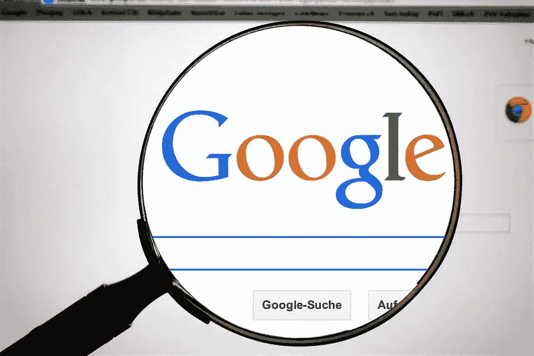

# 如何让谷歌信任你的网站？

> 原文：<https://medium.com/visualmodo/how-to-make-google-to-trust-your-website-1fa152efce1e?source=collection_archive---------0----------------------->

在不断发展的数字营销游戏中，有一点多年来从未改变:如果你想要更多的客户，你需要与谷歌保持良好的关系。在这篇文章中，我们将解释和分享让谷歌信任你的网站的最佳策略。谷歌是最常用的搜索引擎之一，所有年龄和背景的用户都依赖它来获取信息。随着谷歌根据其算法对搜索结果进行排名，那些排名高的网站比其他网站获得了更多的曝光率。事实上，大约 33%的用户会点击他们得到的第一个结果，75%的用户甚至不会点击第二个结果页面。

# 如何让谷歌信任你的网站？

在谷歌上获得排名取决于几个因素，其中最重要的是谷歌对你的网站的信任程度。**以下是你需要做些什么来赢得谷歌的信任:**

# 了解谷歌如何评价你

当你知道谷歌的算法根据 200 多个因素对网站进行评估和排名时，你可能会感到不知所措。然而，你首先应该明白的是，所有这些因素都是为了一个目标:提供更好的用户体验。这是一个非常广泛的目标，包含许多事情，但只要你牢记在心，你就一定会专注于增加你成功[机会](https://visualmodo.com/mistakes-that-you-need-to-avoid-in-content-marketing-strategy-for-business/)的关键方面。因此，你不会盲目地遵循随机的搜索引擎优化策略，你会一直把你的努力集中在真正对你的访问者有影响的事情上，这对每个人都是一个胜利。

# 打造你的品牌

所有的营销人员都知道实施 SEO 以获得更好的排名和更多曝光的重要性，但这一重要信息导致许多人误入歧途。这是许多营销人员开始花费精力和时间在他们的主页上填充关键词的主要原因，认为这肯定会提高他们的排名。然而，SEO Jet 的 SEO 专家亚当·怀特采取了一种有争议的方法来赢得谷歌的信任和提高排名。他建议，与其专注于关键词推荐来建立你的反向链接档案，不如专注于建立你的品牌？这个策略被所有的顶级品牌和成功的 SEO 从业者所实施，它保证提高你作为一个品牌的可信度和可信度。

# 让谷歌信任你的网站

让高权威网站推荐他们的访问者到你的网站，或者，更好的是，你的品牌，是一个加强你的反向链接的策略。然而，我们大多数人只关注链接的这一部分，而忽略了链接的力量。在谷歌眼中，互联网世界的理想版本是万物互联，指的是下一个网站。对于那些想要创造一种仅仅局限在页面墙壁上的用户体验的网站来说，几乎没有空间。另一方面，链接到其他网站，尤其是那些品牌权威性高的网站，会大大增加你赢得谷歌信任的机会。

# 让你的域名信息可信

在评估你的网站时，谷歌还会考虑另一个关键因素，那就是你的域名可信度。您可以做一些事情来证明这一点，这些事情包括:

# 1 长域名注册让谷歌信任你的网站

这仍然是 SEO 中尚未解决的因素之一，但我们可以肯定的是，长期注册你的域名会给谷歌一个信号，表明你会在这个游戏中待很长一段时间。这提高了您的域的权威性，反映了它的可信度。

# 2 公共 Whois 档案

如果你想赢得信任和忠诚，那么你应该向公众展示你的信息。这样，你就表明你没有什么可隐瞒的；你证明你是一个合法的网站，而不是垃圾邮件。

# 3 合法的联系信息

为了进一步公开您的信息，请考虑将您的 Whois 联系信息添加到您自己的网站上。不仅谷歌会批准这一举措。但是你也将创建一个与你的访问者交流的开放门户。

# 优化你的网站

更加关注你的网站和你可以在网站上做的事情。这里有一些你需要考虑的因素:

# A.现场搜索引擎优化让谷歌信任你的网站

站内 SEO 就是你在自己的网站上所做的一切来提高它的排名。例如拥有一个模式、添加关键字优化的元描述、添加替代文本图像描述以及维护干净的代码。虽然提高你的排名通常是你实施现场 SEO 的主要目标，但这些策略也有助于提高你的可信度。

# B.用户体验

我们已经简单地提到了你的用户体验应该是你的首要任务。更详细地说，你可以通过使你的网站移动友好和响应迅速来实现。确保你的页面加载速度很快，并且你的网站没有坏链接也很重要。

# C.基本页面

有几页和一些信息你需要密切注意添加到您的网站。其中包括以下内容:

1.  关于页面
2.  隐私策略
3.  服务条款
4.  附属公司免责声明

# 获得信誉

既然你已经有了基本的东西。所以，你需要付出额外的努力来确保你作为一个领域专家的可信度。一旦你在用户眼中建立了信誉。因此，作为一个值得信赖的品牌，你也一定会赢得谷歌的信任。要实现这一点，您应该关注以下几点:

# 内容

谷歌的最新算法集中在评估网站的三个主要方面:E-A-T，或专业知识、权威性和可信度。要震撼你的游戏，你需要确保你的内容信息丰富、准确、全面且有价值。

# 用户评论让谷歌信任你的网站

你得到的每一个积极的评价都被认为是对你的可信度的证明，它在你的评估中占很大比重。另一方面，差评是相当具有破坏性的，所以要确保你在不断改进你的网站和品牌。

让谷歌信任你的网站是释放你营销努力的真正潜力的第一步。实施各种策略很容易，但是你所有的努力还是会很分散。如果你不把注意力放在最重要的事情上。从建立你的信誉开始你的旅程，这可以通过建立你的品牌来实现。让你的域名值得信赖，优化你的网站。之后，你可以专注于维护和提高你作为领域专家的可信度。