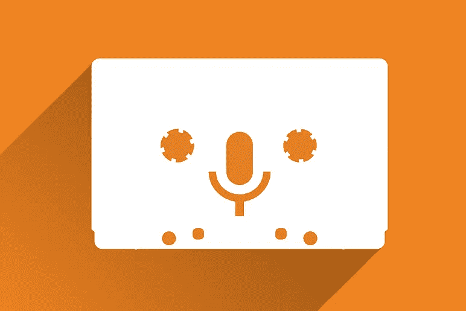

# 如何用播客赚钱

> 原文：<https://medium.com/visualmodo/how-to-make-money-with-a-podcast-b06d7c7445b5?source=collection_archive---------0----------------------->

随着播客越来越受欢迎，越来越多的人开始直接参与并创建新的节目，以努力利用自己作为行业专家的优势，建立观众群，与更多有影响力的人联系，建立个人品牌，并增加他们企业的曝光率。许多人现在也成功地使用播客作为额外的方式为他们的企业和个人赚钱。

# 用你的播客做广告赚钱

让我们从最基本的盈利方式开始:投放广告。说到播客广告，公司和品牌一般会为每千次收听支付 X 美元。通常，这个比率被称为 CPM，正如你在上面的图片中看到的，Anchor(一个播客主持人)支付 15 美元 CPM。他们跟踪收听，播客在播放他们的广告时赚取费用。在这种情况下，如果播客只有 500 次播放，那么播客仍可获得 7.50 美元。

一些利用 CPM [广告](https://visualmodo.com/how-much-should-you-spend-on-adwords/)模式的赞助商根据他们将出演的剧集的平均预期下载量付费。例如，如果一个播客每集平均获得 5000 次下载，赞助商可能仍然要支付 15 美元的 CPM。但他们会提前这么做，不管该集的实际下载量如何。它可能会上升到 10，000，使他们的投资回报率更高。这是一集表现不佳的剧集，仅获得 3000 次下载。这类赞助往往着眼于几个月的剧集趋势。决定他们支付的总 CPM。

此外，如果你想做广告。你应该知道有两种不同的广告可以在你节目的三个不同的地方播放。每一个都可能从广告商那里产生稍微不同的费率。

# 播客广告风格

预先录制的广告就像它们听起来一样:在过去的某个时间点录制的广告，在多个剧集中播放(或者至少可以播放)。这也可能是主持人的朗读，但也可能是赞助商发送的要在剧集中播放的节目。这些赚得不错，但是你更容易被听众忽视，因为他们会一遍又一遍地听。

主机阅读广告是最有效的广告之一。主持人花时间录制他们播客独有的广告，展示他们对专门为听众量身定制的产品或品牌的独特看法。这些广告对它们出现的剧集来说是独一无二的，正因为如此，它们往往是收入最高的。

# 用播客空间赚钱

那么，插播广告就是在节目中间播放的片段。一般来说，主持人会休息 1-3 分钟，然后连续播放广告，然后继续节目。有时它们是独一无二的，有时它们被记录下来。不管怎样，这些广告的收听率也很高，但远不及前置广告。所以他们不要求很高的价格。

在你的节目开始之前，前滚动广告就开始了。这些可以是主机读取的或预先录制的，但它们是听众按下播放键后的第一件事。有时主持人会在介绍音乐或任何节目开始时读一个前滚动广告，但在它之前绝对没有内容。前置式广告是最受欢迎的，因为它们的收听率最高，因为用户按下播放按钮，砰！他们被广告击中了。这意味着你可以得到比其他老虎机更高的 CPM。

后滚动广告也榜上有名。还有节目！这些是听众在音轨结束前听到的最后的东西。你可以使用任何你想要的数字，但是他们不要求像其他人一样高的 CPM 率，因为听众可能会缩短节目并错过这些。然而，对于那些沉迷于演员表和听播放列表的人来说，它们仍然是有效的。

记住所有这些变量，你就能明白为什么广告和赞助对播客来说如此有利可图。然而，由于他们完成了 CPM，你必须获得每集的大量收听，才能真正使他们作为一个职业在经济上可行。然而，有钱总比没钱好，CPM 广告是弥补主持费用和你在播客中可能发生的其他费用的绝佳方式。

# 播客观众支持

听众支持可能是播客最流行的盈利方式，听起来就像是这样。你的听众为你的节目捐款。他们给你钱是因为他们喜欢你创作的内容，希望你继续创作。由于播客往往是免费的，用户花一美元(或二十美元)去看一个他们每周都在听的节目通常不会有任何问题。

作为一个受到粉丝支持的播客，你可以通过这种方式赚很多钱。如果你建立了一个爱你和你的内容的社区，他们集体每个月可以给几千美元。然而，听众支持的播客货币化方法存在缺陷。最重要的是你要听从听众的摆布和他们的好意。收入不稳定，你不能 100%地指望每月的收入。

第二个担心是，对于一些人来说，寻求支持感觉有点怪异。他们可能会觉得好像是在请求施舍。播客们不想让自己听起来像是在乞讨，或是不要脸，或是过于自我推销。

尽管有这些疑虑，但是，听众的支持是播客收入或盈利的最好方法之一。正因为如此，许多平台已经开放，为听众简化这个过程。毕竟，听众和播客之间的摩擦越少，他们就越有可能完成交易(这同样适用于电子商务商店，所以记住这一点)。

# 播客支持平台

虽然没有办法做一个详尽的列表，但我们将重点介绍一些更受欢迎的听众支持平台。

Glow.fm 对听众支持行业来说是一个相对较新的行业，但他们发展得非常快。Glow.fm 的重要之处在于，他们专门致力于播客，正因为如此，希望用户之间的摩擦越少越好。因此，他们在播客的 show notes 中的链接直接指向一个页面，听众可以简单地点击并使用 Apple Pay 或 Google Pay(或其他东西，如果他们愿意)支付，而不必注册一个单独的帐户或离开他们的 podcatcher。

Patreon 可能是播客与支持者联系的首选方式。Patreon 是一个众筹网站，允许用户持续支持项目，而其他网站(Kickstarter 和 IndieGoGo)则更关注更大的一次性承诺。播客可以设立奖励等级，通过独家内容、不和谐角色、Reddit 天赋以及他们能想到的任何其他方式来激励他们的听众。

Anchor.fm 是一个播客主持人，其平台内置了听众支持。如果播客在节目的设置中启用了该选项，则“支持此播客”按钮会出现在节目的主页上。实际上，Anchor 的侦听器支持工作起来像 Glow，但是是特定于平台的，Glow 是平台不可知的。

# 向客人推销景点

这是一个有争议的举动。在某些情况下非常有争议。最受欢迎的播客是一对一采访。人们崇拜他们。他们可以从很多不同的角度听到很多不同的话题，这使内容保持多样化，并帮助它不会变得陈旧。

如果你是一个真正优秀的采访者，你的节目越来越受欢迎，预定的客人可能会从你不得不出去向客人推销你的节目变成你的客人向你的节目推销自己。

虽然这是一个了不起的转变，但时间和日程安排的问题也随之而来。你可能会有比你的播客或录制时间更多的嘉宾选择。所以你必须开始对别人说不。所以你必须开始挑选你节目中的嘉宾。那是艰苦的工作。而且费时。

这时候卖客串就进来了。为了让整个过程值得你花时间，你会向参加你节目的人收取出场费。这有双重作用:

付款。这是你的收入来源，也是你的播客赚钱的目的。你只会看到真正对你的节目感兴趣的客人。就像大学申请费一样，这只是一点摩擦，为什么不呢？观众和我想为真正的观众做这件事。

即使出场费低至 10 美元，这也足以让那些对你不感兴趣的人远离你的收件箱。结果，你提高了价格等级，但是，如果你做得好，你可以赚很多钱。所以，在继续之前，让我们看一个真实的例子:

# 用播客赚钱:示例

约翰·李·杜马斯运营着一个名为“企业家在燃烧”的播客，这是一个非常受欢迎的商业播客，每月有超过 100 万人收听。他每集向客人收费 6500 美元。是的，那是六千五百美元。每位客人。他每个月做 4 集节目，这意味着他仅从播客嘉宾那里就赚了 26，000 美元。他的嘉宾出席申请表上写着:

> 《着火的企业家》是一个顶级的获奖播客，至今已有超过 2000 集，每月收听超过 100 万次。每个月有 400 多人申请 4 个面试名额，竞争非常激烈，我们收取出场费，以确保只有真正热情的企业家才会申请。祝你好运！

即使每个职位 6500 美元，他每个月也能带来 400 多名申请者。他过去常常收取 5000 美元，并提高它来阻止人潮。它勉强做到了用播客赚钱。

现在，如果没有障碍的话，你能想象 EoF 的工作人员需要处理多少申请才能找到高质量的客人吗？

诚然，大多数人无法逃脱收取客人 6500 美元。(但如果可以，我们真为你高兴！)即使你收取 100 美元的出场费，你的嘉宾的质量也可能会提高，而且你会为你的节目带来可观的收入，因为你实际上并没有做什么不同于你已经在做的事情。

# 照顾

如果你决定收取嘉宾出场费，请注意一些听众可能会把你的节目视为该产品、人物或品牌的商业信息片或广告。但愿不会如此。为了消除这种看法，你需要培养自己和观众之间的信任，并且仍然只认可符合你节目标准的嘉宾。仅仅因为有人愿意支付过高的价格并不意味着他们对你节目的听众有好处。

只要你把它们记在心里，并一如既往地经营你的事业，你就绝对不会做任何不道德的事情。

# 奖赏

人人都爱贴纸。去开会？到处都是贴纸。去咖啡店吗？把贴纸留在桌子上。想参加比赛吗？赠送一些贴纸作为奖品。人们会喜欢他们的。我们不知道贴纸是什么，但它确实有一些东西。人们喜欢它们。它们的生产成本很低。因此，你可以以 0.25 美元左右的价格买到它们。即使你以 1-2 美元的价格出售，也有很大的利润空间。

如果你不想成为一个不得不处理邮件的人。或者自己处理生意。像 Redbubble、Zazzle、Society6 等网站可以充当中介。你上传你的设计(或标志)，当人们购买你的东西时，他们会给你寄钱。

总之，merch 很容易推广，可以成为一个很好的被动收入来源。只要你吸引你的听众，培养真正的粉丝。你已经在做了。因此，merch 是一个显而易见的方式来赚钱你的播客。

# 在你的播客上赚钱

此外，还有出售 merch 的绝佳选择。实体商品对播客来说是一个巨大的福利，因为它不仅给你最忠实的粉丝们提供了一些有形的东西来增加他们的收藏，还给了你一个被动的广告流。卖衬衫，这样人们就能看到你的商标、名字、网址等等。手提袋和浴帘也是如此。(像 Society6 这样的网站确实允许定制浴帘！)

虽然 t 恤往往是最畅销的商品，但你可以向热爱购物的听众推销无穷无尽的商品。正如我们上面提到的，手提包效果很好，束带包卖得就像要过时了一样(它们没有过时)。你也可以做旅行杯，这对你自己也有好处，因为你可以带着它们去参加会议。然而，这甚至没有提到什么可能是最重要的。最后，这是用你的播客赚钱的最好方法。