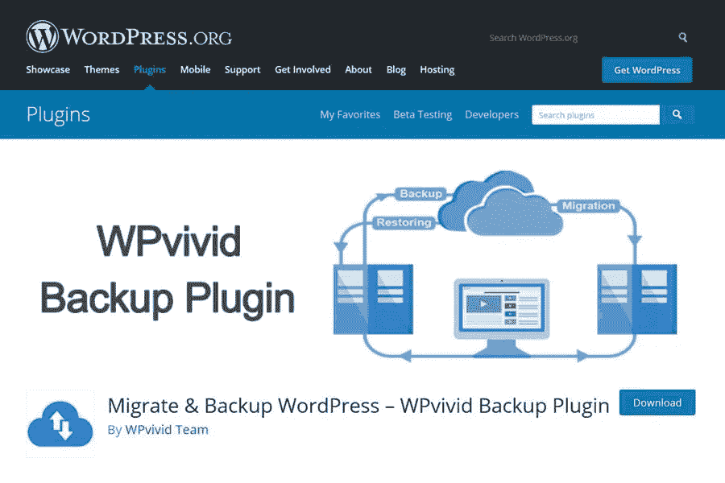

# 如何迁移 WordPress 网站

> 原文：<https://medium.com/visualmodo/how-to-migrate-a-wordpress-website-21177f3db24e?source=collection_archive---------0----------------------->

## 到任何目的地使用 WP 生动备份插件

WPvivid WordPress 插件提供了一个一体化的解决方案，可以帮助你进行网站备份、恢复，甚至网站迁移。它充满了令人敬畏的功能，所有这些功能都包含在一个直观的用户界面中，这也使得它非常适合初学者。你想知道最棒的是什么吗？—完全免费使用！

注意:该插件的专业版目前正在测试中，很快就会上市。

总的来说，就免费插件而言，这是解决 WordPress 站点迁移问题的最佳方案之一。这就是为什么，为了这次阅读的目的，我们整理了一份关于如何使用 WPvivid 备份插件将 WordPress 网站迁移到任何目的地的综合指南。

# 使用 WPvivid 备份插件迁移 WordPress 网站

所以事不宜迟，让我们开始吧:

# 第一步:安装 WPvivid 备份插件

要将你的 WordPress 网站从你当前的主机提供商迁移到一个新的主机提供商，你需要在两个网站上都安装插件。你可以把它安装在你当前的网站上，就像你安装其他插件一样。

此外，确保你的新主机提供商安装了 WordPress，但除了 WPvivid 备份插件之外没有其他插件或主题。这里有一个如何安装插件的快速教程:

只需前往你的 WordPress 仪表盘，然后从左侧边栏进入**插件>添加新的**并搜索**WP 生动备份插件**。现在点击**安装**，然后点击**激活**，WPvivid 将会安装在你的网站上。

# 步骤 2:设置迁移目标网站

一旦完成，前往[迁移目的地](https://visualmodo.com/how-to-duplicate-a-wordpress-website-easily/)网站。现在，前往 WPvivid 中的关键选项卡。这里您需要生成一个密钥。它看起来就像上图所示。

# 步骤 3:开始 WPvivid 迁移

现在，回到你原来的 WordPress 网站，然后到 WPvivid 下的**自动迁移**部分。在这里，您会注意到需要粘贴新生成的迁移密钥的地方。完成后，单击保存并向下滚动到下方。接下来，您需要选择要传输的内容。如果你想将整个 WordPress 网站迁移到新的目的地，选择*数据库+文件*。现在点击*克隆，然后转移*，该过程将开始。

这将启动传输过程。现在，根据您网站的大小、服务器速度、您的互联网连接和其他因素，完成迁移需要几分钟时间。

# 步骤 4:使用 WPvivid 完成迁移

传输完成后，前往您的目的地网站，进入**WP vivid>Backup&Restore**菜单。向下滚动，您将看到新的备份文件已从源网站发送。

现在，您可以选择下载、恢复或删除备份文件。点击*恢复*，在您的目标网站上开始迁移过程。但首先，请选择您是否想要–

*   恢复并替换原始域。

或者，

*   恢复并保持原始域不变。

如果要转移到新的域，您需要选择第一个选项。但是，如果您计划将旧域也迁移到新主机，那么您可以选择第二个选项。

在你选择了一个选项后，选择**恢复。**同样，这需要几分钟的时间来完成。一旦完成，打开你的网站，看看是否所有的东西都被完美的移植了。

# 可选:优化 WPvivid 插件

Wpvivid 带有一个丰富的设置面板，可以让你更好地控制如何处理所有的[备份](https://www.forbes.com/sites/tomcoughlin/2019/07/24/where-do-you-backup-data/)和迁移。如果你有非常大的文件，那么来这里根据你的需要优化插件是有意义的。

从上图可以看到，有两个设置选项卡——**常规**和**高级**。对于我们的迁移需求，我们正在修补设置。

*   **启用 web 托管/共享托管的优化模式**:此选项可帮助您优化服务器资源有限的共享托管环境的备份流程。
*   **压缩文件**:一些虚拟主机提供商会限制你上传大的 zip 文件，这在迁移你的 WordPress 网站时会是一个问题。但是，您可以通过将备份拆分成许多较小的部分来轻松地解决这个问题。
*   **排除大于**的文件该选项允许您删除大于指定文件大小的文件。
*   **PHP 脚本执行超时:**一旦到达指定的超时时间，将关闭备份进程。如果您的网站有大到中等大小的文件，请尝试输入较大的值。
*   **备份的 PHP 内存限制:**如果在备份过程中遇到内存耗尽错误，请增加该值。
*   **用于恢复的 PHP 内存限制:**如果在恢复过程中遇到内存耗尽错误，请增加该值。

关于 WPvivid 备份插件上全部高级设置的使用，可以参考[他们的详细文档](https://wpvivid.com/wpvivid-backup-plugin-advanced-settings.html)。

# WP 生动的备份和迁移插件最后的话

如你所见，这是迁移你的 WordPress 网站的一个非常快速简单的方法。此外，没有对 FTP 或任何技术问题进行太多的修改，这对初学者来说也非常方便。

然而，看看它是如何处理网站迁移的，这个插件主要是为那些可以在他们自己的域名上创建一个 WordPress 网站，然后快速方便地把它转移到他们客户的网站上的开发者准备的。