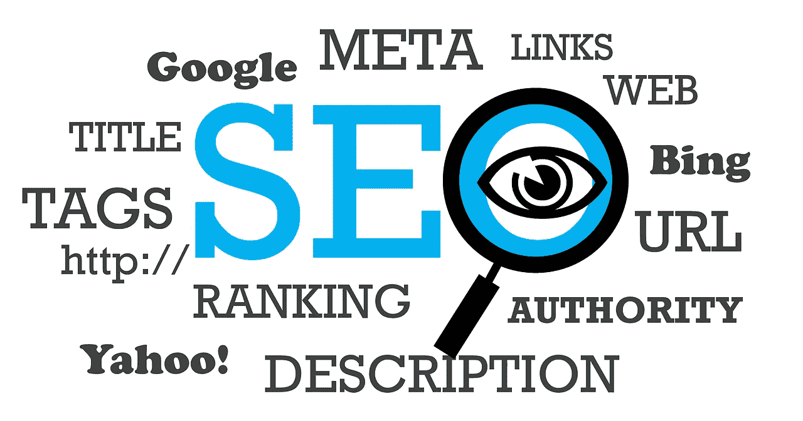

# 2019 年如何钉钉你的 SEO 策略？

> 原文：<https://medium.com/visualmodo/how-to-nail-your-seo-strategy-in-2019-c1afb989cc62?source=collection_archive---------1----------------------->

2018 年是 SEO 发生巨大变化的一年，例如语音搜索、区块链技术和谷歌移动优先指数的增长。这些趋势将 SEO 带到了一个全新的水平，并为其未来的改进提供了坚实的基础。现在，谈到未来，2019 年即将到来，预计将带来新的技术和趋势。当然，为了保持竞争力，你需要跟上这些变化。下面是 2019 年要准备的几个 SEO 策略[趋势](https://visualmodo.com/)。

# 2019 年 SEO 策略

# 让你的网站对语音搜索者可见

随着人工智能助手和复杂的语音识别软件的兴起，语音搜索在过去几年中发展速度惊人。今天，大约 41%的成年人每天至少进行一次语音搜索。并且，这一数字预计到 2020 年将达到 50%。

语音搜索已经成为你搜索引擎优化难题的重要组成部分。然而，它重新定义了我们做 SEO 的方式。

例如，语音助手旨在模拟现实生活中的对话。搜索者现在可以使用完整的句子和提问自然地与搜索引擎“对话”。因此，它们不限于短尾文本查询。

这种现象会影响语音搜索结果。谷歌希望尽可能准确地回答用户的问题，选择能够直接回答用户问题的网站。

# 为什么重要？

这就是为什么你需要把你的观众放在第一位，理解他们的意图，优化你的对话式搜索短语的内容。要了解人们通常会问什么问题，并根据这些问题调整您的关键词，请跟踪在线社区、行业论坛、问答平台和社交网络。像 Keywordtool.io 或 LSI 这样的工具也可能有所帮助。

当然，语音搜索仍然相对较新，优化它需要正确的工具和大量的研究和审计。因此，如果你仍然不确定使用什么工具，以及如何将搜索意图和你的关键词研究结合起来，你总是可以[投资 SEO 服务](https://www.onlinemarketinggurus.com.au/seo-agency/)，让专业人士把你放在你的语音搜索者面前。

# 利用人工智能技术和聊天机器人

聊天机器人是数字营销领域的新生事物。它们不仅能帮助您在下班时间提供实时客户支持，还能吸引您的客户，让他们与您的品牌进行个性化互动。今天的聊天机器人是人工智能驱动的，这意味着它们会不断改善对话模式，并提供相关的客户反馈。

从搜索引擎优化的角度来看，聊天机器人有很多好处。例如，聊天机器人可以让你引导你的客户经历他们购买旅程的不同阶段，帮助他们毫不费力地找到想要的信息，并更快地转化。这将导致更低的跳出率和更好的用户参与度，向谷歌显示你是一个相关和权威的信息来源。

# 提升您的内容制作技能

内容营销仍然是你的 SEO 战略的基础。它给你机会让你的表现最好的关键词排名更高，增加你的有机流量，并与你的目标受众建立信任。通过创建紧跟行业趋势并解决读者具体问题的内容，你将把自己定位为一个可信的在线资源，并让他们更快地转化。最重要的是，高质量的内容是你最有效的链接建设实践。当你所在领域的可信网站开始看到你的文章给你的读者带来的价值时，他们会开始在他们的博客文章中有机地链接到他们，增加你的反向链接组合。

现在，在 2019 年，简短的自助式博客帖子不会提供任何 SEO 价值。你需要开始创作引人注目的、独特的、信息量大的内容，真正与你的目标读者产生共鸣。

首先，这意味着创建长篇博文。据 Backlinko 称，2000 字的内容在谷歌上表现更好。用相关的统计数据和最近的研究来支持你的内容，提供对主要行业话题的独到见解，并提供可行的建议。无论是长篇文章还是终极指南，你的内容都不应该充斥着无聊的文字。

最后，别忘了内容生产不仅仅包括文章。有许多吸引人的内容形式，你应该尝试一下，以增加用户参与度，提升你的排名。这些可以是信息图、视频、测验——基本上，任何类型的内容都可以提供有针对性的用户体验。

# 提升用户体验以取悦 RankBrain

谷歌一直在努力通过为搜索者提供更相关、更权威的搜索结果来改善他们的浏览体验。正因为如此，它使用大量的算法和排名信号来根据网站的质量进行分类。其中最重要的一个就是 RankBrain。

RankBrain 结合了网站停留时间或点击率等不同指标来评估其相关性。当然，你的目标是改善网站的这些方面，让谷歌给你更高的排名。

例如，要增加您的[有机 CTR](https://visualmodo.com/blog/) ，您可以:

*   测试和提高你的搜索引擎优化标题。从你的读者的角度写标题，为你的主要关键词优化标题，使用能激发点击的情感挂钩。
*   创建吸引人和无垃圾邮件的元描述。他们不仅要告诉用户你的页面是关于什么的，还要吸引他们点击链接。
*   实现结构化数据来告诉 Google 你的页面是关于什么的。这将增加你出现在谷歌信息框中的机会，比如旋转木马、热门故事、视频等。
*   使用描述性的和令人难忘的网址，让你的网页内容更有深度。

# 内容

然而，让人们点击你的内容只是完成了一半的工作。另一半是让他们在你的页面上停留更长时间。停留时间是谷歌最重要的排名因素之一，因为它表明你的内容有多相关、友好和吸引人。如果有人在你的页面上停留 10 分钟，阅读你的帖子并点击你的链接，这是他们喜欢它的明确信号。然而，如果快速浏览你网站的人越来越多，谷歌会认为你的网站与你的受众无关，并降低你的排名。

就像 CTR 一样，有很多方法可以增加你的停留时间。首先，你应该提高你的页面加载速度，确保你的网站同时迎合移动和桌面用户，简化你的网站导航，并提高你的网站的整体吸引力。

# 回到你身边

SEO 策略生态系统不断发展。并且，为了保持领先，你需要根据这些关键的变化来调整你的 SEO 策略。监控数字营销行业的主要趋势，并战略性地将它们应用到你的 SEO 实践中。另一方面，不要忘记定期测试你的网站的性能。找出不适合你的做法，并迅速消除它们。记住，SEO 没有一个放之四海而皆准的方法。这一切都是为了适应你的具体需求的主要趋势。