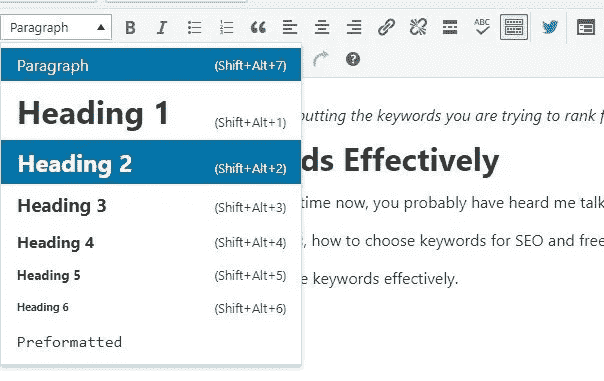
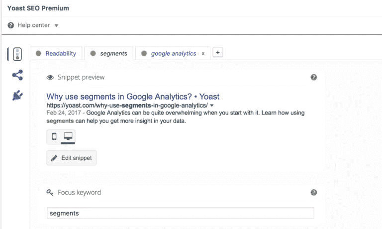

# 如何优化博文 SEO？

> 原文：<https://medium.com/visualmodo/how-to-optimize-blog-post-seo-2d3864abef9e?source=collection_archive---------0----------------------->

## 出现在搜索中

如何优化博文 SEO？内容写作应该是每一个 SEO 策略的关键要素。你如何确保你的博客文章有最高的机会在谷歌排名良好？你需要采取的连续步骤是什么？在这篇文章中，我将带你回到 SEO 的基础。

# 如何优化博文 SEO？

# 找到那个关键词

每个内容搜索引擎优化策略的第一步应该是关键词研究。你应该弄清楚你想找到什么样的搜索词。不过，找出正确的关键词可能会令人望而生畏。你真的需要进入你的观众的头脑。

不过，一个词不是一个话题。除了关键词(或关键短语)，你还需要一个角度，一个围绕关键词的具体故事。如果你想了解更多，请阅读我们关于如何为你的博客出主意的建议。

当然，Yoast 最出名的是 Yoast SEO 插件。我们的插件将真正[帮助你优化过程](https://yoast.com/wordpress-seo-content-analysis/)。第一步是填写你希望你的文章被发现的关键词(焦点关键词)。之后，插件会给你反馈如何提高你的博文的 SEO。例如，它会检查你的帖子是否有以下内容:

# 使用该关键字

如果你想让某个词排名靠前，你应该在你的文章中经常使用这个词。这样，谷歌将知道你的文字是关于特定的关键字。但是不要过度。谷歌根本不喜欢[过度优化的](https://visualmodo.com/)文本。2 %的关键词密度(其中五十个单词中有一个是你的关键词)是很棒的。最好创建一个相当长的文本，我们推荐一个至少 300 字的文本。这样，你就可以多次使用你的关键词。

# 优化你的标题

检查你的焦点关键词是否在标题中。你帖子的标题真的很重要。你一定要在那里使用你的关键词。尽量在至少一个副标题中使用你的关键词。

# 那个片段怎么样？

片段是谷歌在搜索结果中显示的东西。这是你文章的标题和简短的描述。Yoast SEO 将帮助您优化代码片段:它向您显示代码片段的预览，并允许您轻松编辑内容。这一点非常重要，因为这是你的读者首先会读到的东西。所以这段文字必须说服他们去你的网站。

不幸的是，我们永远不确定谷歌是否会展示这个特定的片段。然而，创建一个很棒的片段预览应该是你的 SEO 策略的一部分。当然，不要忘记再次使用那个 focus 关键字！

# 别忘了:写一篇牛逼的帖子！

优化博文 SEO？搜索引擎是你一定要做的事情。但更重要的是，你应该确保你写了一个很棒的帖子。你文章的主题应该是原创的，你文章的信息应该吸引你的读者。最重要的是，你的文本应该是令人愉快的，不要太难阅读。在不牺牲文章可读性的情况下，你应该使用上面介绍的技巧来优化你的博客文章，让它更加突出！