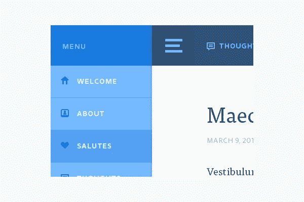

# 如何优化网站导航菜单

> 原文：<https://medium.com/visualmodo/how-to-optimize-website-navigation-menu-49ef1fa385ce?source=collection_archive---------0----------------------->

在这篇文章中，我们将展示如何优化网站导航菜单来吸引你的访问者并使其更易访问。查看如何更好地利用网站菜单的技巧。

在一个理想的世界里，你的网站的每一个页面都可以通过一个网站范围的菜单来访问。但是作为一名网络开发者或网站所有者，你无疑知道，网站的真实世界远非理想。

# 如何优化网站导航菜单

我们努力应对多种设备、固定宽度的网站、在不产生新问题的情况下很难改变的主题等等。然而，网站菜单是你的网站上最常用的导航工具，你想尽可能地利用它。在这里，我将提出一些有用的最佳实践，让你为用户和 [SEO](https://visualmodo.com/) 优化你的网站菜单。

# 网站菜单

首先，我认为我们应该忘记一个网站只能有一个菜单的假设。我想我们已经习惯了一个网站的上栏的小链接。

像许多其他网站一样，Greenday.com 在黑色栏中有第一个菜单，而红色栏也包含许多内部或外部页面的链接。社交档案、Apple Music 和 Spotify 链接，还订阅了时事通讯。

曼哈顿学院有一个明确的指向内部页面的第二菜单，针对特定的受众。这表明这些额外的菜单无处不在。

我的观点是？不要把所有的东西都放在一个菜单里。这样会使你的网站变得杂乱，使你的主菜单不能很好地反映你的网站结构。关注最重要的内容。例如:我确实喜欢菜单中的“联系人”链接。但是，如果你的主要目标是让你的访问者联系你，就只加一个。否则，链接可以毫无问题地放在第二个网站菜单中。

# 网站菜单中过多链接的负面影响

过多的链接，在你页面的任何地方，都是不推荐的。是的，[谷歌](https://visualmodo.com/)可以在一个页面上允许多达 250 个链接，甚至更多，没有任何问题。但是你的网站的目标可能不是确保你的访问者不能只见树木不见森林。我们建议不要:

*   标签云(真的有什么用？)
*   你的博客存档的每月链接的长列表(不要使用日期存档！)
*   无限可滚动的存档页面，带有文章链接(至少可以添加摘录，并在滚动页面上加载更多文章)
*   列表中的一百个类别(为什么这么多！)
*   带有子菜单和子子菜单的菜单等等

为什么我们反对这样做？一个页面上有太多的链接会破坏你的链接价值。一个页面上有如此多的链接，那么这个页面上的每一个链接对于它所链接的页面来说都是有价值的。除此之外，它扰乱了你的访客的焦点。每一个链接，你都是在偏离你网站的主要目标。

在我看来，你确实需要一个充分的理由来添加多个子菜单。如果你觉得你的菜单需要额外的层次，监控菜单被点击的次数，并根据需要进行调整。我认为在很多情况下，你最好为你的子菜单项创建一个好的登陆页面。

# 完美的菜单

当然，没有“完美菜单”的模板。这很大程度上取决于你的网站和你的目标。无论如何，当[优化](https://wordpress.org/plugins/wordpress-seo/)你的菜单时，有两个重要的问题你应该问自己:

*   我的网站最好的菜单结构是什么？
*   我的菜单上至少应该有哪些菜单项？

我们能给你的另外两个提示是使用重要子项的下拉菜单。不要在你的菜单上添加太多链接，否则它们会失去价值。对于一个好的网站菜单，你有其他的建议吗？请在评论中告诉我们！