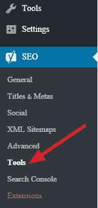
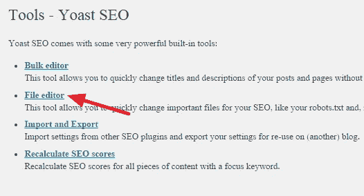
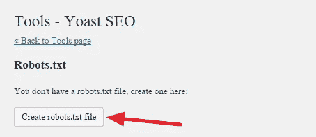
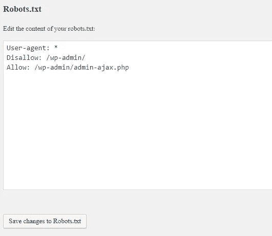
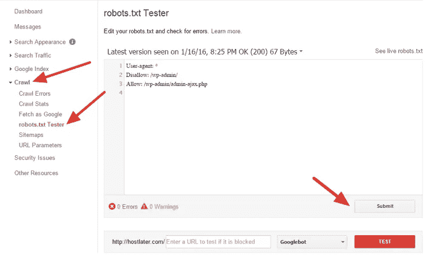
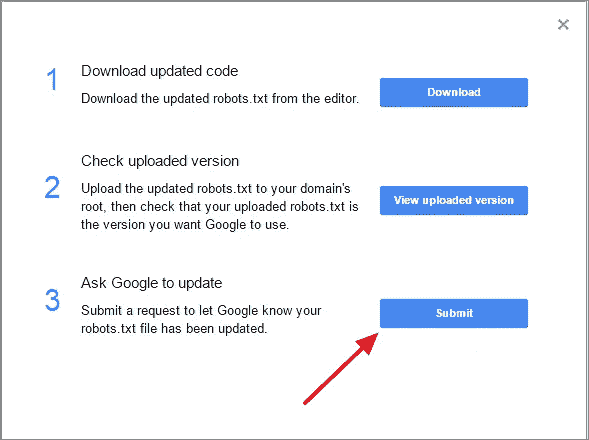
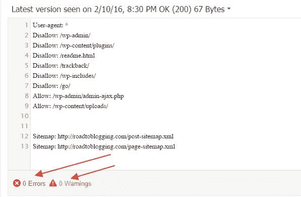

# 如何为 SEO 优化 WordPress Robots.txt 文件

> 原文：<https://medium.com/visualmodo/how-to-optimize-wordpress-robots-txt-file-for-seo-973d748ffe71?source=collection_archive---------0----------------------->

你优化了你的 WordPress Robots.txt 文件进行 SEO 了吗？如果你没有，你就忽略了 SEO 的一个重要方面。Robots.txt 文件对你的站点的 SEO 起着重要的作用。你很幸运，WordPress 会自动为你创建一个 Robots.txt 文件。有了这份文件就成功了一半。你必须确保 Robots.txt 文件被优化以获得全部的好处。

Robots.txt 文件告诉搜索引擎机器人要抓取哪些页面，避免哪些页面。在这篇文章中，我将向你展示如何在 WordPress 中编辑和优化 Robots.txt 文件。

# 为 SEO 优化 WordPress Robots.txt 文件


**什么是 Robots.txt 文件？**

让我们从基本的开始。Robots.txt 文件是一个文本文件，指示搜索引擎机器人如何抓取和索引网站。每当任何搜索引擎机器人来到你的网站，它会读取 robots.txt 文件并按照指示操作。通过使用这个文件，你可以指定机器人抓取你的网站的哪一部分，避免哪一部分。然而，robots.txt 的缺失不会阻止搜索引擎机器人抓取和索引你的网站。

**在 WordPress 编辑&理解 robots . txt**

我已经说过，每个 WordPress 站点在根目录中都有一个默认的 robots.txt 文件。你可以去 http://yourdomain.com/robots.txt.的[查看你的 robots.txt 文件。例如，你可以从这里查看我们的 robots.txt 文件:](http://yourdomain.com/robots.txt.)[https://roadtoblogging.com/robots.txt](https://roadtoblogging.com/robots.txt)

如果您没有 robots.txt 文件，您必须创建一个。这很容易做到。只需要在你的电脑里创建一个文本文件，保存为 robots.txt，上传到你的根目录。您可以通过 [FTP 管理器](https://visualmodo.com/best-ftp-client-wordpress/)或 [cPanel 文件管理器](https://visualmodo.com/)上传。

现在让我们看看如何编辑 robots.txt 文件。

您可以使用 FTP 管理器或 cPanel 文件管理器编辑 robots.txt 文件。但是很费时间，有点难度。

编辑 Robots.txt 文件的最好方法是使用插件。有几个 WordPress robots.txt 插件。我更喜欢 [Yoast SEO](https://visualmodo.com/) 。这是 WordPress 最好的 SEO 插件。我已经分享了[如何设置 Yoast SEO](https://visualmodo.com/) 。

Yoast SEO 允许你在 WordPress 管理区修改 robots.txt 文件。不过如果不想用 Yoast 插件，可以用其他类似 [WP Robots Txt](https://visualmodo.com/) 的插件。

一旦你[安装了](https://visualmodo.com/)并激活了 Yoast SEO 插件，进入 WordPress 管理面板> SEO >工具。



然后点击“文件编辑器”。



然后你需要点击“创建 robots.txt 文件”。



然后你会得到 Robots.txt 文件编辑器。您可以从这里配置 robots.txt 文件。



在编辑文件之前，您需要理解文件的命令。主要有三个命令。

*   **用户代理** —定义搜索引擎机器人的名字，如 Googlebot 或 Bingbot。您可以使用星号(*)来指代所有搜索引擎机器人。
*   不允许 —指示搜索引擎不要抓取和索引你网站的某些部分。
*   **允许** —指示搜索引擎抓取并索引您想要索引的部分。

以下是 Robots.txt 文件的示例。

```
User-agent: *
Disallow: /wp-admin/
Allow: /
```

这个 robots.txt 文件指示所有搜索引擎机器人抓取网站。在第二行，它告诉搜索引擎机器人不要抓取/wp-admin/部分。在第三行，它指示搜索引擎机器人抓取和索引整个网站。

**配置&SEO 优化 Robots.txt 文件**

Robots.txt 文件中的一个简单的错误配置就能让你的网站在搜索引擎中完全失去索引。例如，如果您在 Robots.txt 文件中使用命令“Disallow: /”,您的网站将从搜索引擎中被取消索引。所以在配置时你需要小心。

另一件重要的事情是为 SEO 优化 Robots.txt 文件。在进入 Robots.txt SEO 的最佳实践之前，我想警告你一些不好的做法。

*   不要用 Robots.txt 文件来隐藏低质量的内容。最佳实践是使用 noindex 和 nofollow meta 标记。你可以通过使用 Yoast SEO 插件来做到这一点。
*   不要使用 Robots.txt 文件来阻止搜索引擎索引你的类别、标签、档案、作者页面等。您可以使用 Yoast SEO 插件为这些页面添加 nofollow 和 noindex meta 标签。
*   不要使用 Robots.txt 文件来处理重复的内容。还有其他方法。

现在让我们看看如何让 Robots.txt 文件 SEO 友好。

1.  首先，你需要确定你的网站的哪些部分你不希望搜索引擎机器人抓取。我更喜欢禁用/wp-admin/、/wp-content/plugins/、/readme.html、/trackback/。
2.  在 Robots.txt 文件上添加“Allow: /”派生代码并不重要，因为无论如何，机器人都会抓取你的站点。但是您可以将它用于特定的机器人。
3.  将站点地图添加到 Robots.txt 文件中也是一个很好的做法。阅读:[如何创建网站地图](https://visualmodo.com/best-wordpress-sitemap-plugins/)

这里有一个 WordPress 的理想 Robots.txt 文件的例子。

```
User-agent: *
Disallow: /wp-admin/
Disallow: /wp-content/plugins/
Disallow: /readme.html
Disallow: /trackback/
Disallow: /go/
Allow: /wp-admin/admin-ajax.php
Allow: /wp-content/uploads/
Sitemap: [https://roadtoblogging.com/post-sitemap.xml](https://roadtoblogging.com/post-sitemap.xml)
Sitemap: [https://roadtoblogging.com/page-sitemap.xml](https://roadtoblogging.com/page-sitemap.xml)
```

你可以在这里查看 RTB Robots.txt 文件:[https://roadtoblogging.com/robots.txt](https://roadtoblogging.com/robots.txt)

**在谷歌站长工具中测试 Robots.txt 文件**

更新 Robots.txt 文件后，您必须测试 Robots.txt 文件，以检查是否有任何内容受到更新的影响。

你可以使用[谷歌搜索控制台](https://www.google.com/webmasters/tools/)来检查你的 Robots.txt 文件是否有任何“错误”或“警告”。只需登录谷歌搜索控制台并选择网站。然后转到 Crawl > robots.txt Tester 并点击“提交”按钮。



将弹出一个框。只需点击“提交”按钮。



然后重新加载页面，检查文件是否更新。更新 Robots.txt 文件可能需要一些时间。

如果它还没有更新，您可以在框中输入您的 Robots.txt 文件代码，检查是否有任何错误或警告。它将在那里显示错误和警告。



如果您注意到 robots.txt 文件中有任何错误或警告，您必须通过编辑 robots.txt 文件来修复它。

**最终想法**

我希望这篇文章能帮助你优化你的 WordPress robots.txt 文件。如果您对有任何疑问，请随时通过评论向我们提问。

然而，如果你想让你的 WordPress 博客 SEO 友好，你可以阅读我们关于[如何设置 WordPress Yoast SEO 插件](https://visualmodo.com/)的文章。

如果你觉得这篇文章有帮助，请帮我在脸书、推特或谷歌+上分享这篇文章。