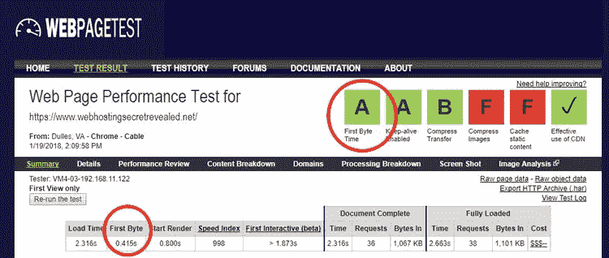
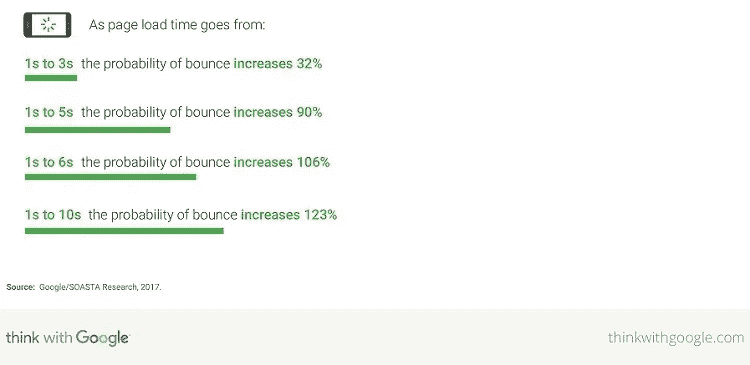
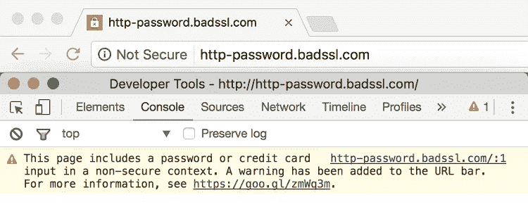
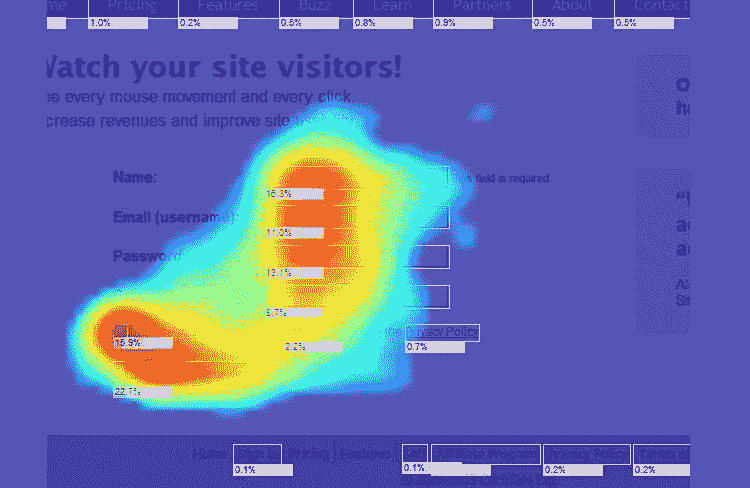

# 如何规划 2019 年的网站改造

> 原文：<https://medium.com/visualmodo/how-to-plan-a-website-revamp-for-2019-b115de2ad8e5?source=collection_archive---------0----------------------->

规划一个完整的网站改造曾经是一项巨大的任务，而且由于这项任务的巨大和复杂，它从来都不是小企业所期待的。虽然任何组织在某种程度上缺乏资源，可能仍然会发现这是一个令人生畏的挑战，但网站改造的前景远不如几年前那样令人生畏。这在一定程度上是因为有大量可用的工具，可以使这个过程进行得更顺利，并且可以更快地完成。

# 如何规划 2019 年的网站改造

在过去的几年中，组织进行网站改造的原因也发生了变化。即使在五年前，所有关于网站改进的讨论都集中在为移动用户优化一个[网站](https://visualmodo.com/wordpress-themes/)，现在几乎所有网站所有者都完成了，优化的新焦点是用户在你网站上的体验。

下面介绍了一些要点，如果你计划在 2019 年对网站进行改造，你可能需要考虑这些要点，这样你最终会得到一个符合当今最重要的用户需求以及你作为一个组织的需求的网站。

# 虚拟主机的重要性

选择合适的网络主机对你的业务来说可能是至关重要的，如果你正在为 2019 年做一个全面的改造，可能是时候考虑你当前的主机是否满足你的需求了。例如，如果您当前的主机经历了任何停机，这可能会导致收入损失，如果您的网站多次宕机，也会影响您的搜索排名。

*以上是我们网站 TTFB 使用 WebPageTest 的截图。结果是 415ms，非常好。*

速度是你的网站主机应该能够提供给你的另一个重要方面，如果你的网站被缓慢加载的内容和图片所困扰，你的网站很可能会失去很多访问者。互联网冲浪者因放弃那些不能立即加载以提供他们所寻找的内容的网站而臭名昭著。

安全性是您的组织非常关心的另一个问题，因为随着网络犯罪分子将注意力转向大量入侵小型企业的有利可图的前景，小型企业正受到更大的攻击。因此，如果你真的想改造你的网站，找到最好的虚拟主机是你不能忽视的事情。

最后，如果你没有得到你认为作为客户应该得到的那种客户服务和技术支持，那么当你考虑为你的网站雇佣一个新的主机时，这是你应该考虑的其他事情。

# 谷歌已经将移动速度确立为其基准

由于手机上网的普及，以及手机购物者和上网者的庞大数量，谷歌已经将手机速度作为加载速度的基准。然而，搜索引擎巨头也对这个问题进行了广泛的研究，发现今天大多数移动网站都没有达到用户对[加载速度](https://www.searchenginejournal.com/google-new-industry-benchmarks-mobile-page-speed/187777/)的期望。

谷歌发现，如果一个网站没有在三秒钟内完全加载到他们的移动设备上，普通用户会放弃这个网站——但普通移动网站的加载时间长达 22 秒！仅仅这个事实就很容易理解为什么用户会很快离开一个网站而选择另一个加载速度更快的网站。

谷歌研究的底线是，随着加载时间从 1 秒增加到 10 秒，放弃率上升了 123%。

你从这一切中得到的启示是，你的网站需要针对移动设备进行优化，并快速加载到移动设备中，否则你可能会失去大部分潜在客户。

# 你的网站需要符合 GDPR 标准

欧盟于 2016 年通过了《通用数据保护条例》( GDPR ),该条例于 2018 年 5 月生效，为欧盟内外的数据控制器和数据处理器引入了[特定的义务](https://www.gdpr.associates/what-is-gdpr/)。实际上，它让管理大量个人数据的组织有义务确保他们遵守法规，否则他们将受到巨额罚款。

该法规的要点之一是确保个人明确同意将其私人数据用于任何目的，另一个要点是个人有权要求获得关于其所有数据的信息，第三个方面是用户有权将其个人数据从组织的数据库中删除。

《GDPR》中还包括一些其他次要内容，但这些是主要内容，如果个人认为他/她的权利受到了侵犯，他们可以选择向违法组织提出索赔。如果[你的网站拥有大量个人数据](https://premium.wpmudev.org/blog/gdpr-compliance/)，特别是金融机构，并且你的一些客户在欧洲，这是你需要注意的一个重要因素。

# Chrome 浏览器已经将非 SSL 网站标记为不安全

2017 年初，Chrome 浏览器开始将所有非 SSL 网站标记为“不安全”，这意味着该网站和其他方之间进行的任何交易都可能受到网络犯罪分子的黑客攻击。

[安全套接层(SSL)](https://www.wordfence.com/blog/2017/01/chrome-56-ssl-https-wordpress/) 技术对网站和该网站用户之间交换的所有数据进行加密，从而确保隐私，黑客无法为个人利益拦截数据。

不用说，如果您的网站没有迁移到 SSL 来为您的用户提供这种级别的安全性，您很可能会失去业务，尤其是如果您的竞争对手向用户提供 SSL 环境。

您可以通过在网站上安装 SSL 证书来解决这个问题。如果你有预算限制，你可以选择[让我们加密 SSL 证书](https://letsencrypt.org/)。这是一个免费的数字证书，可以安装在您的网站上，为您的访问者提供一个安全可信的环境。

# 整合富媒体内容

在过去的五年中，组织在其网站上包含富媒体内容变得更加容易，尤其是随着视频制作成本的大幅降低。

如果到目前为止你还没有在你的网站上加入视频和图片，那么你 2019 年的改造将是一个加入它们的好时机。有大量的数据表明在你的网站内容中包含视频和图片的价值，因为这些是最吸引用户的内容形式。

如果你想接触到目标受众，你想让他们在你的网站上花些时间，你需要把图片和视频作为你网站内容的主要组成部分。

事实上，如果你的改造因为资金的原因在本质上有所限制，这可能是你能对你的网站进行的最重要的一次升级。你还应该考虑在你的网站上嵌入像 YouTube 这样的手机友好型网站，这样你就可以不费吹灰之力地提高参与度。

# 分析热图

热图技术对一个网站来说非常有用，在你 2019 年的改造中，你应该考虑一下这个问题。当你在你的网站上安装了热图技术，你将能够识别用户在你的网站上花费大部分时间的地方，例如，他们阅读或查看的内容，以及他们跳过的内容。

了解这些信息对于准备一个吸引用户并最终鼓励他们执行某种期望的行为的策略来说是非常宝贵的。

数字热图会告诉你，你的任何图像或内容是否令人厌烦，导航是否让访问者对你的网站感到困惑，你网站上的一些链接是否无关紧要，以及你的行动号召是否薄弱和表现不佳。

这个分析工具可以很好地告诉你你的网站到底出了什么问题，以及你应该做些什么来解决任何缺点。事实上，许多组织使用热图技术来帮助他们确定当网站大修时，他们的网站需要如何改进。

# 包裹

毫无疑问，在考虑 2019 年网站改造时，应该记住其他一些考虑因素，但如果你注意到上述几点，你应该最终拥有一个为你的用户提供[迷人体验](https://visualmodo.com/top-conversions-boosting-web-design/)的网站，这将在几年内为你的组织带来回报。