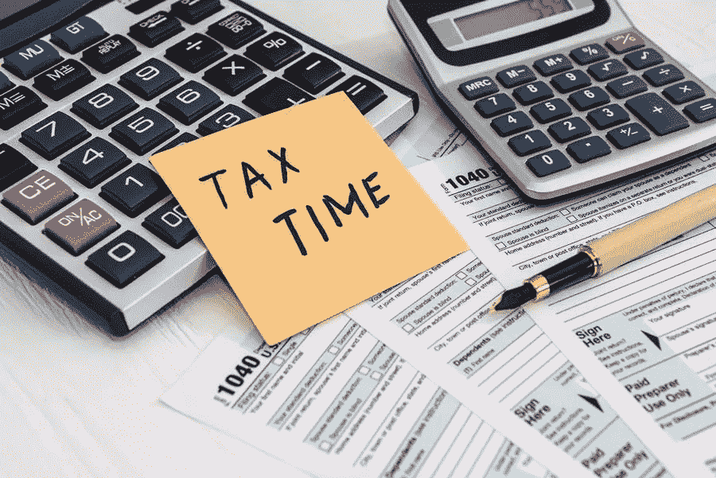

# 如何规划制作今年的税务清单？

> 原文：<https://medium.com/visualmodo/how-to-plan-and-make-a-tax-checklist-for-this-year-e361b9e1aee5?source=collection_archive---------0----------------------->

纳税季是每个人一年中最忙的时候之一。当你有这么多事情要做的时候，你会忘记最后期限是可以理解的，直到离最后期限只有一天了，或者更糟，你只记得最后期限的那天。在这篇文章中，我们将解释并给出最好的税务建议，并展示如何计划并制作今年的税务清单。

对于大多数人来说，虽然这是一项非常繁琐的任务，需要大量的准备工作，但他们仍然能够按时报税。然而，也有一些人需要注册会计师的帮助来准备好他们的文件，并在截止日期前及时归档。尽管雇佣会计师帮助你准备和申报税收会花你几美元，但这总比因为没有申报税收或延迟申报而被政府罚款要好。

# 2020 年税收提示:清单

如果你不想再迟到了，这里有一些建议可以帮你实现这个目标:

*   确保你的信息是正确的

在你开始制作清单之前，首先要确保你的雇主掌握了关于你的所有正确信息。例如，您的地址必须是最新的。如果你最近搬家了，确保你公司的人力资源部门知道，并且地址的必要变化在你的个人资料中有所反映。这一点很重要，因为有些税务文件会寄到你雇主记录中反映的家庭住址。

如果你最近结婚或有任何其他你认为重要的变化，会影响你的纳税申报，确保这些也反映在你的个人资料中。重要的是，所有关于你的信息是同步的和正确的。

*   列出你必须申报的所有税款以及它们各自的截止日期。

了解什么样的纳税申报单需要提交以及何时到期是很重要的，这样你就再也不用因为申报晚了而被罚款了。为了防止这种情况发生，请确保您了解相关信息。您可以使用 [Google Sheets](https://visualmodo.com/8-simple-google-sheets-tips/) 并将它们同步到您的日历中。因此，税务清单上的伟大提示。

设置你的日历，在截止日期前提醒你两周的截止日期，这样你就有足够的时间准备。如果你有自己的事业，而且你还得处理好你的个人纳税申报单，那就更是如此了。

确保你有足够的时间来处理和输入所有文件的信息。如果需要任何证明文件，确保你也有。

*   保护您需要的所有文件

1 月 31 日之前，你会收到一些报税文件。如果这些文件到那时还没有到达，那么你必须去他们的办公室跟进，或者直接从源头获取。

你可以去国税局网站下载相关文件。您也可以选择将文件邮寄到您的地址。如果你想拿起你的文件。他们的网站也有一页告诉你在哪里可以找到它们。你只需要选择离你最近的地点。

*   保留单据:税务提示清单

保留收据是你全年都应该做的最重要的事情之一。这可能不是你第一次报税了。你已经知道保留收据和文件是至关重要的。

文件和收据很重要。确保你在纳税申报单上填写了正确的金额。可以作为免赔额的购物收据或费用也更容易记住。一旦你有了实际的收据。

*   知道哪些扣除适用于你

税法似乎总是在频繁地变化，特别是关于税收减免以及它们如何适用于每个人。因此，跟上法律的变化以及它们如何适用于你是很重要的。

例如，这些天来，你可以逐项扣除，但你也可以利用标准化扣除系统。您可以选择您所属的和使用的归档状态类别。设定你每年总收入中可扣除的标准金额。

# 税务提示核对清单结论:

虽然报税是一件令人厌倦的工作，但值得记住的是，这是非常必要的。你必须遵守它，并确保你正确地提交你的纳税申报表。因此，有了正确的信息，就不需要审计了。