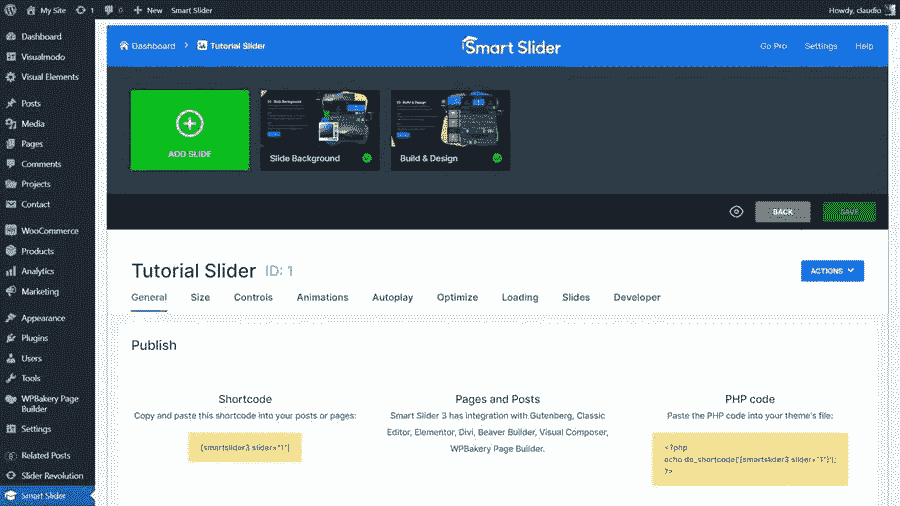

# 如何在 WordPress 发布你的 Smart Slider 3 插件内容

> 原文：<https://medium.com/visualmodo/how-to-publish-your-smart-slider-3-plugin-content-in-wordpress-7cb38d78fc67?source=collection_archive---------0----------------------->

在今天的 WordPress 插件教程中，我们将学习如何轻松地将 Smart Slider 3 插件内容发布到你的 WordPress 页面或帖子中。使用任何你喜欢的页面生成器，以简单、快速、免费的方式使用插件短代码。

# 在 WordPress 发布你的 Smart Slider 3 插件内容

假设你进入 WordPress 仪表盘的智能滑块部分，将鼠标悬停在你想要在你的一些 WordPress 页面或帖子上显示的插件滑块内容上。因此，检查编辑器的“发布”部分，获取在页面上发布智能滑块内容的短代码。

在页面上发布智能滑块内容的最流行的发布方法。例如 Shortcode、PHP 代码和 Gutenberg 块，可以让你在 WordPress 站点上发布滑块。您可以将智能滑块 3 与其他页面生成器一起使用。你可能需要使用一个短代码/文本模块，在那里你可以放置滑块的短代码。有些页面生成器有自己的小部件/模块，比如 Divi 或 Elementor。

# 使用 Elementor WordPress 插件

首先，在 Elementor widget 列表中找到 Smart Slider 3 的 widget。其次，把它拖到你想放滑块的位置。点击[选择滑块按钮](https://visualmodo.com/knowledgebase/wordpress-heading-simple-slider/)选择您的滑块或输入滑块 ID——所选滑块加载到编辑器中。不能使用页面生成器编辑滑块。但是，您可以看到在您的页面上发布智能滑块内容的样子。

一些主机的服务器有一个共同的问题，即给定的 memory_limit 值没有被使用。你的网站停在 100 米左右的内存限制。他们无法确定我们客户的真正原因，但[将 PHP](https://visualmodo.com/how-to-install-smart-slider-wordpress-plugin-free/) 版本从 5.x 升级到 7.x 解决了这个问题，发布了智能滑块。

# 使用 WPBakery 插件

为了能够正确发布 Smart Slider 3，请转到您希望使用该滑块的帖子或页面，并添加一个新的文本块:在您打开该文本块后，您可以使用 Smart Slider 图标添加滑块，也可以从后端粘贴短代码。