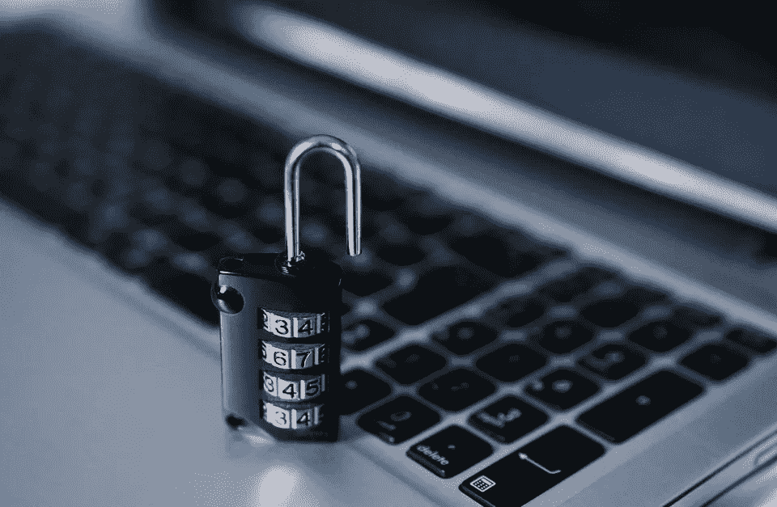

# 如何恢复被黑的 WordPress 网站？

> 原文：<https://medium.com/visualmodo/how-to-recover-hacked-wordpress-sites-f99e8afc5f7?source=collection_archive---------0----------------------->

现在看看如何用这个简单易懂的教程来恢复被黑的 WordPress 主题，并修复这种可能发生在每个网站管理员身上的糟糕情况。

当你看到一条信息“你的网站被黑了”你会怎么做？显然，对于网站所有者来说，这是最困难的情况，你的第一反应可能是恐慌。但在这种情况下，你需要冷静思考，谨慎决策。即使你没有备份，你仍然有可能将你的网站恢复到原来的状态，远离黑客。

通过这篇博文，我们将学习如何在你的 WordPress 站点被黑时恢复。如果你想尽快遇到这种情况，那么你需要保持冷静和镇定，否则，你会陷入最糟糕的情况。

# 如何恢复被黑的 WordPress 网站？

你只需要深呼吸几次，然后在你的电脑上运行一个反病毒/恶意软件扫描程序，以确保你不会被黑客从你的电脑上窃取信息。

接下来就看这个问题“你的网站有备份吗”？

**如果您的网站没有备份:**

如果您的站点没有备份，那么您需要更加努力地恢复您的[站点](https://visualmodo.com/wordpress-themes/)。嗯，你不需要担心，因为你有可能让你的网站恢复原样。你只需要遵循以下步骤:

你可以使用网站扫描仪扫描恶意软件

要快速做到这一点，你可以使用一个网站扫描器，如 Sucuri。如果您的网站显示任何恶意软件的结果，这意味着您需要保持专注，并立即采取行动。没有人希望他们的网站被谷歌标记，或者失去潜在的读者或访问者。

**可选:可以删除索引文件，管理区**

如果您不能立即找到源文件，您可以轻松地通过 FTP 删除索引文件。另外，如果你认为黑客可以访问你的网站，你可能需要通过 FTP 删除 WordPress 管理区(可选:你也可以上传一个显示你的网站正在维护的自定义索引文件)。

如果你不知道你的 WordPress 版本或者没有最新的版本，你必须在 wp-includes 文件夹中找到 version.php，在那里你可以看到类似于" **$wp_version = '4.1.1'"** 。为了替换你的 WP 文件，了解你的 WordPress 版本是很重要的。

**用新的用户名和密码替换 Mysql 用户名和密码**

您可以这样做，以确保无论是谁，只要能够通过 PHP 或 SQL 访问您的用户名和密码，在您用新的用户名和密码替换它后，就无法再次破解。

你只需要访问你的主机仪表板，比如 cpanel，然后向下滚动并点击 MYSQL 数据库。

然后，在适当的数据库下交叉检查是否有额外的用户添加了任何内容。如果发现异常，您也可以删除，然后通过单击列在授权用户下的用户来更改您的用户的密码，或者也可以创建一个新用户和表单。

**清除旧的管理员用户，并通过 phpMyAdmin 创建一个新的管理员用户**

首先，你需要去 **phpMyAdmin** ，然后去 [WP_users](https://visualmodo.com/wordpress-membership/) ，然后你可以找到违规的帐户(你的旧管理员用户帐户或者一个新的，如果你已经能够插入 SQL 的话)。

如果您想要手动添加字段，那么这将变得更加复杂，但是幸运的是，您可以使用一段简单的 SQL 来为一个新的管理员用户生成所有必要的字段。

> 插入到` wp_users` (`ID '，` user_login '，` user_pass '，` user_nicename '，` user_email '，` user_url '，` user_registered '，` user_activation_key '，` user_status '，` display _ Name ')
> 值
> (NULL，' username '，MD5('password ')，'用户名'，' email@domain.ext '，"，NOW()，"，' 0 '，'用户名')；

你也可以改变你的 WordPress 安全密钥

改变你的 WordPress 安全密钥很容易，但是为此，你需要去 WordPress salt 密钥生成器。然后，复制所有行并替换 wp-config.php 文件中合适的行。

**如果您的网站有备份:**

如果你的网站有备份，那么恢复你的网站就容易多了。

**如有必要，更改合适的密码和用户名:MySQL、FTP**

进入你的主机仪表板(如 cPanel)，进入 FTP 用户和 MySQL 用户。如果您发现任何新密码，请将其删除，然后更改相关用户的密码。

使用最合适的方法从备份中恢复您的站点。

嗯，这取决于你如何备份你的网站。大多数插件需要你将网站恢复到仪表板，所以如果你是通过插件来访问的话，你可能需要创建一个新的管理员用户。

**更改你的 WordPress 安全密钥**

这种方法使 cookies 无效，因此黑客即使在更改密码后也不会保持登录状态。

**使用** [**文字防护**](https://wordpress.org/plugins/wordfence/) 扫描恶意软件和后门

前往高级选项，选择扫描外部的 WP 安装，以及扫描图像作为可执行文件。

如果你发现任何恶意软件或其他风险，请确保在删除或替换有问题的文件后再次更改所有的 WordPress 密码，因为黑客可能已经通过已有的代码劫持了新的登录信息。

然后按照简单的指南来增强你的 WordPress 的安全性，确保它不会再次发生。而且，如果你的网站没有备份，那么你必须走很长的路去修复你的网站。

**结论**

因此，在这篇博客中，我们解释了恢复你被黑的 WordPress 站点的简单指南。在这种情况下，你需要冷静地思考，想出有助于恢复网站原始设计和感觉的方法。