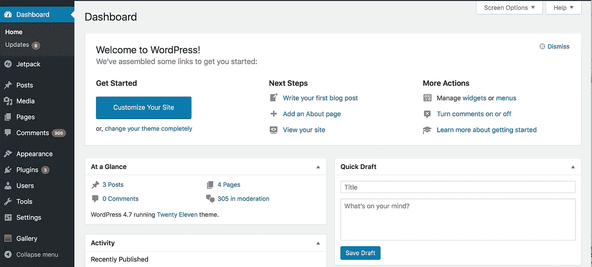
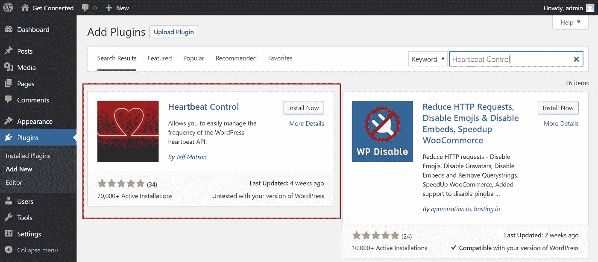
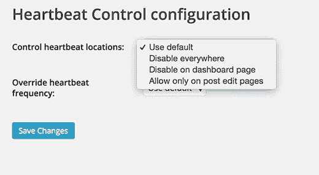

# 如何在 WordPress 中减少 Admin-Ajax 服务器负载

> 原文：<https://medium.com/visualmodo/how-to-reduce-admin-ajax-server-load-in-wordpress-5ba49a5a3185?source=collection_archive---------0----------------------->

为了增加更好的用户体验，我们总是以提高网站速度而告终。点击一个网站链接似乎是一件简单的事情。但是你有没有想过，有多少请求是在一次点击后的几秒钟内被立即 pinged 通的？在这几秒钟内发生了很多事情，可能会降低网站管理的速度——Ajax 就是这里解释的那个。

虽然，网站加载缓慢背后有各种各样的原因。如果在现场检查[速度测试](https://visualmodo.com/wordpress-themes/)工具，有时会在管理 Ajax.php 文件中显示警告。这意味着管理 Ajax.php 文件也是网站加载缓慢的原因之一。

Admin-ajax.php 是 WordPress AJAX API 的一部分。它也处理来自后端和前端的请求。Ajax 允许通过在后台与服务器交换少量数据来异步更新网页。

在 WordPress 3.6 中，WordPress 引入了 Heartbeat API。API 刺激浏览器和服务器之间的双向连接。此外，它还用于在用户写或编辑时自动保存、post 锁定和登录到期警告。

Heartbeat API 在创建与服务器通信的请求时，在接收数据/响应时触发事件。这通常会给服务器带来巨大的负载，从而降低网站的运行速度。

由于这个心跳 API，Admin-ajax.php 每隔 15 秒就会生成请求。该请求可以是与[服务器](https://visualmodo.com/)的任何通信。因此，通过发送太多的请求，服务器需要很长时间来显示您的内容或加载网站。

# 如何降低 Admin-Ajax 服务器负载？

# 加速 WordPress 管理仪表板

因此，在后端加速站点的最佳解决方案是禁用 Heartbeat API。相反，安装[心跳控制插件](https://wordpress.org/plugins/heartbeat-control/)。心跳控制插件允许你容易地管理 WordPress 心跳 API 的频率。通过这个插件，心跳 API 可以被完全禁用。

**注意:** *如果你正在使用任何缓存插件，那么在继续之前禁用对象缓存。它将大幅加快* [*的速度。*](https://visualmodo.com/)

# 要安装心跳控制插件:

1.  登录你的 **WordPress Admin** 仪表盘。
2.  进入**插件> >添加新的**并搜索**心跳控制**。
3.  现在，**安装**并且**激活**它。

# 心跳控制插件的配置:

1.  转到设置，然后控制心跳(**设置>控制心跳**
2.  现在，选择地点。这些地点有三个选项可供选择。

*   到处禁用
*   在仪表板页面上禁用
*   仅在帖子编辑页面上允许

如果我没猜错的话，你的网站经常贡献超过 1 个用户。所以，我建议只在帖子编辑 **页面**位置选择**允许禁用插件。**

1.  现在，您需要通过 Override Heartbeat Frequency 菜单选择执行 admin-ajax 请求的时间间隔。
2.  设定 **60 秒**的时间间隔。通过这样做，请求将在每 60 秒后生成。这大大降低了服务器的负载。
3.  现在，搜索使用**心跳 API** 的插件。

*   为此，请访问 **GTMetrix** 网站并分析您的网站。现在，转到瀑布选项卡，分析哪个文件需要长时间连接和响应。
*   现在，向下滚动，看看是否有 admin-ajax.php 邮政的条目。
*   如果是，**展开**并导航到 **Post 选项卡**找到插件。

现在你们都[定](https://visualmodo.com/)了。