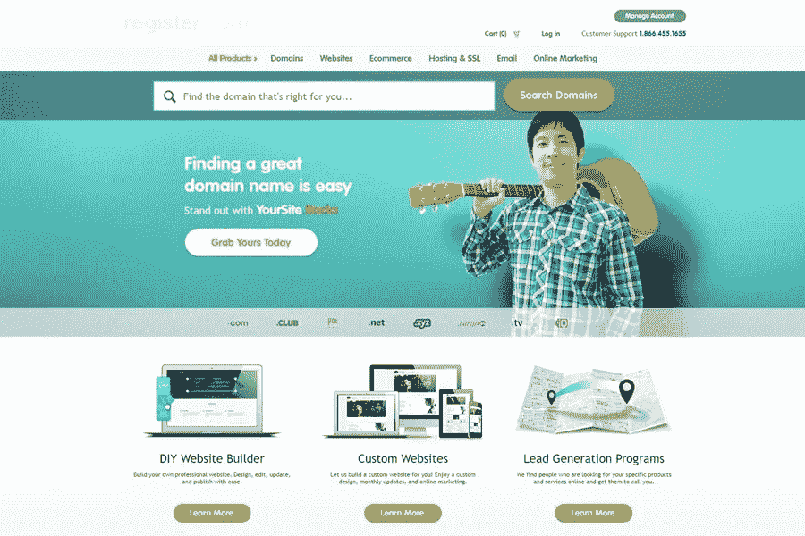

# 如何注册域名？

> 原文：<https://medium.com/visualmodo/how-to-register-a-domain-name-2c5364b50b29?source=collection_archive---------0----------------------->

互联网如此强大的众多原因之一是，它让几乎任何人都有能力与世界其他地方分享他们的声音和知识。让自己出名的一个特别受欢迎的方法是建立一个网站。如今，许多服务，比如 WordPress，都在商业领域提供网站，但是在很多情况下，把你的网站放在你自己的领域更有意义——在互联网上的一个个人空间，你可以完全控制发布的内容和外观。下面介绍如何注册自己的域名。

在获取域名方面，没有太多的技术规则或限制。基本上可以注册任何域名，只要:没被别人抢过。这是可以得到的。此外，它仅由字母数字字符(a-z、A-Z、0–9)和连字符组成。不能用空格。所以，从技术上讲，这为你打开了无限的可能性。然而，并不是所有的域名都是平等的。

# 了解如何注册域名

首先，你不应该认为域名只是互联网地址。这个故事还有更多的内容。一个好的域名应该具备以下四个特质:

# TLD——顶级域名

注册域名时，你可以从一系列顶级域名(也称为顶级域名或域名扩展)中进行选择。其中，您可以选择:。com，。然而，一般的规则是以. net 和. org 为目标。com——最受欢迎的 TLD——除非你将在美国以外的当地市场运营，在这种情况下，你可以选择当地的、基于国家的 TLD(例如它对意大利来说，。加拿大的 ca)。

最后，除了那些基于国家的顶级域名，我们现在还可以访问数百个定制的顶级域名。例如，您现在可以获得。披萨，。爱，。生活，。商店或博客。

注意:从技术角度来看，你选择哪个域 TLD 并不重要。或多或少，这只是给你的访问者一个额外的提示，告诉他们你在运行什么类型的网站。例如，如果我设法获得了一个. fooddomain，这可能意味着该网站将与食物有关。

# 难忘的

域名不能太长或太复杂。一般来说，越短越好。你可以做的一件事是想象在电话里向某人拼写你的域名。所以，如果很难拼写，也很难记忆。

# 简单的

你的域名越能揭示你的业务，就越好。在 99%的情况下，只要有可能，你的域名应该是你公司名称的一个版本。

# 法律和规则

注册域名时，有可能不小心侵犯了某人的商标。例如，如果你奇迹般地得到了 cocacola.blog，这将会给你带来很多法律上的麻烦。确保你打算注册的名字不侵犯任何商标总是一个好主意。检查的最简单的方法是简单地搜索你感兴趣的术语。

在这个阶段，你可以想出两到五个你认为对你/你的企业有潜在好处的域名。以下是我的候选名单:

*   coopWP.com
*   coopWP.eu
*   coopWP-WP.com

# 可用域名

现在你已经有了首选域名的候选名单，是时候看看哪些是实际可用的，也就是说，还没有被其他人注册。

有很多地方可以检查这一点，但目前为止我最喜欢的工具是 DomainTyper。这个工具的伟大之处在于，只要你开始输入域名，它就会告诉你这个域名是否可用。

以下是您使用该工具的方法:1 .开始输入您的域名。2.确保你感兴趣的 TLD 在列表中。如果没有，请单击“添加”按钮进行添加。3.决定一个可用的域名。我想我会选择 coopWP.me。

# 步骤 3:选择域名注册商

现在你知道你想注册什么域名，你知道它是可用的，你可以去你选择的域名注册商那里购买域名。正如我在开始时提到的，域名注册商是一家可以代表你注册域名的公司，然后给你对该域名的完全访问权。

另外，现在有很多域名注册商，你想和哪家合作取决于你自己。不过，在很大程度上，它们之间没有太大的区别，所以你可以从任何注册商那里购买任何域名，只有一个小小的例外。

如果你想使用一个本地域名，比如 visualmodoWP.me，那么你可能想从意大利的本地域名注册商那里购买(在这种情况下)。大多数其他国家也是如此。这些公司的用户界面略有不同，但最终你得到的是一样的——一个闪亮的新域名。

# WordPress 网站？

在我们进一步讨论之前，在选择注册商时，还有一件事你应该考虑进去。如果你确定你的最终目标是推出一个 WordPress 网站(使用你的新域名)，那么你应该考虑从同一家公司获得域名本身和你的网络服务器。

这大大简化了整个设置。而且，在大多数情况下，你可以让网络主机为你配置一切——将你的域名连接到你的主机账户，甚至在上面安装 WordPress。到最后，除了掏出钱包，你基本上什么都不用做。

我推荐这种方法的公司是 BlueHost，因为他们有一些市场上最好的 WordPress 托管包。以下是所有东西分解的方式:

*   网站托管计划起价为每月 3.95 美元。
*   BlueHost 的域名注册费用是每年 14.95 美元。
*   第一年总共是 62.35 美元。

# 购买您的域名

最后。在此之后，你将有你的新域名注册，并准备使用。接下来，我将使用 Namecheap 作为我的例子。正如我提到的，我认为他们是域名注册的首选之一。进入 name price，在主搜索框中输入你想要的域名。

# 注册可用的域名

浏览列表时，标签为“0.88 美元域名”的标签引起了我的兴趣。我最终在那里找到了一个很酷的域名，所以我决定选择那个。现在需要做的就是点击上面截图角落里的“添加到购物车”图标。

# 查看购物车

点击“查看购物车”按钮后，您会看到一个相当长的结账页面。这是你检查一切是否正常的地方。一些更重要的细节:

你可以注册一至十年的域名。你的选择。建议让“WhoisGuard”选项保持启用状态。它为您最重要的个人信息提供完全的匿名和隐私。

在“改善您的网站”部分，您可以看到其他优惠，如托管、SSL 证书、私人电子邮件和 Gmail 集成。这些都不是强制性的。如果只是想注册一个域名，这些都不需要添加。您可以点击“确认订单”来完成处理器。如果您有促销代码，请输入。

# 名称廉价帐户使用

下一步是用 Namecheap 创建一个帐户(或者登录到一个现有的帐户)。这是完成付费程序和成为 Namecheap 注册用户所必需的。

创建您的 Namecheap 帐户后，您可以继续结账并继续付款。

# 完成您的付款

Namecheap 为您提供了多种付款方式。我喜欢用 PayPal 进行在线支付，但你可以自由选择传统的信用卡支付或任何其他方式。如果你选择信用卡，你需要提供信用卡的所有信息，就像在其他网上购物平台一样。总之，准备好了就点击“继续”。

# 结帐付款和信息

下一页将显示付款摘要。如果您选择了 PayPal 作为付款方式，您必须授权 PayPal 付款。有一个熟悉的贝宝按钮。就是这样！您刚刚成功注册了自己的域名。

在下一个屏幕上，您可以查看您的订单，下载收据，并开始管理您的新域及其设置。Namecheap 在这里给了你几个选择:但是在你走之前:

# 检查你的电子邮件

从您注册域名起，您有 14 天的时间来验证您的电子邮件地址。你应该会收到一封来自 Namecheap 的邮件。你所要做的就是点击里面的确认链接。