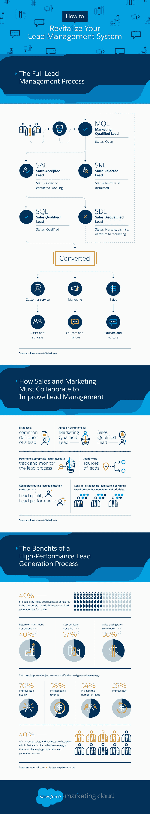

# 如何重振你的销售线索管理系统？

> 原文：<https://medium.com/visualmodo/how-to-revitalize-your-lead-management-system-50ccca569a83?source=collection_archive---------0----------------------->

如果你在一个依赖销售的行业(老实说，谁不是在一个依赖销售的行业？)，那么你就知道从销售线索到销售的转化不是一条直线。你越容易改变人们(并让他们开心)，你的未来就越安全。

# 如何重振你的销售线索管理系统？

但你如何管理这些线索可能会改变游戏规则，这是许多公司可以改进的地方。以这个统计数据为例:在所有产生的线索中，公司没有跟进其中的 8/10——整整 80%的线索没有跟进。

部分问题可能是部门之间缺乏联系。销售不会也不应该在真空中工作，而是需要与[营销](https://creativemarket.com/visualmodo/1536386-28-WordPress-Themes-Mega-Bundle)、客户服务等联系起来，以充分发挥潜在客户的潜力。你还能如何改变你的领导[管理](https://visualmodo.com/)流程？这张图解释了这一点。

