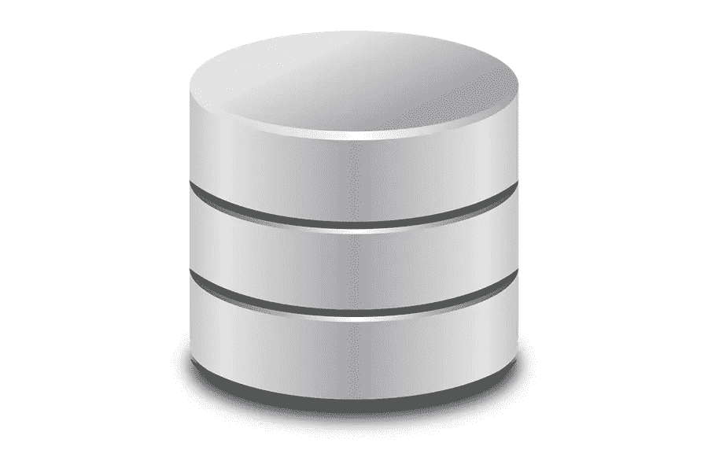

# 如何在 SQL Server 上运行 WordPress

> 原文：<https://medium.com/visualmodo/how-to-run-wordpress-on-sql-server-96b70a21b9aa?source=collection_archive---------0----------------------->

您可能没有意识到这一点，但是可以使用 SQL Server 来运行 WordPress 站点，尽管这是一个稍微复杂和迂回的设置过程，需要一定程度的耐心和专业知识来正确地进行编排。

当然，如果您精通管理服务器的细节，处理从 SQL server 阻塞到硬件故障等一切事情，那么您可能仍然渴望冒险尝试 WordPress 集成。

为此，这里有一些关于实现这一目标的小技巧，从简单到更具挑战性。

# 利用综合工具

与其从零开始解决让 WordPress 和 SQL Server 互相合作的问题，不如利用其他人已经做的努力来克服它。

Nami 项目就是这样一个解决方案，它从头开始构建，允许 SQL server 充当 WordPress 运行的应用程序数据库。

这条路线有一些需要遵守的条件和需要考虑的限制；它只与 SQL Server 2012 或更高版本兼容，因此，如果由于某种原因，您的数据库运行在旧版本上，那么它将不支持。尽管这个问题适用的群体微不足道。

如果你走这条路，要记住的另一个问题是，并不是所有的 WordPress 插件都被支持，因为这是一个分叉版本的平台，所以[兼容性](https://visualmodo.com/contact-page-creation-key-elements/)不能保证。即便如此，这个平台背后的团队仍在不断调整、改进和更新它。用户的众包支持帮助支付了这笔费用。好消息是，这个项目可以自由访问和使用。所以，您可以尝试一下，不需要预先支付任何现金。

# 采取不同的方法

如果你愿意弄脏你的手，找到一个稍微复杂一点的方法让 WordPress 在 SQL Server 上运行，那么这个指南值得更详细地考虑。

它概述了有效地让杜平 WordPress 接受 SQL Server 所涉及的步骤。作为它的数据库，部分是通过搭载 MySQL 的实现来实现的。

这种方法的主要缺点是它在 SQL Server 2008 上。所以你用新的迭代获得你想要的结果的成功会有所不同。

# SQL Server 上的 WordPress:使用替代方案

最终，您可能会认为让 WordPress 与 SQL Server 合作的麻烦太大了。在这种情况下，坚持使用 MySQL 几乎肯定会更好。该特定 CMS 中官方支持的数据库管理系统。

坚持使用 MySQL 的优势在于它是开源的。因此，不一定与 Microsoft 的 SQL Server 具有相同的成本。事实上，前面提到的 Nami 项目依赖于与 Azure 的集成。这增加了集成过程的额外成本，而 WordPress 对 MySQL 的本地支持避免了这些。

从 SQL Server 数据库迁移到 MySQL 数据库也是完全可能的，而且相对容易。这可以为你提供另一种拥抱 WordPress 的方式。而不必为冲突和不兼容性寻找解决方法。存在于它和微软的平台之间。

如果你对此感到不知所措，让专业人士帮助你是有意义的。任何 WordPress 的采用或迁移，因为这将有效地解决问题。